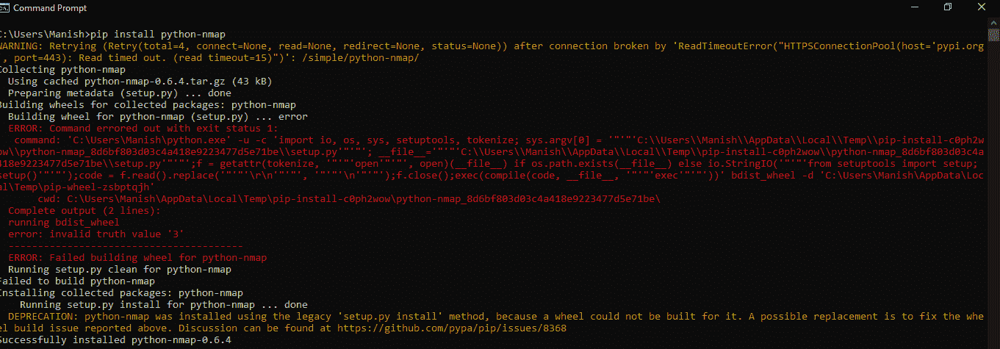

# Python Nmap 模块

> 哎哎哎:# t0]https://www . javatppoint . com/python-nmap 模块

我们都知道什么是端口，以及它们是如何与网址相关联的，但我们中的许多人可能从未听说过端口扫描仪。基本上，端口扫描器是一个应用，设计用于探测与特定端口连接的主机或服务器，它用于开放端口的服务器和主机。从最后一行，我们还可以得出结论，没有特殊许可，我们不能在关闭的端口上使用端口扫描程序应用，未经许可对关闭的端口执行扫描是非法的。管理官员通常使用端口扫描仪来验证他们自己网络的安全策略，以检查这些网络如何识别攻击者或各种威胁。

#### 注意:开放端口是指不需要主机特别许可就可以使用端口扫描程序检查其服务器或端口的端口。

Python 是一种多样化的编程语言，这意味着我们几乎可以在与技术相关的每个领域和任务中看到 Python 语言的应用。因此，我们肯定会想到一个问题，那就是我们有没有可能用 Python 构建一个端口扫描器，还有一个问题，那就是我们能不能自己构建一个端口扫描器。我们可以构建自己的端口扫描器应用，甚至可以使用 Python 程序来实现。是的，我们可以使用 Python 程序构建一个端口扫描程序应用，我们甚至可以使用我们构建的应用扫描多个端口，这是绝对正确的。

Python 为我们提供了模块，我们可以在 Python 程序中使用这些模块来构建端口扫描器。我们可以在 Python 中找到的这样的模块之一是 nmap-python 模块，它用于构建端口扫描器。我们将在本文中学习 Nmap 模块，我们将通过在 Python 程序中使用该模块来构建我们自己的端口扫描器。

## Python 中的 Nmap 模块

Nmap Module，实际名称为 nmap-python Module，是一个开源的 python 模块，通过使用 Python 程序创建端口扫描器，帮助我们实现端口扫描的任务。通过在 Python 程序中使用这个 Nmap Module，我们可以构建一个端口扫描器，当我们运行程序时，端口扫描器会自动检查我们在程序内部定义的端口范围。

**Nmap:** 一种免费的开源网络扫描工具，用于创建端口扫描仪，以执行多个端口的检查，称为 Nmap。

### Nmap 模块:安装

Python Nmap Module 在 Python 中并不是一个内置的模块，如果我们想在 Python 中使用这个模块创建一个端口扫描器，我们首先要在我们的系统中安装它。我们可以通过多种方式在系统中安装这个 Nmap 模块，但是我们更喜欢使用 pip 安装程序来完成这个任务。因此，我们将使用命令提示符终端的 pip 安装程序在我们的设备中安装 Nmap 模块，以便我们可以将其导入 Python 程序。

我们将在设备的命令提示符终端中使用以下 pip installer 命令，以便在系统中安装 Nmap Module:

```py

pip install python-nmap

```

像我们一样在 shell 中写入命令后，我们必须按 enter 键开始安装过程，并且必须等待一段时间，直到安装过程完成。



我们可以看到，现在 Nmap 模块的安装过程已经完成，并且它已经成功安装在我们的系统中。我们现在可以在 Python 程序中使用 Nmap 模块及其功能，方法是将该模块导入程序。

### Nmap 模块:实现

我们现在将在 Python 程序中使用这个 Nmap Module，在这个模块中提供的函数的帮助下，我们将使用这个程序创建一个端口扫描器。由于我们已经了解到未经许可对关闭的端口进行端口扫描是非法的，因此我们将选择 localhost (127.0.0.1)作为目标来使用端口扫描程序。在这个示例 Python 程序中，我们将给出端口扫描器中的范围，程序将告诉我们给定范围中的哪个端口是打开的，哪个端口是关闭的。

**示例:**

请看下面的示例 Python 程序，其中我们使用了 Nmap 模块来执行本地主机(127.0.0.1)的端口扫描:

```py

# Import Nmap Module
import nmap
# Providing range of port scanning
starting = 70
closing = 90
# Assigning target host
targetHost = '127.0.0.1'
# Using scanner from Nmap Module
portScanner = nmap.PortScanner()
# Looping over the range to check each port
for j in range(starting, closing + 1):
    # Scanning the target host
    resultant = portScanner.scan(targetHost, str(j))
    # Storing result in the form of dictionary
    resultant = resultant['scan'][targetHost]['tcp'][j]['state']
    # Printing result for port
    print(f'The port {j} number from the range is {resultant}.')

```

**输出:**

```py
The port 70 number in the range is closed.
The port 71 number in the range is closed.
The port 72 number in the range is closed.
The port 73 number in the range is closed.
The port 74 number in the range is closed.
The port 75 number in the range is closed.
The port 76 number in the range is closed.
The port 77 number in the range is closed.
The port 78 number in the range is closed.
The port 79 number in the range is closed.
The port 80 number in the range is closed.
The port 81 number in the range is closed.
The port 82 number in the range is closed.
The port 83 number in the range is closed.
The port 84 number in the range is closed.
The port 85 number in the range is closed.
The port 86 number in the range is closed.
The port 87 number in the range is closed.
The port 88 number in the range is closed.
The port 89 number in the range is closed.
The port 90 number in the range is closed.

```

**说明:**

我们首先将 Nmap 模块导入到我们的程序中，这样我们就可以在程序中使用端口扫描仪和其他功能。之后，我们已经定义了范围，我们将扫描每个端口以检查端口(来自范围)是关闭还是打开，并且我们将对范围中的每个端口执行此操作。之后，我们定义了执行检查的目标主机，并初始化了‘targetHost’变量以在其中打开本地主机。然后，我们使用 Nmap 模块中的 portscanner()函数来初始化一个 scanner 变量，稍后我们将使用它来扫描目标主机。之后，我们使用 for 循环，这样我们就可以在给定范围内的每个端口上循环，并检查它是关闭还是打开。在 for 循环中，首先，我们初始化了一个“resultant”变量，其中我们使用之前初始化的 scanner 变量扫描了目标主机。之后，在 for 循环中，我们再次调用结果变量来存储结果，无论端口是关闭的还是打开的，我们使用包含多个变量的字典来生成结果。最后，我们使用 print 语句打印范围内每个端口的结果。这个 for 循环将继续，直到它到达范围的终点，然后程序将被完全执行。

在输出中，我们甚至可以看到为每个端口单独打印结果，以检查端口是关闭还是打开。这就是我们如何在 Python 程序中使用 Nmap 模块来创建一个端口扫描器，并使用它扫描多个端口。

#### 注意:为了成功运行我们将在本文中讨论的程序，我们必须在我们的系统中安装 nmap 工具，如果我们想在我们的系统中安装该工具，我们必须参考 nmap 工具的官方网站。从官方网站上，我们可以下载 nmap 工具的安装文件，然后我们可以在我们的系统中安装 nmap 工具，以成功运行本文中讨论的程序。

* * *