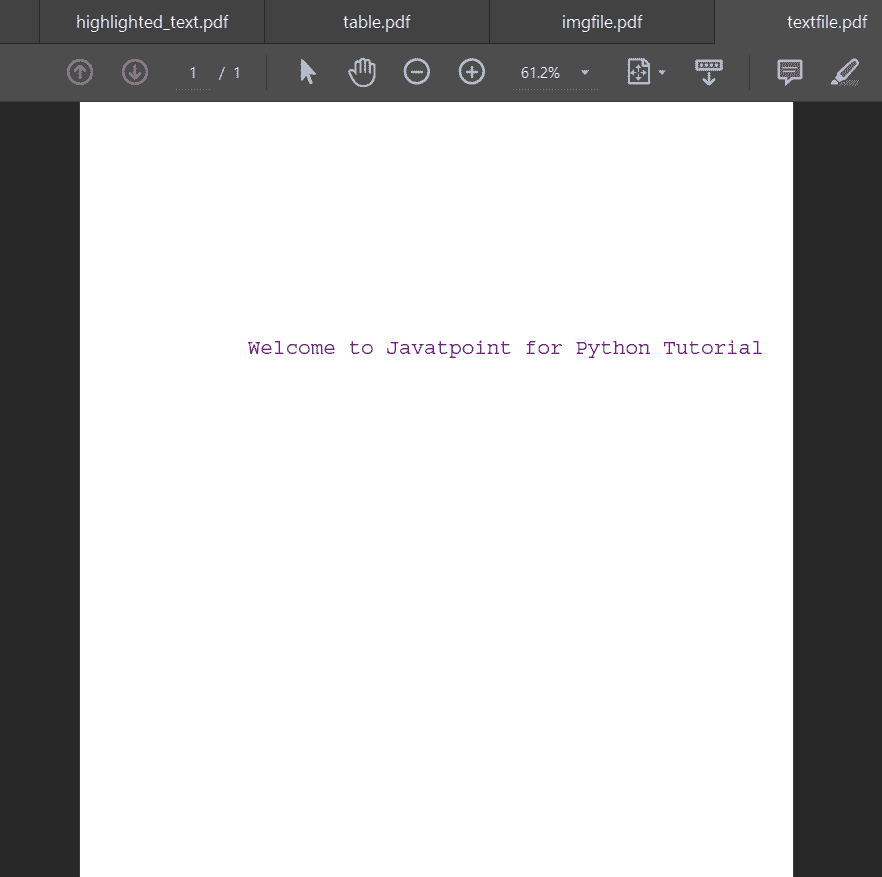
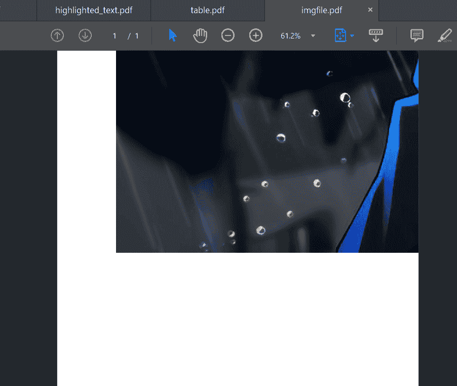
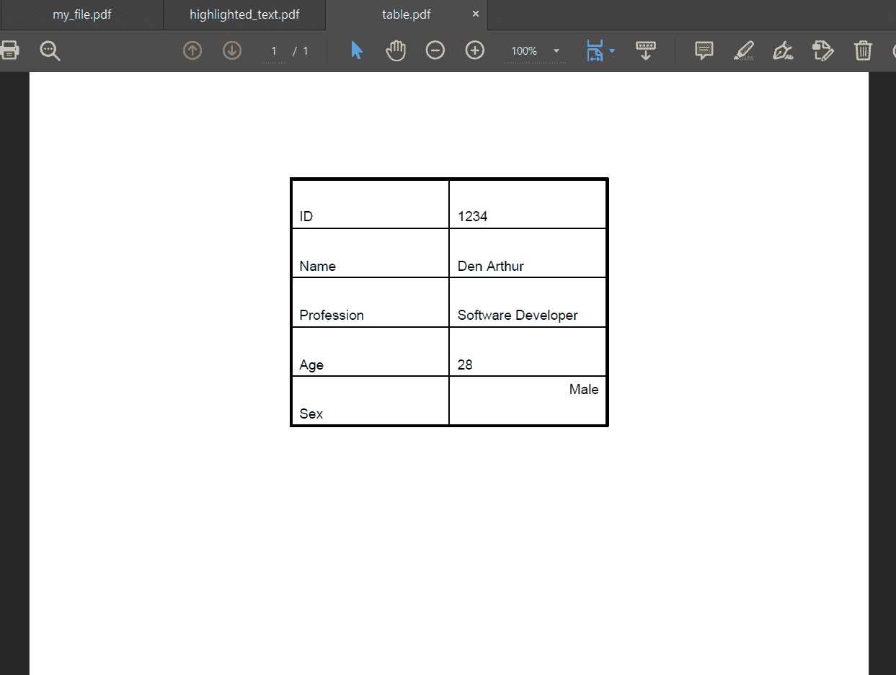
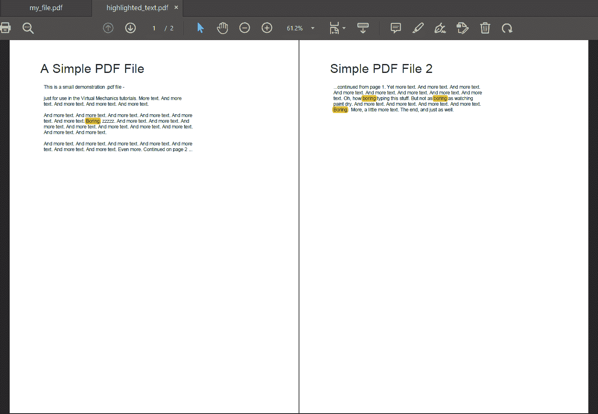
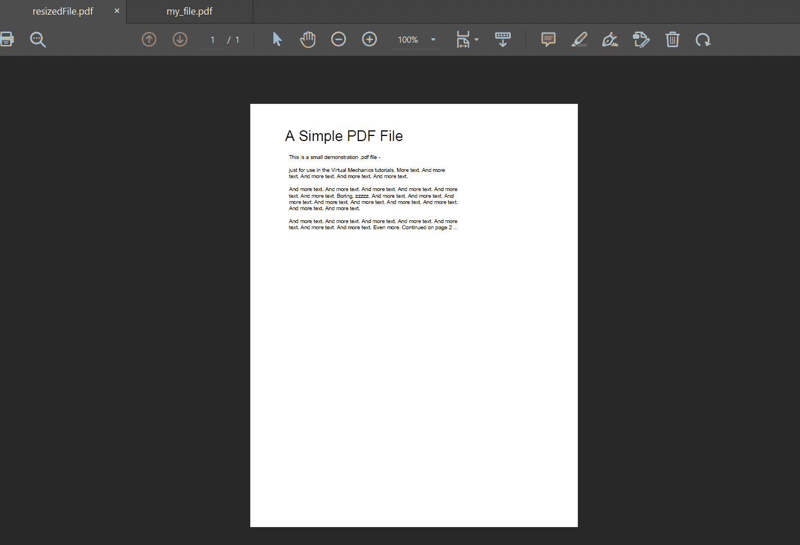

# 使用 Python 操作 PDF

> 原文：<https://www.javatpoint.com/manipulating-pdf-using-python>

在前面的教程中，我们已经讨论了使用 Python 编程语言的不同包和模块可以对 PDF 文件执行的各种操作。我们已经学习了不同 Python 库的工作原理，这些库可以用来操作 PDF 文件。此外，我们已经理解了使用 Python 提取文本、图像、表格和网址。

下面的教程将介绍操作 PDF 文件的一些其他操作，包括创建 PDF 文件、在 PDF 文件上添加文本、图像和表格等等。

那么，让我们开始吧。

## 使用 Python 创建 PDF 文件

Python 提供了一个功能，程序员也可以直接从代码中创建一个 PDF 文件。我们可以将 Python 代码中的文本、图像、表格和表单直接插入到 PDF 文件中。为了实现同样的目的，Python 编程语言提供了一个名为 **reportlab 的库。**

但是在我们开始使用库之前，我们有必要安装它。

### 安装 reportlab 库

我们可以使用 pip 安装程序使用以下命令安装 **reportlab** 库:

**语法:**

```py

$ pip install reportlab

```

现在，让我们从实现部分开始；我们可以执行以下操作:

**示例:**

```py

from reportlab.lib.pagesizes import LETTER
from reportlab.pdfgen.canvas import Canvas 
# creating a new pdf file
my_canvas = Canvas("newfile.pdf", pagesize = LETTER)
my_canvas.save()

```

**说明:**

在上面的代码片段中，我们已经从它们各自的模块中导入了所需的函数。然后我们创建了一个名为**newfile.pdf 的 PDF 文件。**在**画布()**功能中，我们将 PDF 页面的大小设置为**字母**大小，这是由 **reportlab** 库提供的预定义大小。然后，我们使用**保存()功能保存了创建的 PDF 文件。**

## 使用 Python 在 PDF 上添加文本

借助 **reportlab** 库，我们可以轻松添加一个 PDF 文件。让我们考虑下面的例子来理解这一点:

**示例:**

```py

from reportlab.lib.pagesizes import LETTER
from reportlab.lib.units import inch
from reportlab.pdfgen.canvas import Canvas
from reportlab.lib.colors import purple
# creating the pdf file
my_canvas = Canvas("textfile.pdf", pagesize = LETTER)
# setting up the font and the font size
my_canvas.setFont("Courier", 18)
# setting up the color of the font as red
my_canvas.setFillColor(purple)
# writing this text on the PDF file 
my_canvas.drawString(2 * inch, 8 * inch, "Welcome to Javatpoint for Python Tutorial")
my_canvas.save()

```

**输出:**



**说明:**

在上面的代码片段中，我们再次从它们各自的模块中导入了函数。然后我们创建了一个名为 **textfile.py.** 的 PDF 文件，我们正在设置字体和字体大小，因为我们要在 PDF 文件上写一些文本。借助 **reportlab 的预定义功能，我们将 PDF 大小设置为 **LETTER，**字体设置为 **Courier，**字体设置为 **18** 字体。**然后我们借助**设置填充颜色**功能为文本选择了**紫色**颜色。在这之后，我们在 PDF 文件上写了一些文本，指定了文本在 PDF 页面上的位置。最后，我们使用 **save()** 功能保存了创建的 PDF 文件。因此，我们成功地创建了一个 PDF 文件。

## 使用 Python 在 PDF 上添加图像

我们也可以利用 Python **reportlab** 库在 PDF 文件中插入图像。与在 PDF 文件中插入文本相比，插入图像可能是一项乏味的工作。图像有其独特的大小，PDF 文件也是如此。因此，管理图像的大小和找到图像的最佳位置可能是一项乏味的工作。

让我们考虑以下示例来理解在 PDF 文件中添加图像:

**示例:**

```py

from reportlab.lib.pagesizes import LETTER
from reportlab.pdfgen.canvas import Canvas
my_canvas = Canvas("imgfile.pdf", pagesize = LETTER)
my_canvas.drawInlineImage("my_image.jpg", 100, 450)
my_canvas.save()

```

**输出:**



**说明:**

在上面的代码片段中，我们已经导入了所需的函数。然后我们使用 **Canvas()** 函数创建一个新的 PDF 文件。然后，我们使用了**drawinliningimage()**函数，以便将图像插入到创建的 PDF 文件中。我们已经指定了图像在目录中的位置以及图像的位置，即要在 PDF 文件上设置的 **(100，450)** 。 **reportlab** 库将 PDF 文件的左下方位置视为 **(0，0)** ，并以类似的方式管理图像的位置。字母大小的 PDF 尺寸为 **612x792、**和 **(100，450)** 将是图像在 PDF 文件上的位置。

## 使用 Python 在 PDF 上添加表格

我们也可以使用 **reportlab** 库向 PDF 文件添加表格。让我们考虑下面的例子来理解在 PDF 文件中添加表格。

**示例:**

```py

from reportlab.lib import colors
from reportlab.lib.pagesizes import letter, inch
from reportlab.platypus import SimpleDocTemplate, Table, TableStyle 
# creating a pdf file to add tables
my_doc = SimpleDocTemplate("table.pdf", pagesize = letter)
my_obj = []
# defining Data to be stored on table
my_data = [
   ["ID", "1234"],
   ["Name", "Den Arthur"],
   ["Profession", "Software Developer"],
   ["Age", "28"],
   ["Sex", "Male"]
]
# Creating the table with 5 rows
my_table = Table(my_data, 1 * [1.6 * inch], 5 * [0.5 * inch])
# setting up style and alignments of borders and grids
my_table.setStyle(
   TableStyle(
       [
           ("ALIGN", (1, 1), (0, 0), "LEFT"),
           ("VALIGN", (-1, -1), (-1, -1), "TOP"),
           ("ALIGN", (-1, -1), (-1, -1), "RIGHT"),
           ("VALIGN", (-1, -1), (-1, -1), "TOP"),
           ("INNERGRID", (0, 0), (-1, -1), 1, colors.black),
           ("BOX", (0, 0), (-1, -1), 2, colors.black),
       ]
   )
)
my_obj.append(my_table)
my_doc.build(my_obj)

```

**输出:**



**说明:**

在上面的代码片段中，我们创建了一个新的带有字母大小的 PDF 文件。要存储在表格中的数据在列表**“我的数据”中提供。**这里列表的形状是 **5x2。**五排两列。因此，这是将在 PDF 文件上形成的表格。之后，我们定义了表格的边距、网格线、它们的大小和形状。我们还使用了**设置样式**功能。也可以参考 **reportlab** 库的官方文档来创建表格。如果这些网格线没有被定义，那么在 PDF 上就会有一个排列顺序的细节；然而，没有被网格线或边界分开。

## 使用 Python 突出显示 PDF 上的文本

Python 还为我们提供了在名为**“fitz”的 PDF 文件中突出显示文本内容的功能顺序。Fitz** 是我们可以用来对 PDF 文件进行文本高亮显示的最简单的库。由于我们已经讨论了 **fitz** 库的安装过程，让我们直接进入 **fitz** 库的实现，以便突出 PDF 上的文本。

**示例:**

```py

import fitz   
# opening the pdf file
my_pdf = fitz.open("my_file.pdf")    
# input text to be highlighted
my_text = "Boring"  
# iterating through pages for highlighting the input phrase
for n_page in my_pdf:
    matchWords = n_page.search_for(my_text)    
    for word in matchWords:
        my_highlight = n_page.add_highlight_annot(word)
        my_highlight.update()   
# saving the pdf file as highlighted.pdf
my_pdf.save("highlighted_text.pdf")

```

**输出:**



**说明:**

在上面的代码片段中，我们已经导入了 **fitz** 库。然后我们使用了 **open()** 功能来加载将要突出显示的 PDF 文件 **my_file.pdf，**。要突出显示的短语在文本变量中给出。我们在突出**这个词“无聊”。**然后，我们遍历每一页，看看是否有与该单词匹配的潜在内容。如果找到匹配的单词，我们已经使用了 **fitz** 中的 **add_highlight_annot** 函数来突出显示它们。因此，通过这种方式，我们获得了 PDF 文件上的高亮文本。

## 使用 Python 调整 PDF 页面的大小

调整页面大小是使用 Python 操作 PDF 文件的另一个例子。有时，在 PDF 页面上调整大小可能是必要的，Python 提供了一个名为 **PyPDF2、**的库，程序员可以使用它来执行页面调整大小的功能。让我们考虑下面的例子来理解这一点:

**示例:**

```py

import PyPDF2 
myPDF = "my_file.pdf"
myPDF = PyPDF2.PdfFileReader(myPDF)
my_page = myPDF.getPage(0)
# Resizing the first page
my_page.scaleBy(0.5)
my_resized = PyPDF2.PdfFileWriter()
my_resized.addPage(my_page) 
with open("resizedFile.pdf", "wb+") as f:
    my_resized.write(f)

```

**输出:**



**说明:**

在上面的代码片段中，我们已经导入了所需的库。然后，我们开始读取需要调整大小的输入 PDF 文件。然后，我们读了它的页面。这里我们只调整了第一页的大小，所以 **getPage** 函数被提供了值 **0，**代表初始页面。现在，为了调整页面大小，我们使用了**缩放比**功能，并将**第 0 页**缩放了 **0.5。**因此，第一页减少了页面实际尺寸的一半。然后我们将页面保存到一个新的 PDF 文件**resizedFile.pdf。**通过这种方式，我们成功地使用 Python 执行了页面调整。

## 使用 Python 将 PDF 文件转换为 CSV

有时，表格数据也以 PDF 格式呈现。但是，这些类型的信息不能直接解析。例如，我们不能直接使用**熊猫**库处理带有数据框的 PDF 文件，在处理之前必须将其转换为 CSV 或 Excel 格式。由于这是一个相当重要的过程，我们将了解如何将 PDF 文件转换为 CSV 格式。

让我们从安装名为“白板”的 Python 库开始

### 安装白板库

我们可以使用 pip 安装程序使用以下命令安装**白板**库:

**语法:**

```py

$ pip3 install tabula-py

```

现在，让我们借助下面的例子来理解**白板**库在将 PDF 文件转换为 CSV 格式中的实现:

**示例:**

```py

import tabula
tabula.convert_into(
    "tableFile.pdf",
    "tableFile.csv",
    output_format = "csv",
    pages = "all"
    )

```

**说明:**

在下面的代码片段中，我们已经导入了**白板**库。然后，我们使用了一个名为**“转换成”**的单行函数，指定参数为输入 PDF 文件的路径、文件必须转换到的路径、输出文件的格式以及我们想要转换的页数。通过这种方式，我们可以轻松有效地将 PDF 文件转换为 CSV 格式。

使用像 Python 这样的编程语言，我们可以对 PDF 文件执行许多其他功能。也可以参考官方文件进行参考。

* * *