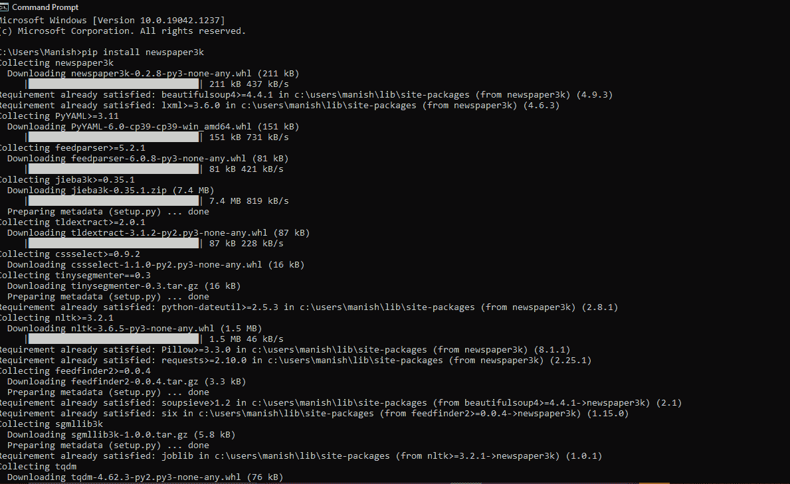
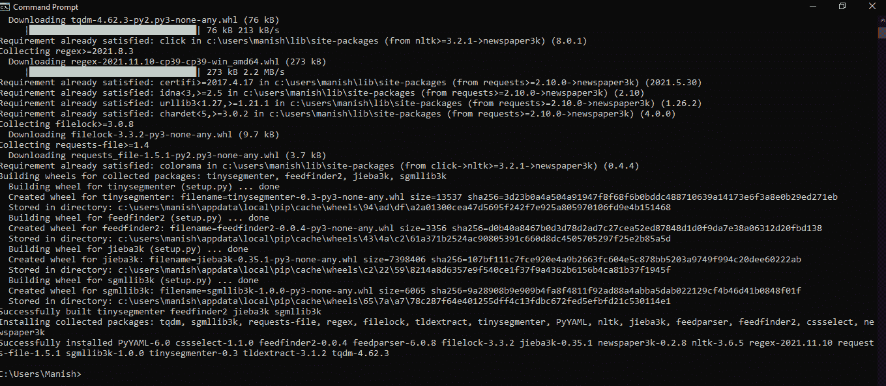
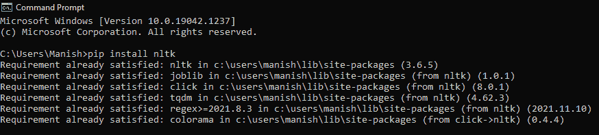

# Python `newspaper3k`模块

> 原文：<https://www.javatpoint.com/python-newspaper-module>

我们大多数人往往对阅读完整的报纸甚至一篇完整的文章不感兴趣。在这种情况下，我们只想知道文章的关键词、标题或许多这样的小东西，这样我们就不必花那么多时间阅读一篇完整的文章。当我们只想阅读精选的文章，却不知道如何为自己挑选有用的文章时，这也变得很有用。我们都必须意识到什么是网页抓取以及它是如何工作的。我们也知道网络报废有多重要，以及从一个源网站中提取所有有用的信息对我们有多大帮助。我们也可以在报纸网站上执行这一操作，从那里我们可以获取一篇文章的链接，并从该文章中提取有用的信息。我们可以通过使用 Python 程序来执行所有这些，对于这个任务，Python 为我们提供了一个非常有用的模块，即`newspaper3k`模块。在本教程中，我们将学习 Python 的`newspaper3k`模块，我们将学习如何使用该模块使用 Python 程序执行报纸报废和管理。

## Python 中的`newspaper3k`模块

Python 模块中的报纸，基本上是为了从报纸文章中精选有用的信息而设计的。因此，我们可以使用 Python 的`newspaper3k`模块，通过在 Python 程序中对文章的网络链接进行问题来对文章进行废弃和处理。我们可以从一篇文章中检索所有有用的信息，如标题、关键词等。，通过使用`newspaper3k`模块的功能。Python 的`newspaper3k`模块使用了具有网页废弃功能的高级算法，因此可以从报纸网站中提取所有有用的文本。`newspaper3k`模块在我们日常生活中通常使用的在线报纸网站上工作非常令人惊讶。

#### 注意:我们应该注意到，`newspaper3k`模块在网上报纸网站上执行网络报废流程。这就是为什么，如果我们同时从一个网站发出多个请求，可能会导致该网站的阻止。因此，每当我们实际需要使用这个模块时，我们都必须相应地使用它。

### `newspaper3k`模块:安装

`newspaper3k`模块不是 Python 中的内置模块，因此，我们必须首先在系统中安装这个模块，只有在此之后，我们才能从文章的网络链接中收集有用的信息。我们可以使用多种方法从多个来源安装这个`newspaper3k`模块，但是我们建议的方法是使用画中画安装程序。通过 pip 安装程序，我们可以在命令提示符终端使用以下命令非常容易地安装`newspaper3k`模块:

```py

pip install newspaper3k

```

一旦我们将上面给出的命令写入我们设备的终端 Shell，我们就应该按回车键开始安装过程，然后我们必须等待一段时间才能完成安装过程。一旦该`newspaper3k`模块的安装过程完成，它将在终端 Shell 中向我们显示以下安装成功消息窗口:




我们可以看到，Python 的`newspaper3k`模块已经成功安装在我们的系统中，现在，我们可以通过将其导入 Python 程序来使用`newspaper3k`模块中的功能来执行报纸报废。

### `newspaper3k`模块:支持的语言

Python 的`newspaper3k`模块支持它，这就是为什么它变得更加流行的原因，因为人们可以从他们选择的语言中删除新闻文章。**`newspaper3k`模块支持以下语言，并附带其输入代码:**

| -你好。不，不。 | 语言 | 语言的输入代码 |
| one | 阿拉伯语 | 阿肯色州 |
| Two | 中国人 | 中文 |
| three | 希腊的 | -他 |
| four | 丹麦的 | 这 |
| five | 意大利的 | 它 |
| six | 德国人 | 需要（demand 的缩写） |
| seven | ...还有更多 | .... |

当我们在程序中为一篇文章的网络链接创建一个实例时，我们必须提供一种语言的输入代码。我们在程序中提供的语言代码将帮助`newspaper3k`模块执行并使用其特定语言的特定算法集来从文章中抓取和精选。

### `newspaper3k`模块:实施

我们已经在系统中安装了`newspaper3k`模块，现在我们都想执行它的实现，这样我们就可以理解这个模块是如何工作的。`newspaper3k`模块的实现也将帮助我们学习如何从文章中挑选多个关键词和有用的信息。但是，在 Python 程序中使用`newspaper3k`模块 will 之前，我们应该注意到，我们必须首先为文章链接创建一个实例。我们创建的文章实例将使用`newspaper3k`模块的功能从文章中获取所有信息。因此，首先，我们应该了解文章实例的语法以及其中使用了哪些参数。

**创建实例的语法:**

按照下面的语法，我们必须在程序中使用来为文章创建一个实例:

```py

instanceName = Article(urlOfArticle, language = "language input code according to the article's language")

```

**从上面写的语法中我们可以看到，我们使用了以下两个参数:**

1.  **文章网址:**在这里，我们必须提供文章的网络链接，我们将从这里收集文章中的有用信息。
2.  **语言:**我们要提供文章所用语言的输入代码。

我们现在已经学习了创建文章实例的语法，现在可以继续`newspaper3k`模块的实现部分了。我们将使用下面的示例程序来理解这个`newspaper3k`模块的实现。

**NLTK 模块:**NLTK 模块在进行报纸报废的时候也是非常重要的，我们要将这个模块和`newspaper3k`模块配合使用，才能成功的对一篇文章进行报纸报废。nltk 模块用于对文章的链接执行 NLP，如果不执行 NLP，我们就无法从文章中收集有用的信息。因此，在使用示例中的`newspaper3k`模块时，我们还必须使用 nltk 模块，并使用程序中的下载(' punkt ')功能下载 nltk 数据。我们还应该确保 ntlk 模块安装在我们的系统中，如果它没有安装在我们的系统中，我们可以使用以下命令来安装它:

```py

pip install nltk

```



在完成 ntlk 模块的安装过程后，我们可以继续`newspaper3k`模块的实现部分，并将其用作执行报纸报废的示例程序。

**例 1:** 看看下面的 Python 程序，我们用了一篇 TOI 的文章，用`newspaper3k`模块进行报纸报废:

```py

# Import article from the newspaper module
from newspaper import Article
# Import nltk module
import nltk
# Download ntlk data
nltk.download('punkt')
# URL of the TOI's news article
urlOfArticle = "http:// timesofindia.indiatimes.com/world/china/chinese-expert-warns-of-troops-entering-kashmir/articleshow/59516912.cms"
# Creating instance for the article
instanceOfArticle = Article(urlOfArticle, language="en") # en is for English
# Downloading the article piece from the program
instanceOfArticle.download()
# Parsing the article
instanceOfArticle.parse()
# Performing NLP on the article piece
instanceOfArticle.nlp()
# Extracting title of the article
print("Title of the article:", instanceOfArticle.title)
print("n")
# Extracting texts from the article
print("Text from the article:", instanceOfArticle.text)
print("n")
# Extract summary of the article
print("Summary of the article piece:", instanceOfArticle.summary)
print("n")
# Extracting important keywords of the article
print("Important Keywords of the article:", instanceOfArticle.keywords)
print("n")
print ("We have successfully performed scrapping from the piece of article's link given in the code!")

```

**输出:**


我们已经成功地从代码中给出的文章链接中执行了报废！

**说明:**

我们首先从程序中的`newspaper3k`模块和 nltk 模块导入文章，这样我们就可以使用这两个模块的功能来执行报纸报废。之后，我们在 URL 变量中给出了一篇文章的链接(一篇 TOI 的最新文章)。然后，我们使用 article()函数初始化了文章的实例，并在其中给出了初始化后的 URL 作为参数。此外，我们还在 article()函数中提供了带有 URL 变量的语言输入代码。之后，我们使用 download()函数下载程序中的文章，然后使用 parse()函数解析文章。之后，我们在 NLP()函数的帮助下对解析后的文章片段执行自然语言处理。现在，在对解析后的文章执行 NLP 之后，我们能够打印文章中的有用信息。因此，首先，我们使用了”。title "函数打印文章的标题，然后，我们使用。文本”功能。接下来，我们使用打印文章的摘要”。总结”功能，之后，我们使用打印了文章的重要关键词。关键词”功能。

#### 注:我们应该注意到，TOI 不时删除他们的一些文章，因此，示例中给出的 TOI 的这篇文章链接在将来可能不会起作用。因此，在使用这个例子时，我们必须使用另一篇文章的新链接。

### `newspaper3k`模块:一些有用的功能

当我们使用`newspaper3k`模块执行文章链接的废弃时，我们使用了一些重要的功能来成功完成该任务。这些功能对于执行报纸报废和处理以及在输出中打印重要信息非常有用。在本节中，我们将了解`newspaper3k`模块的重要功能，如下所示:

| 不，先生 | 函数名 | 功能正常工作 |
| one | 第()条 | 首先，我们必须创建一个文章实例，以便从示例中给出的文章链接中收集任何有用的信息，我们可以使用 article()函数来创建一个。 |
| Two | 下载() | 借助下载()函数，我们可以下载我们在程序中提供的网址的文章。 |
| three | 解析() | 下载文章后，我们必须解析文章，我们可以使用 parse()函数来实现。 |
| four | nlp() | 在从文章中收集任何有用的信息之前，我们还必须对解析后的文章执行 nlp，我们可以使用 NLP()函数来做到这一点。 |
| five | 实例名称.title | 它用来打印文章的标题。 |
| six | instance name . text-执行处理名称.文字 | 如果我们想打印文章的文本，我们可以使用这个函数。 |
| seven | instanceName .关键字 | 这个函数非常有用，因为它打印了文章中所有重要的关键词。 |
| eight | instanceName.summary | 如果我们想打印文章的摘要，可以使用这个功能。 |

这些都是`newspaper3k`模块的重要功能，我们可以根据自己选择的信息类型(如关键词、标题等)来使用。)我们想从文章中。

## 结论

我们不可能都阅读完整的报纸，因此，我们只想从文章中获得有用的信息。`newspaper3k`模块为我们提供了一个选项，我们只能通过对文章执行报纸报废来获取文章的有用信息。我们可以在 Python 程序中使用`newspaper3k`模块的功能来执行报纸报废，并在输出中打印来自文章链接的所有有用信息。

* * *