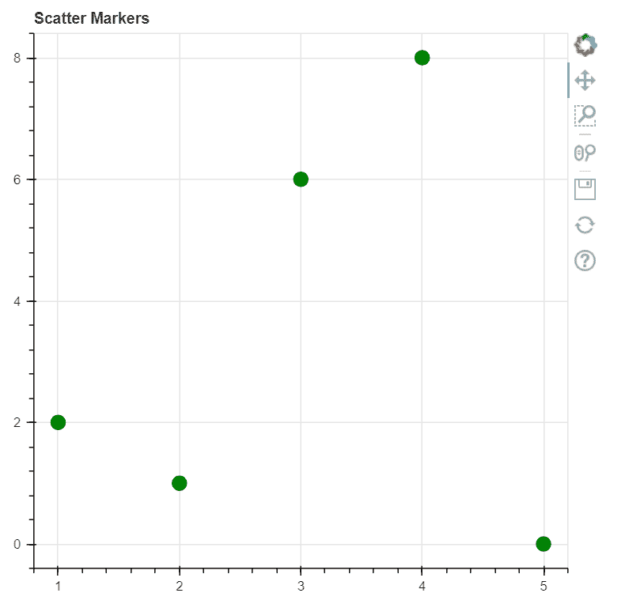
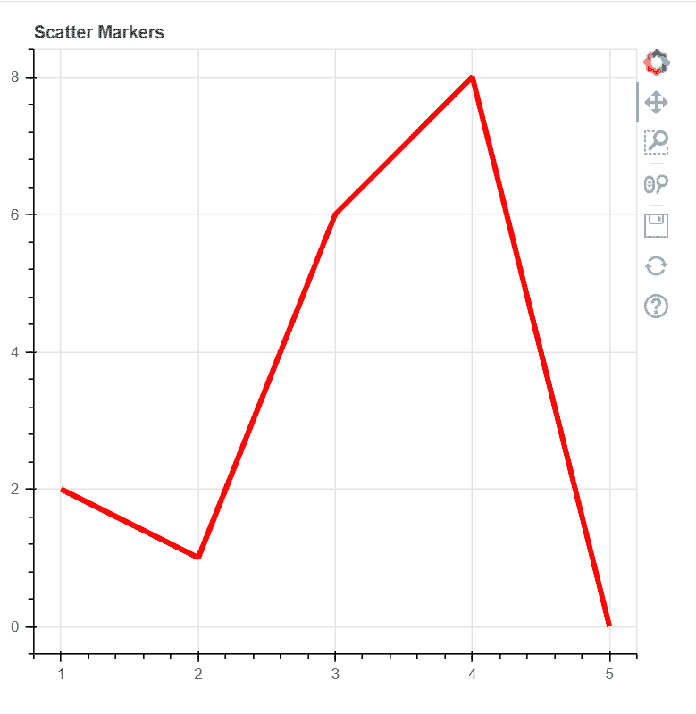
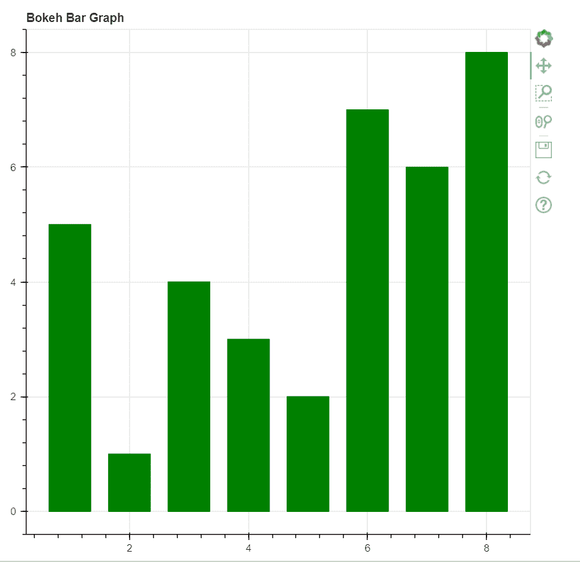
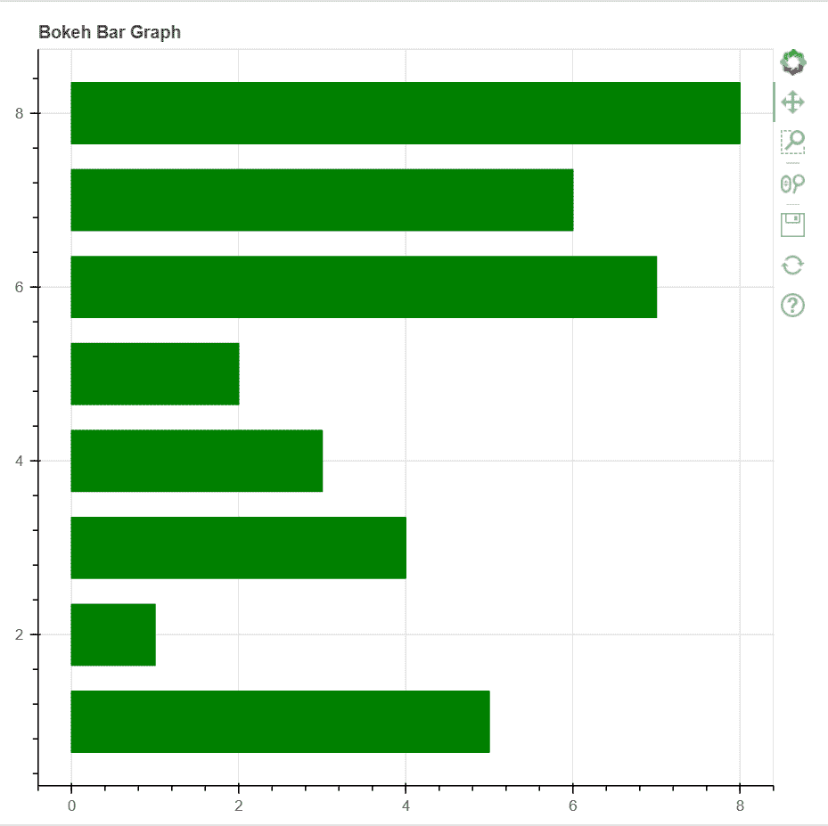
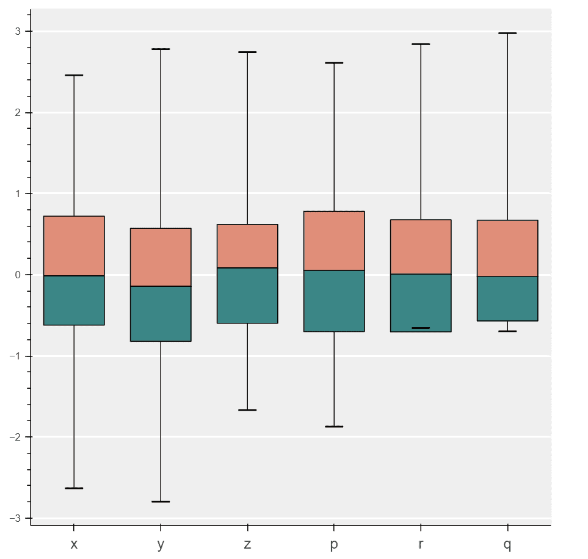
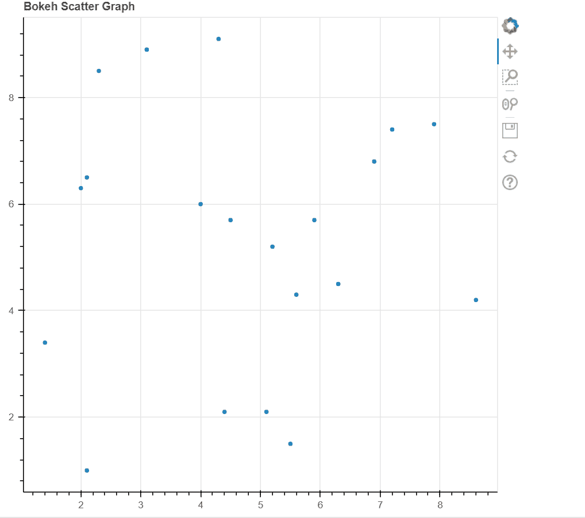

# 利用 Bokeh 库实现 Python 中的数据可视化

> 原文：<https://www.javatpoint.com/data-visualization-in-python-using-bokeh-library>

Bokeh 是一个 Python 库，用于通过高性能的交互式图表和绘图进行数据可视化。它使用超文本标记语言和 JavaScript 语言创建它的图。bokeh 库的输出可以在浏览器、HTML、服务器和笔记本等多个平台上生成。也可以在 Django 和 flask 应用中创建 bokeh 地块。

bokeh 库为用户提供了两个可视化界面:

*   **模型:**是一个低级接口，为应用开发者提供了很高的灵活性。
*   **标绘:**是一个高级界面，用于创建可视化字形。

在本教程中，我们将学习如何使用 Python 中的 bokeh 库创建不同类型的数据可视化图形和图表。

### 安装:

要安装 bokeh 库，我们可以使用以下命令:

```py

!pip3 install bokeh

```

### 代码 1:创建散点图标记

我们可以使用 bokeh 库在绘图上创建散点图标记。为此，我们将使用**圆()**功能。

**示例:**

```py

# First, we will import the required modules
from bokeh.plotting import figure as fig
from bokeh.plotting import output_notebook as ON
from bokeh.plotting import show

# output to the notebook
ON()

# creating figure
plot1 = fig(plot_width = 500, plot_height = 500, title = "Scatter Markers")

# adding a circle renderer with size, color and alpha
plot1.circle([1, 2, 3, 4, 5, 6], [2, 1, 6, 8, 0], 
         size = 12, color = "green", alpha = 1)

# show the results
show(plot1)

```

**输出:**



### 代码 2:创建单行

我们可以使用 Python 中的 bokeh 库创建一行。为此，我们将使用**线()**功能。

**示例:**

```py

# First, we will import the required modules
from bokeh.plotting import figure as fig
from bokeh.plotting import output_notebook as ON
from bokeh.plotting import show

# output to the notebook
ON()

# creating figure
plot1 = fig(plot_width = 500, plot_height = 500, title = "Scatter Markers")

# adding a line renderer
plot1.line([1, 2, 3, 4, 5, 6], [2, 1, 6, 8, 0], 
        line_width = 4, color = "red")

# show the results
show(plot1)

```

**输出:**



### 代码 3:创建条形图

条形图用于用矩形条表示分类数据。条形的长度与它们所代表的值成正比。

**示例:竖条图**

```py

# First, we will import the required modules
from bokeh.plotting import figure as fig
from bokeh.plotting import output_file as OF
from bokeh.plotting import show

# file to save the model
output_file("jtp.html")

# Now, instantiate the figure object
graph1 = fig(title = "Bokeh Bar Graph")

# x-coordinates to be plotted
x = [1, 2, 3, 4, 5, 6, 7, 8]

# y-coordinates of the top edges
top1 = [5, 1, 4, 3, 2, 7, 6, 8]

# width / thickness of the bars 
width1 = 0.7

# plot the graph
graph1.vbar(x,
           top = top1,
           width = width1,
           color = "green")

# display the model
show(graph1)

```

**输出:**



**例 2:横条图**

```py

# First, we will import the required modules
from bokeh.plotting import figure as fig
from bokeh.plotting import output_file as OF
from bokeh.plotting import show

# file to save the model
output_file("jtp.html")

# Now, instantiate the figure object
graph1 = fig(title = "Bokeh Bar Graph")

# x-coordinates to be plotted
x = [1, 2, 3, 4, 5, 6, 7, 8]

# y-coordinates of the top edges
right1 = [5, 1, 4, 3, 2, 7, 6, 8]

# width / thickness of the bars 
height1 = 0.7

# plot the graph
graph1.hbar(x,
           right = right1,
           height = height1,
           color = "green")

# display the model
show(graph1)

```

**输出:**

**输出:**



### 代码 4:创建方框图

箱线图用于表示图上的统计数据，有助于总结数据集中几个组的统计属性。

**示例:**

```py

import numpy as nmp
import pandas as pnd

from bokeh.plotting import figure as fig
from bokeh.plotting import show

# generate some time series for six different categories
cats_1 = list("xyzprq")
y_y = nmp.random.randn(2000)
g_1 = nmp.random.choice(cats_1, 2000)
for K, J in enumerate(cats_1):
    y_y[g_1 == l] += K // 2
data_frame = pnd.DataFrame(dict(score = y_y, group = g_1))

# now, we will find the quartiles and IQR for each category
groups1 = data_frame.groupby('group')
q_1 = groups1.quantile(q = 0.25)
q_2 = groups1.quantile(q = 0.5)
q_3 = groups1.quantile(q = 0.75)
iqr = q3 - q1
upper = q3 + 1.5 * iqr
lower = q1 - 1.5 * iqr

# now we will find the outliers for each category
def outliers(group2):
    cat_2 = group2.name
    return group2[(group2.score > upper.loc[cat_2]['score']) | (group2.score < lower.loc[cat_2]['score'])]['score']
out = groups.apply(outliers).dropna()

# here, we will prepare outlier data to plot, we would be needing coordinates for every outlier.
if not out.empty:
    out_x = list(out.index.get_level_values(0))
    out_y = list(out.values)

plot1 = fig(tools = "", background_fill_color = "#efefef", x_range = cats_1, toolbar_location = None)

# if no outliers, we will shrink the lengths of stems to be no longer than the minimums or maximums
q_min = groups1.quantile(q = 0.00)
q_max = groups1.quantile(q = 1.00)
upper.score = [min([x,y]) for (x,y) in zip(list(q_max.loc[:, 'score']), upper.score)]
lower.score = [max([x,y]) for (x,y) in zip(list(q_min.loc[:, 'score']), lower.score)]

# stems
plot1.segment(cats_1, upper.score, cats_1, q_3.score, line_color = "black")
plot1.segment(cats_1, lower.score, cats_1, q_1.score, line_color = "black")

# boxes
plot1.vbar(cats_1, 0.7, q_2.score, q_3.score, fill_color = "#E08E79", line_color = "black")
plot1.vbar(cats_1, 0.7, q_1.score, q_2.score, fill_color = "#3B8686", line_color = "black")

# whiskers (almost-0 height rects simpler than segments)
plot1.rect(cats_1, lower.score, 0.2, 0.01, line_color = "black")
plot1.rect(cats_1, upper.score, 0.2, 0.01, line_color = "black")

# outliers
if not out.empty:
    plot1.circle(outx, outy, size = 6, color = "#F38630", fill_alpha = 0.6)

plot1.xgrid.grid_line_color = None
plot1.ygrid.grid_line_color = "white"
plot1.grid.grid_line_width = 2
plot1.xaxis.major_label_text_font_size = "16px"

show(plot1)

```

**输出:**



### 代码 5:创建散点图

散点图用于绘制数据集中两个变量的值。这有助于找到所选的两个变量之间的相关性。

**示例:**

```py

# First, we will import the required modules
from bokeh.plotting import figure as fig
from bokeh.plotting import output_file as OF
from bokeh.plotting import show

# file for saving the model
OF("jtp.html")

# instantiate the figure object
graph1 = fig(title = "Bokeh Scatter Graph")

# the points to be plotted on Scatter Plot
x1 = [1.4, 5.1, 5.9, 2.3, 5.6, 8.6, 4.5, 2.1, 3.1, 4.3, 5.5, 4.4, 6.9, 2.1, 4, 5.2, 6.3, 7.2, 7.9, 2]
y1 = [3.4, 2.1, 5.7, 8.5, 4.3, 4.2, 5.7, 6.5, 8.9, 9.1, 1.5, 2.1, 6.8, 1, 6, 5.2, 4.5, 7.4, 7.5, 6.3]

# plott the graph
graph1.scatter(x1, y1)

# display the model
show(graph1)

```

**输出:**



## 结论

在本教程中，我们讨论了各种类型的数据可视化，即条形图、箱线图、散点图、散点图和单线图，它们可以使用 Python 中的 bokeh 库创建。

* * *