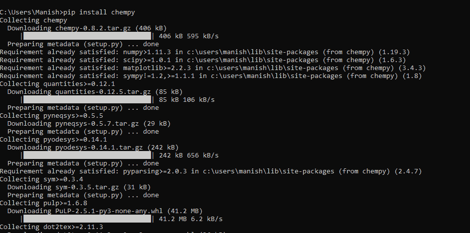

# Python ChemPy 模块

> 原文：<https://www.javatpoint.com/python-chempy-module>

在学习 Python 及其基础知识的同时，想必大家都听说过，Python 是最受欢迎的编程语言之一，市场对 Python 的需求与日俱增。描述其背后的原因也不是很难，但正如我们大多数人读到的那样，Python 很容易学习和理解，这就是它如此受欢迎的原因。这在某种程度上是正确的，但不完全正确，因为还有其他主要原因，这些原因是 Python 日益流行和需求增加的背后原因。最重要的原因是 Python 有一个非常丰富的库，其中有很多在多个领域非常有用的包，如 ML(机器学习)、机器人开发、AI(人工智能)、数据科学、数据分析等。除此之外，Python 还为多个主题提供了多个解决方案包，如物理模块、化学模块、统计模块等。Python 提供的重要解决方案包之一是旨在解决无机和物理化学问题的 ChemPy 模块。在本教程中，我们将学习 Python 的这个 ChemPy 模块，并了解它的应用、实现和安装。

## Python 的化学复制模块介绍

ChemPy 模块是一个 Python 包，主要用于解决无机、物理和分析化学问题。ChemPy 模块是一个开源免费的 Python 包，在材料科学、化学工程、化学等领域都有应用。ChemPy 模块基本上是为了在 Python 程序的帮助下解决所有与化学和相关化学领域相关的问题而设计的。

这个包包括许多类，用来代表不同类型的反应、反应系统和物质。ChemPy 模块还包括化学动力学中常见的一些微分方程的解析解，它还拥有物理和分析化学中所有成熟的公式，这些公式帮助我们找到许多重要的值。

### Python 中的化学复制模块:应用

ChemPy 模块在材料科学等化学的各个领域和相关领域有多种应用。ChemPy 模块为我们提供了广泛的类和函数，在计算离子强度、化学平衡等重要值时非常有用。这个模块的类也代表反应、系统反应、物质，因此我们可以通过 Python 程序来实现它们。除了这些应用，chempy 模块还有许多其他与化学及其相关领域问题相关的应用，我们将在本节中讨论。

**以下是在 Python 程序中使用 ChemPy 模块的一些一般应用:**

*   我们可以通过 Python 程序使用 chempy 模块来平衡化学反应
*   我们可以使用 chempy 模块中的多个公式来计算多个化学和分析值，如道德、摩尔浓度等
*   我们可以利用这个模块的功能来维持化学反应的化学平衡
*   我们可以使用 chempy 模块的类来识别物质，并在程序中维护反应系统
*   我们还可以使用 chempy 模块的功能，通过应用以下公式来计算离子或分子的离子强度
*   ChemPy 模块还为我们提供了可用作解析公式函数
*   我们可以使用 chempy 模块打印元素周期表中具有原子质量、电荷等属性的元素
*   我们还可以使用 Python 程序中 chempy 模块的函数来计算化学动力学，例如给定化学反应的反应顺序

这些是 Python ChemPy 模块的一些通用应用，它还有许多其他应用。通过将这个模块导入到程序中，我们可以通过 Python 程序实现 chempy 的所有应用。

### Python 中的化学复制模块:安装

ChemPy 不是 Python 的内置模块，因此首先，我们必须在系统中安装这个模块，然后再将其导入 Python 程序。在开始使用 chempy 模块之前，我们应该确保它存在并成功安装在我们的系统中。如果我们的系统中没有 chempy 模块，我们可以使用多种方式和方法来安装 chempy 模块，但是在本教程中，我们将通过 pip 安装程序安装 chempy 模块。我们将使用 pip 命令，使用 pip 安装程序通过系统的命令提示终端安装 chempy 模块。以下 pip 命令，我们将使用它通过 pip 安装程序安装 chempy 模块:

```py

pip install chempy

```

一旦我们在终端内部编写了上面给出的命令，我们就必须按回车键给出 pip 安装程序命令来开始安装过程。一旦安装过程开始，将需要一段时间才能在我们的系统中成功安装该模块，因此，我们必须等待一段时间。



如我们所见，chempy 模块已成功安装在我们的系统中，现在我们可以开始使用它来了解其实现和应用。

### Python 中的化学复制模块:实现

现在，随着 chempy 模块的实现，我们可以使用它的应用和功能来执行许多化学分析，并通过 Python 程序解决许多化学问题。但是在本教程中，我们将只使用 chempy 模块的以下两个应用，并了解该模块的实现:

1.  从元素周期表中得到“N”个元素
2.  得到给定化学物质的性质和公式

我们将在上面列出的每个应用中使用 Python 程序，并在输出中打印所需的结果，以了解 chempy 模块的实现。

### 应用 1:从元素周期表中获得“N”个元素:

我们可以得到所需数量的元素及其性质，如原子质量、符号等。，在输出中使用程序中 chempy 模块的周期表函数。我们将通过下面的示例程序来理解这个应用的实现和使用，其中我们将在输出中打印‘n’个元素及其属性。

**例 1:**

请看下面的程序，我们在输出中打印了元素周期表中的元素:

```py

# Importing the chempy module
from chempy.util import periodic as prd
# Number of elements from user
num = int(input("Enter number of elements which you want to fetch from periodic table: "))
print("Printing", num, "elements from the periodic table")
# Displaying the periodic element information
print("Atomic No.\tName\t\tSymbol\t\tMass")
# Using for loop to loop over periodic table
for a in range(1, num + 1):
	# Printing the atomic number of elements
	print(a, end = "\t\t")
	# Displaying the names of elements
	if len(prd.names[a]) > 7:
		print(prd.names[a], end = "\t")
	else:
		print(prd.names[a], end = "\t\t")
	# Printing the element symbol
	print(prd.symbols[a], end = "\t\t")

	# Displaying the atomic mass of element
	print(prd.relative_atomic_masses[a])
print("Result for periodic elements is printed according to number you provided")

```

**输出:**

```py
Enter number of elements which you want to fetch from periodic table: 24
Printing 24 elements from the periodic table

Atomic No.	Name		Symbol		Mass
1		Helium		He		4.002602
2		Lithium		Li		6.94
3		Beryllium	Be		9.0121831
4		Boron		B		10.81
5		Carbon		C		12.011
6		Nitrogen	N		14.007
7		Oxygen		O		15.999
8		Fluorine	F		18.998403163
9		Neon		Ne		20.1797
10		Sodium		Na		22.98976928
11		Magnesium	Mg		24.305
12		Aluminium	Al		26.9815385
13		Silicon		Si		28.085
14		Phosphorus	P		30.973761998
15		Sulphur		S		32.06
16		Chlorine	Cl		35.45
17		Argon		Ar		39.948
18		Potassium	K		39.0983
19		Calcium		Ca		40.078
20		Scandium	Sc		44.955908
21		Titanium	Ti		47.867
22		Vanadium	V		50.9415
23		Chromium	Cr		51.9961
24		Manganese	Mn		54.938044

Result for periodic elements is printed according to the number you provided

```

如我们所见，输出中会打印出所需元素数量及其原子质量和符号的列表。

**说明:**

我们首先从程序的 chempy 模块中导入周期函数作为“prd”。之后，我们初始化了‘num’变量，在这里我们接受用户输入的值，然后我们将打印‘num’数量的元素。之后，我们使用 `for`循环在周期函数上循环，以在输出中打印所需数量的函数。我们使用 name[a]函数打印元素名称，符号[a]打印元素符号，相对原子质量[a]打印它们的原子路径。我们使用 `for`循环直到' num '的次数，然后在输出中打印列表。

### 应用 2:获取给定化学物质的性质和配方:

我们可以打印一种物质的化学和一般性质，比如它的配方、html 名称等。，方法是使用 chempy 模块的实质功能。利用物质函数，我们还可以用现有的公式验证给定物质的公式。我们将通过以下示例程序了解该应用的实现和使用:

**例 2:**

请看下面的 Python 程序，我们在其中对铁氰化物使用了 chempy 的物质函数:

```py

# Import the chempy module
from chempy import Substance as sst
# Defining chemical formula for Ferricyanide
elemtentFerriCyanide = sst.from_formula('Fe(CN)6-3')
# Checking if the chemical formula provided is right
if elemtentFerriCyanide.composition == {0: -3, 26: 1, 6: 6, 7: 6}:
        print("Yes formula for Ferricyanide given in the program is right")
# Printing chemical formula for Ferricyanide
print("Chemical formula for Ferricyanide:", elemtentFerriCyanide.unicode_name)
# Printing chemical formula for Ferricyanide in latex form
print("Chemical formula for Ferricyanide in latex name form:", elemtentFerriCyanide.latex_name)
# Printing chemical formula for Ferricyanide in html form
print("Chemical formula for Ferricyanide in html name form:", elemtentFerriCyanide.html_name)
# Printing total mass of Ferricyanide
print("Atomic mass of Ferricyanide compound:", '%.3f' % elemtentFerriCyanide.mass)

```

**输出:**

```py
Yes formula for Ferricyanide given in the program is right
Chemical formula for Ferricyanide: Fe(CN)₆³?
Chemical formula for Ferricyanide in latex name form: Fe(CN)_{6}^{3-}
Chemical formula for Ferricyanide in html name form: Fe(CN)<sub>6</sub><sup>3-</sup>
Atomic mass of Ferricyanide compound: 211.955

```

如我们所见，我们使用 chempy 模块的物质功能在输出中打印了铁氰化物的多种属性。

**说明:**

我们已经从程序的 chempy 模块中导入了物质作为 sst。之后，我们通过从库中获取铁氰化物的公式来初始化铁氰化物的变量。然后，我们使用 `if`语句来验证给定变量的公式是否是铁氰化物的化学公式。之后，我们根据 chempy 库打印了该物质的 Unicode、latex 和 html 名称，最后，我们在输出中打印了该物质的质量。

* * *