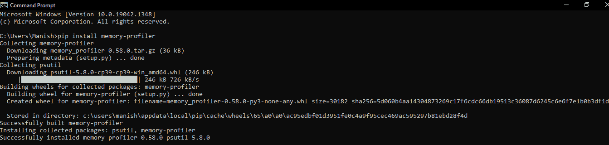
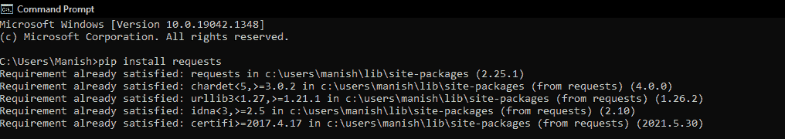

# Python 内存分析器模块

> 原文：<https://www.javatpoint.com/python-memory-profiler-module>

我们都可能听说过应用程序处理速度慢或执行速度慢，但我们有没有试图理解其背后的原因？应用程序花时间处理或执行我们的命令是有原因的，但是内存使用情况如何呢？系统的内存对于应用程序的处理和执行时间非常重要，但实际上没有人谈论它。执行或处理命令时使用了多少内存也会影响应用程序的执行速度。对我们来说，这可能听起来很荒谬或微不足道，但它在我们的系统和安装在其中的应用程序的性能中起着非常重要的作用。因此，与内存较多的应用程序相比，内存较少的应用程序执行时间较长是很常见的。

同样的事情在执行程序时也适用，这就是为什么在执行程序时查看使用了多少内存非常重要。这将帮助我们管理内存使用或以更好的方式设计程序，并记住内存使用。但是现在，一些问题会浮现在我们的脑海中，比如我们如何做到这一点，跟踪程序的内存使用情况，或者找出程序的哪些功能使用了更多的内存，使其执行速度变慢？我们在 Python 中有一个内存分析模块，它帮助我们跟踪程序及其函数的内存使用情况。在本教程中，我们将学习 Python 内存分析器模块，我们将学习如何在执行程序时使用该模块来跟踪与分发一起使用的内存。

## Python 内存剖析器模块介绍

内存分析器是一个开源的 Python 模块，它为我们提供了在程序执行时跟踪程序内存消耗的功能，我们甚至可以通过程序中的逐行分析和程序的函数来监控内存消耗。内存分析器模块还帮助我们分析 Python 的性能，以及其执行过程中内存消耗对性能和执行速度的影响。在这里，我们将借助示例程序讨论内存分析器模块的安装和实现，但首先，我们将了解该模块的优势和特性。

### Python 内存剖析器模块:优势和特点

我们中的大多数人可能已经看到许多人抱怨 Python 与其他语言相比是一种缓慢的编程语言，执行一个程序或应用程序需要更多的时间。如果我们问他们使用什么方法来计算执行速度，我们会得到的第一个答案是 Python 执行代码或部分代码或类似的东西所花费的总时间。但是我们会看到，他们都不会在执行代码的特定部分时谈论使用情况或使用了多少内存。关于程序的执行速度，这看起来似乎是非常无关紧要的信息，但实际上，这非常重要，它会影响 Python 执行程序的速度。因此，分析程序执行过程中的内存使用情况也同样重要，因为 Python 的内存分析器模块，这成为可能。Python 内存分析器模块在监控和分析程序执行过程中的内存使用方面具有以下特点和优势:

*   这个模块帮助我们跟踪 Python 程序在执行过程中的内存使用情况，这样我们就可以知道性能和速度背后的原因
*   我们甚至可以在内存分析器模块的帮助下跟踪程序特定部分的内存使用情况
*   我们甚至可以在程序执行时逐行监控它对内存的消耗

这些是使用内存分析器模块的一些优点，它也有助于我们提高 Python 的性能。

### Python 的内存分析器模块:安装

Python 的 memory-profiler Module 并不是一个内置的模块，这就是为什么如果我们想要了解它的实现并在开发过程中使用它，我们必须在我们的系统中安装这个模块，或者确保这个模块在我们的系统中正确安装。如果内存分析器不在我们的系统中，我们可以通过各种方法安装它，但是我们可以选择的最简单的方法是通过 pip 安装程序安装它。因此，在本安装部分，我们将使用以下命令通过 pip 安装程序安装内存分析器模块:

```py

pip install memory-profiler

```

首先，我们必须在命令提示符终端外壳中写入上面给出的命令，然后，我们必须按“enter”键开始安装过程。一旦安装过程开始，将需要一些时间，我们必须等到它成功安装到我们的系统中。



正如我们所看到的，内存分析器已经成功地安装在我们的系统中，现在我们可以进一步实现它，我们甚至可以将这个模块用于开发目的。

#### 注意:在本教程的实现部分，我们将在一个示例程序中使用带有内存分析器模块的请求模块，以了解通过内存分析器模块进行内存跟踪和分析的实际实现和使用。因此，在我们继续执行实现部分之前，我们应该确保请求模块存在于我们的系统中，如果它不存在于我们的系统中，我们可以使用终端中的以下 pip 命令从 pip 安装程序安装它:

```py

pip install requests

```



正如我们所看到的，请求模块已经存在于我们的系统中，这就是为什么一个已经满足的需求消息会显示给我们。

### Python 的内存分析器模块:实现

我们将在这里使用两个例子来理解内存分析器模块的实现，当结果显示在输出中时，我们将分析程序中的内存使用情况。让我们看一下下面两个示例程序，以了解内存分析器模块的实现:

### 实现 1:从默认函数分析内存使用情况:

在这个实现部分，我们将在示例程序中创建一个默认函数，并在其中定义一些变量，之后，我们将对这些变量执行一些操作。然后，当结果显示在输出中时，我们将分析程序每行的内存使用情况。让我们看下面的示例程序来理解内存分析器模块的这个实现部分。

**例 1:**

```py

# Importing memory-profiler module in the program
from memory_profiler import profile
# Profile Decorator class
@profile
# A default function to check memory usage
def defFunc():
    # Some random variables
    var1 = [1] * (6 ** 4)
    var2 = [1] * (2 ** 3)
    var3 = [2] * (4 * 6 ** 3)
    # Operations on variable
    del var3
    del var1
    return var2
if __name__ == '__main__':
    # Calling default function
    defFunc()
# Print confirmation message
print("We have successfully inspected memory usage from the default function!")

```

**输出:**

```py
Filename: C:\Users\Manish\memoryexample.py

Line #    Mem usage    Increment    Occurences    Line Contents
============================================================
  4      40.2 MiB      40.2 MiB     1            @profile
  5                                              # a default function to check memory usage
  6                                                  def defFunc():
  7                                              # Some random variables
  8      40.2 MiB      0.0 MiB      1            var1 = [1] * (6 ** 4)
  9      40.2 MiB      0.0 MiB      1            var2 = [1] * (2 ** 3)
  10     40.2 MiB      0.0 MiB      1            var3 = [2] * (4 * 6 ** 3)
  11                                             # Operations on variable
  12     40.2 MiB      0.0 MiB      1            del var3
  13     40.2 MiB      0.0 MiB      1            del var1
  14     40.2 MiB      0.0 MiB      1            return var2
We have successfully inspected memory usage from the default functi

```

正如我们所看到的，程序每一行的内存使用情况都显示在最后一行的确认语句中。

**说明:**

我们首先从程序中的内存剖析器模块导入了概要文件装饰器类。之后，我们使用了概要文件装饰器，然后定义了一个名为“defFunc”的默认函数在这个默认函数中，我们定义了三个变量，然后删除了第一个和第三个变量，并从函数中返回第二个变量。然后，我们调用了默认函数，之后，我们使用了像确认消息这样的打印语句。

在上面示例的输出中，我们可以看到多个列，这些列表示下面定义的多个属性:

1.  **行号:**此列表示显示内存使用情况的程序的行号
2.  **内存使用:**此列表示在整个执行过程中，直到特定代码行为止所使用的内存或 RAM
3.  **增量:**此列显示当前行内存使用与前一行代码相比的差异，或者我们可以看到它基本显示
4.  **出现次数:**该行显示针对该特定行号的行代码执行的次数
5.  **行内容:**它表示在该特定行中编写的 Python 代码

因此，这就是我们如何理解 Python 程序甚至程序中特定行的内存使用分析，以便我们知道这个函数或代码行是如何影响性能和执行时间的。

### 实现 2:分析执行过程中的内存使用情况:

这个实现部分将涵盖内存分析器模块的实际实现，用于监控和分析 Python 程序的内存使用情况。在这个实现部分，首先，我们将创建一个 Python 文件，其中包含以下示例程序:

**例 2:**

```py

# Import memory_profiler module
from memory_profiler import profile
# Importing request module in the program
import requests
# Creating a base extractor class
class baseExtr:
	# Using profile decorator for monitoring memory usage
	@profile
	# Default function for parsing words from list
	def parseList(self, array):
		# Creating a file type object in the system
		sampleFile = open('wordParsing.txt', 'w')
		# Looping over the file with for loop
		for parsedWords in array:
			# Writing words in the example file
			sampleFile.writelines(parsedWords)
	@profile
	# Another default function for fetching URL
	def parseURL(self, url):
		# Fetching response from the file
		response = requests.get(url).text
		with open('url.txt', 'w') as sampleFile:
			# Writing fetched responses in the example file
			sampleFile.writelines(response)

```

写完上面给出的程序后，我们将保存名称为【内存示例】的文件**，现在我们将创建另一个文件，我们将在其中导入该文件并在其中编写以下 Python 程序:**

```py

# Import baseExtr class from memoryexample file
from memoryexample import baseExtr
if __name__ == "__main__":
	# Git URL for importing word list
	url = 'https://raw.githubusercontent.com/dwyl/english-words/master/words.txt'
	# Array for word from text file 
	array = ['five', 'four', 'three', 'two', 'one']
	# Initializing Extractor object from baseExtr() class
	wordExtract = baseExtr()
	# Calling parseURL() function from baseExtr class
	wordExtract.parseURL(url)
	# Calling out pasreList() function
	wordExtract.parseList(array)

```

现在，我们已经完成了程序编写部分，当我们运行第二个文件时，我们将看到以下**输出:**

```py
Filename: C:\Users\Manish\memoryexample.py

Line #    Mem usage    Increment    Occurences    Line Contents
============================================================
  17     44.6 MiB     44.6 MiB           1   	@profile
  18                                            def parseURL(self, url):
  19                                            # fetches the response
  20     51.9 MiB      7.3 MiB           1   	response = requests.get(url).text
  21     51.9 MiB      0.0 MiB           1   	with open('url.txt', 'w') as sampleFile:
  22                                         			
  23                                            # writing response to file
  24     52.5 MiB      0.6 MiB           1   	sampleFile.writelines(response)

Filename: C:\Users\Manish\memoryexample.py

Line #    Mem usage    Increment    Occurences    Line Contents
============================================================
  8      47.9 MiB      47.9 MiB       1   	     @profile
  9                                            # Default function for parsing words from list
  10                                         	 def parseList(self, array):
  11                                           # Creating a file type object
  12     47.9 MiB      0.0 MiB       1   	     sampleFile = open('wordParsing.txt', 'w')
  13                                           # looping over the file
  14     47.9 MiB      0.0 MiB       6   	     for parsedWords in array:
  15                                           # Writing words in the example file
  16     47.9 MiB      0.0 MiB       5   	     sampleFile.writelines(parsedWords)

[Finished in 27.1s]

```

我们可以看到执行过程中的总内存使用情况，输出中显示了从文件和 URL 中提取单词的过程。这就是我们如何分析和理解程序的内存使用情况，以及它如何影响程序的性能和执行速度。

* * *