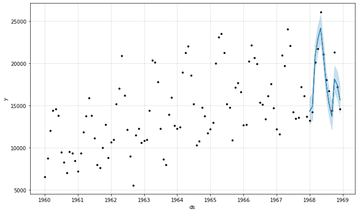

# Python 中带先知的时间序列预测

> 原文：<https://www.javatpoint.com/time-series-forecasting-with-prophet-in-python>

时间序列预测被认为是一项具有挑战性的任务，因为我们可以利用各种方法，每种方法都有各种超参数。

先知库是一个开源库，旨在对时间序列的单变量数据集进行预测。它易于使用和开发，可以自动为模型找到一组好的超参数，以便默认情况下借助趋势和季节结构对数据进行熟练的预测。

在下面的教程中，我们将讨论使用脸书先知图书馆来预测时间序列。

在整个教程中，我们将学习:

1.  先知是由脸书开发的一个开源库，旨在自动预测单变量时间序列数据。
2.  如何拟合先知模型并利用它们来进行样本内和样本外预测？
3.  如何在搁置的数据集上评估先知模型？

所以，让我们开始吧。

## 理解先知预言库

预言家，也被称为“脸书预言家”，是脸书设计的一个预测单变量(单变量)时间序列的开源库。

Prophet 实现了他们所称的可加性时间序列预测模型，该实现支持季节性、趋势和节假日。

根据先知包的文件，它实现了一个程序，根据一个加法模型预测时间序列数据，其中非线性趋势符合每日、每周、每年的季节性，以及假期的影响。

它被设计成易于使用和完全自动的。例如，将它指向一个时间序列并得到一个预测。它旨在用于公司内部利用，如预测销售、产能等。

预言家库提供了两个接口，涉及 Python 和 r .本教程我们将主要关注 Python 接口。

第一步是在画中画安装程序的帮助下安装先知库。

## 如何安装 Python 先知库？

为了安装 Python 模块，我们需要“ **pip** ”，这是一个管理从可信公共存储库中安装模块所需的包的框架。一旦我们有了“ **pip** ”，我们就可以使用来自 Windows 命令提示符(CMD)或终端的命令安装**先知**库，如下所示:

**语法:**

```py

$ python.exe -m pip install fbprophet

```

### 验证安装

一旦模块安装完成，我们可以通过创建一个空的 Python 程序文件并编写一个 **import** 语句来验证它，如下所示:

**文件:验证. py**

```py

# importing the library
import fbprophet
# printing the version number
print("Prophet %s" %fbprophet.__version__)

```

现在，保存上述文件，并在终端中使用以下命令执行它:

**语法:**

```py

$ python verify.py

```

**输出:**

```py
Prophet 0.7.1

```

如果上述 Python 程序文件没有引发任何异常并返回安装程序版本号，则说明先知库安装正确。但是，在引发异常的情况下，请尝试重新安装库，并且还建议参考库的官方文档。

## 了解先知图书馆的工作

现在让我们使用汽车月销量数据集来了解 Python 先知库的工作原理。

该数据集是一个标准的单变量时间序列数据集，由趋势和季节性组成。数据集包含 108 个月的数据，天真的持久性预测可以实现大约 3，235 次销售的平均绝对误差，提供了较低的误差限制。

让我们从加载和总结数据集开始

### 加载和汇总数据集

先知需要以Pandas数据帧的形式存储数据。因此，我们将在Pandas图书馆的帮助下加载和总结数据。

我们可以通过调用 Pandas **read_csv()** 函数，汇总数据的形状(行数和列数)，查看数据的前几行，直接从 URL 加载数据。

让我们考虑下面的例子来证明这一点:

**示例:**

```py

# importing the required function
from pandas import read_csv
# loading the data
filepath = '/content/cars_monthly_sale.csv'
dFrame = read_csv(filepath, header = 0)
# summarizing shape
print(dFrame.shape)
# displaying the first few rows
print(dFrame.head())

```

**输出:**

```py
(108, 2)
     Month    Sales
0  1960-01   6550.0
1  1960-02   8728.0
2  1960-03  12026.0
3  1960-04  14395.0
4  1960-05  14587.0

```

**说明:**

在上面的代码片段中，我们已经从 Pandas 库中导入了 **read_csv()** 函数。然后，我们初始化了存储 CSV 文件数据的路径，并使用导入的函数读取该文件并将其转换为数据帧。然后，我们使用**形状**属性总结了数据的形状。最后，我们为用户打印了前几行数据。

因此，我们可以观察到有 108 个月的数据和两列。第一列是月份，第二列是销售数量。

#### 注意:输出中的第一列是行索引，不是数据集的一部分，只是 Pandas 用来排序行的有用工具。

### 加载和绘制数据集

在我们绘制时间序列数据集之前，它是不完整的。

绘制时间序列可以让我们显示是否有趋势、季节性周期、异常值等等。它让我们对数据有了感觉。

我们可以通过在数据帧中调用 **plot()** 函数来轻松绘制Pandas中的数据。

让我们考虑下面的例子来说明这一点:

**示例:**

```py

# importing the required modules from libraries
from pandas import read_csv
from matplotlib import pyplot
# loading the data
filepath = '/content/cars_monthly_sale.csv'
dFrame = read_csv(filepath, header = 0)
# plotting the time series
dFrame.plot()
pyplot.show()

```

**输出:**


**说明:**

在上面的代码片段中，我们从各自的库中导入了 **read_csv** 函数以及 **pyplot** 模块。然后我们初始化了 CSV 文件的路径。然后，我们使用 **read_csv** 函数读取该文件并将其转换为数据帧。然后，我们使用**绘图()**功能绘制图形，使用**显示()**功能向用户显示图形。

因此，我们可以清楚地看到一段时间内的销售趋势以及每月的销售季节性模式。这些是我们期望预测模型考虑的模式。

现在我们已经熟悉了数据集，让我们探索如何利用先知库进行预测。

## 用 Python 中的 Prophet 预测汽车销量

在下一节中，我们将讨论如何使用先知库来预测汽车销售数据集。

让我们首先在数据集上拟合一个模型。

### 拟合先知模型

为了使用预言家进行预测，我们将首先定义一个**预言家()**对象并对其进行配置。然后我们将调用 **fit()** 函数，并传递数据以使其适合数据集。

**Prophet()** 对象接受参数以根据喜好配置模型类型，如生长类型、季节性类型等。默认情况下，模型会努力自动计算出几乎所有的事情。

**fit()** 函数接受时间序列数据的数据帧。数据帧应该具有特定的格式。第一列的名称必须是“ **ds** ，由日期时间组成。第二列的名称必须是“ **y** ，并且由观察值组成。

该语句意味着我们要更改数据集中列的名称。它还希望将第一列转换为日期时间对象(如果它们还没有转换的话)。例如，这可以通过使用适当的参数将数据集加载到 **read_csv()** 函数来实现。

现在，让我们考虑下面的语法，说明我们如何修改加载的数据集，使其具有预期的结构。

**示例:**

```py

# preparing the expected column names
dFrame.columns = ['ds', 'y']
dFrame['ds']= to_datetime(dFrame['ds'])

```

**说明:**

在上面的语法中，我们更改了数据帧列的名称，使其具有预期的结构。

现在，让我们看看在汽车销售数据集上拟合先知模型的完整示例，如下所示:

**示例:**

```py

# importing the required functions and modules
from pandas import read_csv
from pandas import to_datetime
from fbprophet import Prophet
# loading the data
filepath = '/content/cars_monthly_sale.csv'
dFrame = read_csv(filepath, header = 0)
# preparing the expected names of the columns
dFrame.columns = ['ds', 'y']
dFrame['ds']= to_datetime(dFrame['ds'])
# defining the model
prophet_model = Prophet()
# fitting the model
prophet_model.fit(dFrame)

```

**输出:**

```py
INFO:fbprophet:Disabling weekly seasonality. Run prophet with weekly_seasonality=True to override this.
INFO:fbprophet:Disabling daily seasonality. Run prophet with daily_seasonality=True to override this.

```

**说明:**

我们已经导入了所需的库，并在上面的代码片段中加载了数据。然后，我们准备了列的预期名称。最后，我们定义了预测模型，并对数据集进行了拟合。

下一步是做预测。

### 进行样本内预测

这将有助于对历史数据进行预测。

我们可以对用作训练模型输入的数据进行预测。理想情况下，模型之前已经看过数据，并且会做出适当的预测。

然而，这不是场景，因为模型试图在数据中的所有情况下进行归纳。

这个过程被称为进行样本内(在训练集样本中)预测，并且检查输出可以提供对模型有多好的洞察。也就是它对训练数据的学习程度。

通过调用 **predict()** 函数并传递一个数据帧来进行预测，该数据帧由名为**‘ds’**的一列和带有预测间隔的日期时间的行组成。

有多种方法可以创建这个“**”的 _forecast** ”数据帧。例如，在数据集中的最后十二个月，为每个月创建一个字符串。在下面的例子中，我们将循环一年的日期。然后，我们将把日期列表转换成一个数据帧，并将字符串的值转换成日期时间对象。

让我们考虑下面的语法来证明这一点。

**示例:**

```py

# defining the period for which we want a prediction
future = list()
for i in range(1, 13):
    date = '1968-%02d' % i
    future.append([date])
future = DataFrame(future)
future.columns = ['ds']
future['ds'] = to_datetime( future['ds'] )

```

**说明:**

在上面的代码片段中，我们将列表定义为**未来**。然后我们用**的**循环迭代 1968 年的几个月，并返回那个时期的数据。然后，我们将该数据帧入列名为**‘ds’**的数据帧中，并将该列设置为显示日期时间。

我们现在可以将数据帧提供给**预测()**功能，以便评估预测。

**predict()** 函数的结果将是一个由多列组成的数据帧。也许最重要的栏目是:

*   预测日期时间(**‘ds’**)。
*   预测值(**‘yhat’**)。
*   提供预测不确定性的预测值的下限和上限(**‘yhat _ lower’**和**‘yhat _ upper’**)。

让我们考虑下面的代码片段，我们已经打印了前几个预测:

**示例:**

```py

# summarizing the forecast
print(the_forecast[['ds', 'yhat', 'yhat_lower', 'yhat_upper']].head())

```

**说明:**

在上面的代码片段中，我们已经打印了前几个预测的导入列。

Prophet 还提供了一个内置的实用程序来可视化训练数据集中的预测。这可以使用模型上的**绘图()**功能完成，并将其传递给结果数据帧。它将创建训练数据集的图，并用预测日期的上限和下限覆盖预测。

同样的语法如下:

**示例:**

```py

# plotting the forecast
prophet_model.plot(the_forecast)
pyplot.show()

```

**说明:**

在上面的代码片段中，我们在模型上使用了 **plot()** 函数，并向它传递了一个结果数据帧。然后，我们使用**显示()**功能来显示结果图。

现在，让我们看看制作样本内预测的完整程序。

**示例:**

```py

# importing the required functions and modules
from pandas import read_csv
from pandas import to_datetime
from pandas import DataFrame
from fbprophet import Prophet
from matplotlib import pyplot
# loading the data
filepath = '/content/cars_monthly_sale.csv'
dFrame = read_csv(filepath, header = 0)
# preparing the expected column names
dFrame.columns = ['ds', 'y']
dFrame['ds']= to_datetime(dFrame['ds'])
# defining the model
prophet_model = Prophet()
# fitting the model
prophet_model.fit(dFrame)
# defining the period for which we want a prediction
future = list()
for i in range(1, 13):
  date = '1968-%02d'%i
  future.append([date])
future = DataFrame(future)
future.columns = ['ds']
future['ds']= to_datetime( future['ds'] )
# using the model to make a forecast
the_forecast = prophet_model.predict(future)
# summarizing the forecast
print(the_forecast[['ds', 'yhat', 'yhat_lower', 'yhat_upper']].head())
# plotting the forecast
prophet_model.plot(the_forecast)
pyplot.show()

```

**输出:**

```py
INFO:fbprophet:Disabling weekly seasonality. Run prophet with weekly_seasonality=True to override this.
INFO:fbprophet:Disabling daily seasonality. Run prophet with daily_seasonality=True to override this.
          ds          yhat    yhat_lower    yhat_upper
0 1968-01-01  14334.737769  12802.203888  15949.723255
1 1968-02-01  14905.955964  13337.420778  16552.309312
2 1968-03-01  20842.150502  19242.348853  22460.757530
3 1968-04-01  22870.095215  21341.988780  24473.330178
4 1968-05-01  24176.211162  22508.496756  25726.410744

```



**说明:**

我们可以观察到，上面的代码片段将返回数据集最后 12 个月的预测。

报告了预测的前五个月，我们还可以观察到这些值与数据集中的原始销售值没有太大变化。

此外，我们还可以注意到，已经创建了一个情节。训练数据用黑点表示，预测是一条蓝色线，在蓝色阴影区域有上下限。

最后，我们可以理解，预测的 12 个月与实际观测值非常吻合，特别是在考虑边界的情况下。

* * *