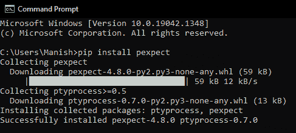

# Python 编程模块

> 原文：<https://www.javatpoint.com/python-pexpect-module>

我们都知道桌面操作系统及其功能和工作原理。我们所有人都一定听说过的一些最著名的操作系统是 Windows、Linux、macOS 和 ChromeOS。其中，chromeOS 也是一款基于 Linux 的桌面操作系统，增加了 Linux 和基于 Linux 的操作系统的普及度。由于增强的安全特性，Linux 是程序员和开发人员中非常流行的操作系统。但与此同时，在普通人中并不多，这种趋势背后最大的原因是在基于 Linux 操作系统的桌面上操作和工作时使用的复杂命令。

现在，说到 Linux，它是类似 UNIX 的操作系统家族中的一个桌面操作系统，由 Linus Torvalds 于 1991 年 9 月 17 日首次发布。除了它的安全特性之外，另一个，或者我们可以说 Linux 最吸引人的地方，是它是一个基于自由开源软件模型的开源自由许可软件。与 windows 和许多其他桌面操作系统不同，Linux 是绝对免费的，人们可以下载数百个发行版的最新版本。Linux 向开发人员提供的其他特性是更快的解释器和编译器、进行大量定制的选项、更低的操作系统复杂性以及许多其他特性。但是如果我们没有 Linux OS，还想用 Linux 命令怎么办。这样做可能有很多原因，包括我们可能想熟悉 Linux 命令等。也许不是所有的编程语言，但是 Python 为我们提供了在 Windows 或任何其他操作系统上运行 Linux 命令的选项。为此，Python 有一个 pexpect 模块，它为我们提供了使用其功能通过 Python 程序自动执行 Linux 命令的选项。因此，我们将了解 Python 的这个预期模块，并了解如何使用它通过 Python 程序运行 Linux 命令。

## Python 编程模块简介

Pexpect 是一个 Python 包，用于执行许多功能，包括通过 Python 程序自动执行 Linux 命令，生成子进程，然后自动控制它们等。Pexpect 模块是 Python 的一个非常丰富的模块，它附带了许多函数来执行许多不同的任务。Pexpect 模块作为 span 子模块工作，它响应预期的模式；我们定义使用 Python 程序来执行几个功能。

**下面是我们可以使用 Python 的 pexpect 模块执行的一些有用的功能:**

*   FTP 密码，
*   嘘，
*   Telnet，
*   自动化 Linux 命令和许多其他命令

## Python 程序模块的安装

Pexpect 不是 Python 的内置包(它不会随 Python 安装一起安装)，这就是为什么如果我们的系统中还没有这个模块，我们就必须执行这个模块的安装。我们应该首先确定系统中是否已经安装了 pexpect 模块，因为如果系统中没有该模块，我们将无法执行实现。如果我们的系统中还没有安装 pexpect 模块，我们可以通过多种方法安装这个模块，在所有可能的安装方法中，用 pip 安装程序安装 Pexpect 模块是最简单、最容易的一种。这就是为什么我们将在本节中使用 pip installer 在我们的系统中安装该模块，在这种方法中，我们将使用以下 pip installer 命令:

```py

pip install pexpect

```

我们必须在命令提示符终端Shell中写入上面给出的命令，并且在写入命令后，我们必须按回车键，以便 pip 安装程序将开始在我们的系统中安装该模块。一旦这个模块的安装过程开始，将需要一段时间才能在我们的系统中成功安装该模块，我们必须等到那时。



如我们所见，我们的屏幕上会显示一条成功安装的消息，这意味着 pexpect 模块现在已成功安装到我们的系统中。现在，我们可以继续进行 Pexpect 模块的实现部分，并开始将其导入示例程序，以了解它的工作原理。

## 用 Pexpect 模块自动执行 Linux 命令

在这一部分中，我们将通过 Python 程序将 Pexpect 模块导入其中来自动执行 Linux 命令。我们在 pexpect 模块中有三种方法，我们可以使用它们通过 Python 程序自动执行 Linux 命令。

**下面是我们可以用来自动化 Linux 命令的 pexpect 模块的三种方法:**

*   使用 run()方法
*   使用种子类方法
*   使用 sendline()方法

我们将通过在一个示例程序中使用上面列出的三种方法来理解它们的实现。我们将为每种方法使用一个单独的示例程序，并通过它自动执行 Linux 命令。

#### 注意:上面列出的所有 pexpect 模块方法只能在基于 UNIX 的操作系统中运行，没有一个适用于 windows。因此，如果我们运行这些方法或示例程序，它将在输出中显示一个错误。首先，如果我们想在视窗操作系统中运行这些程序，我们必须为基于 UNIX 的操作系统建立一个虚拟环境。

### 方法 1:使用 run()方法

我们在 pexpect 模块中有一个 run()函数，可以用来运行和执行命令。我们可以使用 pexpect.run()方法通过在函数中提供一个参数来执行一个 Linux 命令，然后，我们可以在输出中返回执行的结果。run()函数可以替代 os.system 方法，后者用于执行 Linux 命令。

**run()方法的语法:**

以下是使用 pexpect 模块的 run()方法执行 Linux 命令的语法:

```py

>> pexpect.run(Linux command)

```

正如我们在上面的语法中看到的，我们在 run()方法中提供了一个 Linux 命令作为参数。当我们运行程序时，run()方法将执行提供的 Linux 命令，并在输出中显示结果。

让我们通过下面的示例程序来理解用于执行 Linux 命令的 run()方法的实现。

**示例 1:** 看看下面的 Python 程序，我们在其中执行了一个 Linux 命令:

```py

# Importing pexpect module
import pexpect as px
# Using run method with Linux command
executionResult = px.run('echo Welcome to JavaTpoint!')
# Showing result in the output
print("The result after executing Linux commands through run method:")
print(executionResult)

```

**输出:**

```py
The result after executing Linux commands through run method:
Welcome to JavaTpoint!

```

我们可以看到，Linux 命令成功执行，结果打印在输出中。

**说明:**

在程序中将 pexpect 模块作为 px 导入后，我们使用了 run()方法和一个示例 Linux 命令来回应‘欢迎来到 javapoint！’我们将其存储在一个初始化的变量中，即 executionResult。最后，我们使用 print 语句在输出中打印执行结果。

### 方法 2:使用种子类方法

在这个方法中，我们将使用一个种子类来帮助我们自动化程序中给出的 Linux 命令。产卵类是主界面，通过它我们可以在执行过程中启动一个新的子进程，并通过子类控制它。我们在种子类中给出的字符串参数可以被 shell 命令替换(只要需要)，它必须在程序中执行。

**产卵类语法:**

```py

>> pexpect.spawn('Linux Command')

```

正如我们所看到的，我们已经在产卵类中提供了一个 Linux 命令作为参数，并且它可以被 shell 命令替换，shell 命令必须被执行。

在使用产卵类方法时，我们可以使用 expect()函数，这也是产卵类的一个重要方法。expect()方法等待子类(由我们为种子类定义)处理，以便它将返回给定的字符串输入之一。当我们运行程序时，我们将在种子类函数中指定的模式将与子类中定义的输入字符串匹配，匹配的字符串将在输出中返回。子类中使用的 expect()将返回输出中与种子类的输入模式匹配的字符串位置。

**expect()函数的语法:**

我们必须在派生方法的子类中使用 expect()函数，如下所示的语法:

```py

>> childClassObject.expect(inputPatterns, searchwindowsize = -1, async_ = false)

```

**参数:**正如我们在上面给出的 expect()函数的语法中可以看到的，这个函数采用了以下三个参数:

1.  **输入模式:**这些是输入字符串模式，将与我们在种子类中定义的模式相匹配，这是要在函数中给出的强制参数。
2.  **searchwindowsize:** 它是一个可选的窗口大小，定义了搜索窗口的大小。函数中此参数的默认值为-1。
3.  **async_:** 这也是 expect()函数的可选参数，该参数的输入值为“真”和“假”函数中此参数的默认值为 False。在创建非阻塞应用时，我们可以将该值设置为“真”。

expect()函数中用于提升返回值的超时值将是 pexpect.TIMEOUT。我们可以使用 expect()函数的 searchwindow 选项来设置类的 maxread 值。

让我们通过下面的示例程序来理解子类中带有 expect()函数的产卵类方法的实现。

**示例 2:** 看看下面的 Python 程序，其中我们匹配了在种子类中定义的输入模式:

```py

# Importing pexpect module
import pexpect as px
# Starting a child process with spawn class
childProcess = px.spawn("echo JavaTpoint")
# Matching the defined pattern with input strings of expect() function
processResult = childProcessing.expect(["Welcome", "To", "JavaTpoint", "Hello"])
# Returning matched string index result in the output
print("The defined pattern in the spawn class is matched at the index number:", processResult, "from the input strings given in expect function")

```

**输出:**

```py
The defined pattern in the spawn class is matched at the index number: 2 from the input strings given in expect function

```

正如我们所看到的，与定义的模式相匹配的输入字符串的索引号在执行产卵类后被打印在输出中。这就是我们如何在子进程中将 expect()函数中给出的输入字符串与种子类中定义的模式进行匹配。由于索引编号从 0 开始，这就是为什么在第 3 个位置为输入字符串的位置打印索引编号 2。

**说明:**

在程序中将 pexpect 模块作为 px 导入后，我们使用了 spawn 类来启动一个子进程。在启动子进程时，我们已经将一个模式定义为“JavaTpoint”，它将与给定的输入字符串相匹配。之后，我们使用了 expect()函数，在这里我们定义了多个输入字符串。将与定义的模式匹配的字符串的索引号将作为结果存储在初始化的变量中。最后，我们通过在 print 语句中使用初始化变量来打印结果。

### 方法 3:使用发送线方法

在这个方法中，我们将在用种子类启动子进程后使用 sendline()函数。sendline()方法将重写为子进程定义的模式的字符串。Sendline 方法也用于返回由我们定义的模式字符串所消耗的字节数，但是在这一部分中，我们将只使用这个方法来匹配来自输入字符串的模式。当我们为子进程编写字符串时，这个方法用于自动执行 Linux 命令。

**发送线方法的语法:**

以下是使用 pexpect 模块的 sendline 方法为子进程编写匹配模式的语法:

```py

>> childProcess.sendline("pattern")

```

我们可以看到，sendline 函数只接受一个参数，这是子进程的模式。

**我们可以通过下面的示例程序了解 sendline 方法的实现和应用:**

**示例 3:** 看看下面的 Python 程序，其中我们使用了 sendline()函数为子进程编写匹配模式:

```py

# Importing pexpect module
import pexpect as px
# Starting a child process with spawn class
childProcess = px.spawn("JavaTpoint")
# Definite pattern for the child process
childProcess.sendline("Welcome")
# Matching defined pattern with input strings
processResult = childProcessing.expect(["Welcome", "To", "JavaTpoint", "Hello"])
# Returning matched string index result in the output
print("The defined pattern for the child process by the sendline method is matched at the index number: ", processResult)

```

**输出:**

```py
The defined pattern for the child process by the sendline method is matched at the index number: 0

```

如我们所见，expect()函数的输入字符串与 sendline 方法定义的模式相匹配的索引号在执行后打印在输出中。这就是我们如何使用 sendline 方法为子进程定义和匹配模式。

**说明:**

在启动子进程之后，我们使用了 sendline()函数，在这里我们定义了子进程的模式。然后，我们将定义的模式与 expect()函数中给出的输入字符串进行匹配。最后，我们打印了输入字符串的索引号，它与为子进程定义的模式相匹配。

* * *