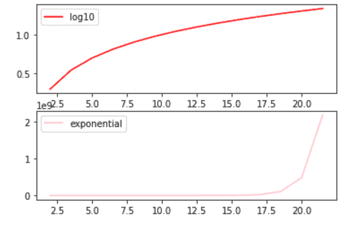
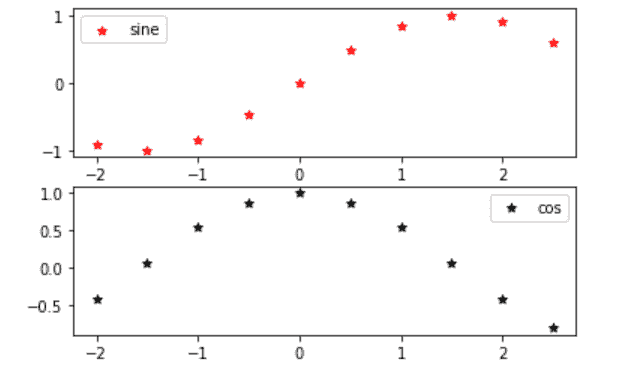
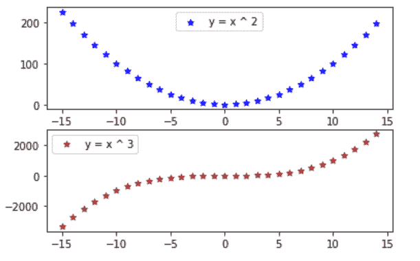

# 支线剧情中的 Matplotlib 图例

> 原文：<https://www.javatpoint.com/matplotlib-legend-in-subplot>

在本教程中，我们将学习如何使用 Matplotlib 在支线剧情中包含图例。使用图例()功能创建绘图后，可以添加图例。

### 语法:

子剧情中图例的语法是:

```py

axes[position].legend(loc = '')

```

其中，loc 用于定位。

## 方法:

以下是我们将在 Matplotlib 的子图中显示图例的方法:

*   首先，我们将使用**支线剧情()**功能在更大的剧情中创建支线剧情。
*   然后，我们将使用**图例()**功能为曲线添加标签。
*   最后，我们将使用 **show()** 来显示这些图

### 例 1:

在本例中，我们将使用 log10 和指数的子图绘制散点图:

```py

# First, we will import the required modules
from matplotlib import pyplot as PPlt
import numpy as nmp

# here we will assign the value to x axis
x_axis1 = nmp.arange(2, 22, 1.5)

# Now, we will get the value of log10
y_axis_log10_1 = nmp.log10(x_axis)

# then, we will get the value of exponential
y_axix_exp1 = nmp.exp(x_axis)

# Here, we will create subplots by using subplot() function
fig, axes = PPlt.subplots(2)

# now, we will depicte the visualization
axes[0].plot(x_axis1, y_axis_log10_1, color = 'Red', label = "log10")
axes[1].plot(x_axis1, y_axix_exp1, color = 'Pink', label = "exponential")

# Here, we will select the position at which legend to be added
axes[0].legend(loc = 'best')
axes[1].legend(loc = 'best')

# At last, we will display the plot

PPlt.show()

```

**输出**



### 例 2:

在本例中，我们将使用正弦和余弦的子图绘制散点图:

```py

# First, we will import the required modules
from matplotlib import pyplot as PPlt
import numpy as nmp

# here we will assign the value to x axis
x_axis1 = nmp.arange(-2, 3, 0.5)

# Now, we will get the value of sine
y_axis_sine1 = nmp.sin(x_axis)

# Now, we will get the value of cos
y_axix_cose1 = nmp.cos(x_axis)

# Here, we will create subplots by using subplot() function
fig, axes = PPlt.subplots(2)

# now, we will depicte the visualization
axes[0].scatter(x_axis1, y_axis_sine1, color = 'Red', marker = '*', label = "sine")
axes[1].scatter(x_axis1, y_axix_cose1, color = 'Black', marker = '*', label = "cos")

# Here, we will select the position at which legend to be added
axes[0].legend(loc = 'best')
axes[1].legend(loc = 'best')

# At last, we will display the plot
PPlt.show()

```

**输出**



### 例 3:

在本例中，我们将使用子图(y = x^2)和(y = x^3):)绘制散点图

```py

# First, we will import the required modules
from matplotlib import pyplot as PPlt

# here we will assign value to x axis
x_axis = list(range(-15, 15))

# here, we will get the value of x * x
y_axis_1 = [x * x for x in x_axis]

# here, we will get the value of x * x * x
y_axix_2 = [x * x * x for x in x_axis]

# Now, we will create subplots by using subplot() function
fig, axes = PPlt.subplots(2)

# Now, we will depicte the visualization
axes[0].scatter(x_axis, y_axis_1, color = 'Blue', marker = '*', label = "y = x ^ 2")
axes[1].scatter(x_axis, y_axix_2, color = 'Brown', marker = '*', label = "y = x ^ 3")

# Here, we will select the position at which legend to be added
axes[0].legend(loc = 'upper center')
axes[1].legend(loc = 'upper left')

# At last, we will display the plot
PPlt.show()

```

**输出**



## 结论

在本教程中，我们讨论了如何使用不同的方法在 matplotlib 图的子图中使用图例。

* * *