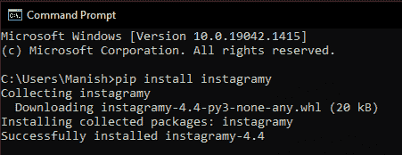

# python instagram 模块

> 哎哎哎:# t0]https://www . javatppoint . com/python-insta gram 模块

Instagram 是当今最受欢迎的社交媒体平台，拥有数十亿用户，在那里。目前，Instagram 不仅是一个可以与他人分享他们的图片的地方，而且可以利用这个平台为自己谋利。人们可以使用 Instagram 作为与他人联系的平台，为商业创造影响力，通过 Instagram 个人资料(页面)推广品牌，为初创企业吸引受众，以及许多其他功能。由于 Instagram 的日益普及和多项新功能，所有这些都成为可能。随着时间的推移，Instagram 为他们的用户引入了许多新功能，例如直接消息选项、业务页面选项(附带了许多功能)、卷轴选项(可以推广他们的页面或产品短视频的地方)等。现在，这是关于 Instagram 的，但是如果我们从开发人员的角度来谈论，我们很想知道作为开发人员，我们可以通过编写程序在 Instagram 上做什么。答案是肯定的！我们可以在 Instagram 上做很多有趣的事情，通过编写程序从 Instagram 上获取信息。许多编程语言为我们提供包，并在程序中使用这些包的功能；我们可以在 Instagram 上做很多有趣的任务。

如果我们专门谈论 Python，它为我们提供了许多包，我们可以将这些包导入到一个程序中，在 Instagram 上做许多有趣和酷的事情，例如了解用户的追随者和追随者、阅读用户的 Instagram 个人资料、删除喜欢和评论信息等。这样的 Python 包之一是“Instagramy”，它为我们提供了在 Instagram 上执行上面列出的许多基本操作的功能。因此，我们将在本教程中了解 Python 的 instagramy 模块，并了解如何使用该模块从 Instagram 中删除信息。

## python insta gram 模块介绍

Instagramy 是一个 Python 模块，我们可以使用它从任何用户的 Instagram 帐户中删除多个信息。该模块为我们提供了多种功能，我们可以在 Python 程序中使用这些功能来收集 Instagram 用户帐户的基本信息。一旦程序成功执行，我们将尝试通过 Instagram 获取的信息将打印在输出中。当一个人想知道许多 Instagram 账户的基本细节，但无法访问 Instagram 应用或网站，或者不想访问 Instagram 时，insta gram 模块就变得非常重要。

**看下面的例子，让我们了解 instagramy 模块的好处:**

假设我们为一家公司工作，我们必须雇佣能够通过他们的 Instagram 账户推广我们公司产品的客户。由于我们必须寻找将通过他们的 Instagram 帐户推广产品的实习生，因此我们必须查看他们的 Instagram 帐户，并检查该帐户是否足够强大，能够向一定数量的人推广我们的产品。否则，对于那些没有多少追随者或追随者的实习生来说，将没有任何好处。现在，假设我们必须从收到的 1000 份申请中选出 10 名最终实习生。在这种情况下，审查每个申请人的档案以最终确定供选择将变得非常困难和耗时。在这种情况下，Python instagramy 模块变得非常重要，从这里我们可以一次直接收集尽可能多的 Instagram 用户的信息。这不仅能节省我们的大量精力和时间，还能提高组织的生产率。

从这个案例研究中，我们可以了解 instagramy 模块的重要性及其优势。Instagramy 模块为我们提供了灵活性，节省了我们的精力和时间，并提高了我们的工作效率。所有这些都是使用 Python insta gramy 模块最常见的好处。

## Instagramy 模块的应用:

我们可以使用 Python 的 instagramy 模块，通过在 Python 程序内部使用该模块的功能来执行各种任务。从 Instagram 服务器获取信息后，任务的结果将显示在输出中。以下是我们可以在 Python 程序中使用 instagramy 模块的功能来执行的一些应用:

*   获取 Instagram 帐户的追随者数量
*   获取 Instagram 帐户的个人信息
*   获取帐户发布的帖子总数
*   获取 Instagram 帐户的追随者数量等。

## Python 的 Instagramy 模块:安装

我们已经理解了使用 Python 的 instagramy 模块的好处，但是如果真的要使用这个模块，我们首先要在系统中安装这个模块。这是因为 instagramy 不是 Python 的内置模块，这就是为什么要使用这个模块的功能，我们首先要执行它的安装。instagramy 模块的安装和使用非常简单，我们可以通过各种方法安装这个模块。但是我们将通过本教程中的 pip 安装程序来安装这个模块，因为这是安装这个模块最简单、最容易的方法。

**我们必须在系统的命令提示符外壳中写入下面给出的 pip 命令，以便通过 pip 安装程序安装 instagramy 模块:**

```py

pip install instagramy

```

一旦我们在终端外壳中写入了上面给出的命令，我们只需按下“enter”键，instagramy 模块的安装过程就会开始。正如我们将看到的，安装过程开始了；我们必须等待一段时间，直到所有的依赖项都成功安装。



如我们所见，instagramy 模块现在已经成功安装在我们的系统中，现在我们可以通过将其导入 Python 程序来开始使用该模块及其功能。现在，我们可以使用这个模块，并通过使用我们在本教程中使用的示例程序中的功能来理解它的实现。

## Python Instagramy 模块的实现

由于我们已经在设备中成功安装了 instagramy 模块，现在是时候开始使用该模块了，这样我们就可以了解它在 Python 程序中的实现和功能。我们将在本部分的示例程序中使用它的一些功能，从给定的 Instagram 帐户中收集一些基本信息，并将其打印在输出中。这就是我们如何理解 Python Instagramy 模块的实现和工作。

**看下面的实现程序，了解 instagramy 模块的实现和工作:**

### 实施 1:从 Instagram 帐户获取以下号码:

在这里，我们将获得 Instagram 帐户的以下数字(Instagram 帐户总数后跟给定的 Instagram 帐户)，并在输出中打印该数字。我们将使用示例程序中 instagramy 模块的功能来执行此任务。查看以下示例程序，了解 instagramy 模块的这种实现方式:

**示例 1:** 看看下面的 Python 程序，其中我们按照给定的 Instagram 帐户打印了以下数量:

```py

# Importing InstagramUser from instagramy module
from instagramy import InstagramUser as IU
# Taking the Instagram account or User Name as input
givenUN = input("Enter a valid and existing Instagram's user name: ")
# Creating instance for giver User name
unInstance = IU(givenUN)
# Getting total number of followings
followingNumber = unInstance.number_of_followings
# Printing result in the output
print('The total number of followings from the given user name by you is:', followingNumber)

```

**输出:**

```py
Enter a valid and existing Instagram's user name: ayushmannk
The total number of followings from the given user name by you is: 866

```

如我们所见，输出中打印了给定 Instagram 帐户的总粉丝数，这就是我们如何获得任何 Instagram 帐户的总粉丝数。

**说明:**首先，我们已经从程序中的 instagramy 模块导入 insta grammus 库作为 IU，使用它的函数来打印以下的总数。之后，我们将 Instagram 用户名(有效)作为用户的输入，这将是程序的给定 Instagram 帐户。然后，我们使用导入的 InstagramUser 函数解析用户名的输入值。我们这样做是为了在程序中为给定的 Instagram 帐户创建一个实例。之后，我们在创建的实例上使用' number _ of _ followings '方法，从初始化变量中的帐户获取 follows 的总数。最后，我们使用 print 语句中的初始化变量在输出中打印用户给定 Instagram 帐户的以下数量。

### 实现 2:获取 Instagram 帐户的总关注人数:

在这里，我们将获得 Instagram 帐户的追随者数量(跟随给定 Instagram 帐户的 Instagram 帐户总数)，并在输出中打印该数量。查看以下示例程序，了解 instagramy 模块的这种实现方式:

**示例 2:** 看看下面的 Python 程序，其中我们打印了给定 Instagram 帐户的追随者总数:

```py

# Importing InstagramUser from instagramy module
from instagramy import InstagramUser as IU
# Taking the Instagram account or User Name as input
givenUN = input("Enter a valid and existing Instagram's user name: ")
# Creating instance for giver User name
unInstance = IU(givenUN)
# Getting total number of followers of Instagram account
followersNumber = unInstance.number_of_followers
# Printing result in the output
print('The total number of followers of the given Instagram user name by you is:', followersNumber)

```

**输出:**

```py
Enter a valid and existing Instagram's user name: virat.kohli
The total number of followers of the given Instagram user name by you is: 174673618

```

我们可以看到，输出中会打印出给定 Instagram 帐户的总关注人数，这就是我们如何获得任何 Instagram 帐户的总关注人数，并保存起来以备将来参考。

**解释:**我们在这个示例程序中使用了与第一个示例程序相同的过程，但是我们在这个示例程序中使用了“number_of_followers”方法，而不是使用“number _ of _ followers”。

### 实现 3:获取 Instagram 帐户发布的帖子总数:

在这里，我们将获得 Instagram 帐户的帖子总数(包括短视频、长视频和该帐户发布的图片)，并在输出中打印该数字。我们应该注意到，在输出中将只打印帐户中当前存在的那些职位的总数。查看以下示例程序，了解 instagramy 模块的这种实现方式:

**示例 3:** 看看下面的 Python 程序，其中我们已经打印了给定 Instagram 帐户发布的帖子总数:

```py

# Importing InstagramUser from instagramy module
from instagramy import InstagramUser as IU
# Taking the Instagram account or User Name as input
givenUN = input("Enter a valid and existing Instagram's user name: ")
# Creating instance for giver User name
unInstance = IU(givenUN)
# Getting total number of posts made
postsNumber = unInstance.number_of_posts
# Printing result in the output
print('The total number of posts made by the given Instagram user name by you is:', postsNumber)

```

**输出:**

```py
Enter a valid and existing Instagram's user name: adityaroykapur
The total number of posts made by the given Instagram user name by you is: 85

```

如我们所见，输出中会打印出给定 Instagram 帐户发布的帖子总数，这就是我们如何获得任何 Instagram 帐户发布的帖子总数(目前该帐户中可用)。

### 实施 4:打印 Instagram 帐户的简历:

我们可以使用 instagramy 模块的功能在输出中打印 bio 中给出的 bio 描述和链接(如果有)。我们将通过提供用户名作为输入来打印这些信息，之后，程序将从 Instagram 服务器获取这些信息后，在输出中打印这些信息。我们可以看下面的示例程序来理解 instagramy 模块的生物打印实现:

**示例 4:** 看看下面的 Python 程序，我们在其中打印了输入 Instagram 用户名给出的生物描述和链接:

```py

# Importing InstagramUser from instagramy module
from instagramy import InstagramUser as IU
# Taking the Instagram account or User Name as input
givenUN = input("Enter a valid and existing Instagram's user name: ")
# Creating instance for giver User name
unInstance = IU(givenUN)
# Getting description of the account's bio
instaBioDesc = unInstance.biography
# Gettings links present in the account's bio
instaBioLinks = unInstance.website
# Printing result in the output
print("Description of the bio of the Instagram account that you have provided in the input: ")
print(instaBioDesc)
print("Following links are present in the bio of Instagram account which you have provided: ")
print(instaBioLinks)

```

**输出:**

```py
Enter a valid and existing Instagram's user name: jaiswalsonoo
Description of the bio of the Instagram account that you have provided in the input: 
Founder and CEO of Javatpoint
Following links are present in the bio of Instagram account which you have provided: 
http://www.javatpoint.com/

```

正如我们所看到的，输入 Instagram 帐户的个人简历中的个人简历和链接的描述会打印在输出中。这就是我们如何打印任何 Instagram 用户简历中的描述和链接。

**说明:**在上面给出的示例程序中，我们使用了“传记”方法打印个人简介，使用了“网站”方法打印 Instagram 帐户个人简介中存在的链接。一旦程序成功执行，并且从 Instagram 服务器获取数据，该信息将打印在输出中。

## 结论

在本教程中，我们已经了解了 Python 的 Instagramy 模块，以及如何在 Python 程序中使用该模块。我们已经学习了如何在我们的系统中安装这个模块，以及如何使用这个模块的功能从给定的 Instagram 用户名打印一些基本信息。我们使用 instagramy 模块与示例程序中的功能一起工作，以了解该模块的工作和实现。

* * *