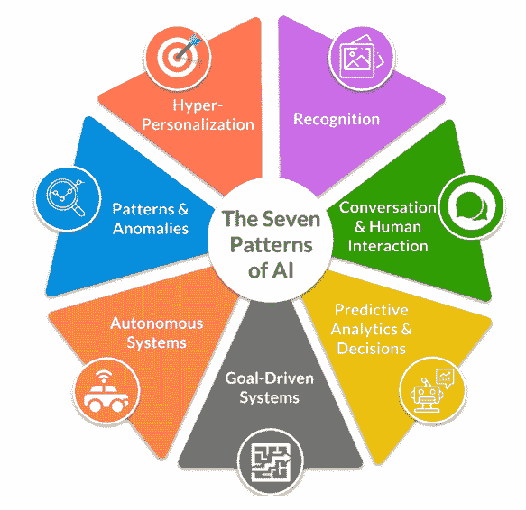
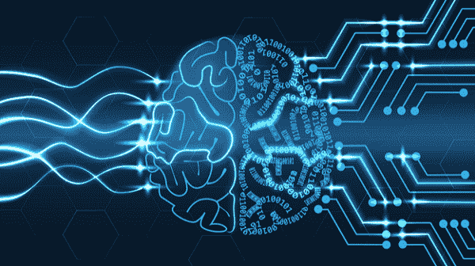
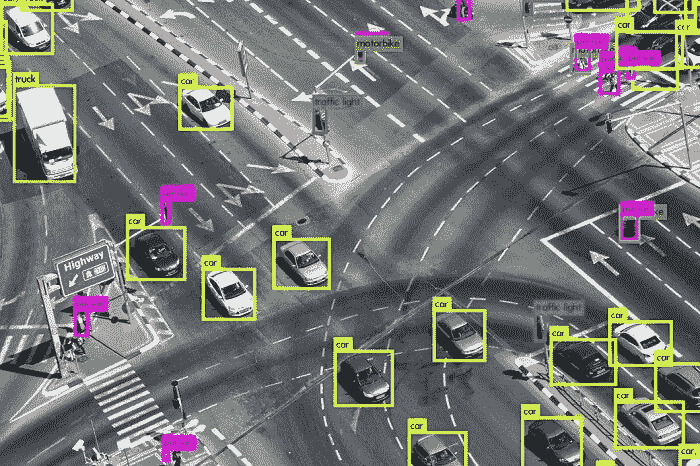

# 理解人工智能的识别模式

> 原文：<https://www.javatpoint.com/understanding-recognition-pattern-of-artificial-intelligence>

在说明人工智能不同实现方式的七种人工智能中，最受欢迎的是识别模式。识别模式背后的原理在人工智能中识别模式包括使用机器学习和认知技术来将非结构化数据分类和归类到不同的类别中。非结构化数据可能包括图像、视频、文本，甚至是定量数据。之所以如此有效，是因为它让机器可以毫不费力地完成我们大脑所做的事情:检测我们在周围现实世界中看到的东西。

识别模式是与众不同的，因为正是解决图像识别问题的努力导致了对人工智能深度学习技术的兴趣增加，也有助于启动人工智能投资和热情的新趋势。然而，识别模式比图像识别广泛得多。事实上，我们可以利用机器学习来检测和理解声音、图像、笔迹、人脸、手势和面部表情等物体。这种设计的目的是制造能够识别和理解非结构化数据的机器。由于其众多的应用，这种类型的人工智能是人工智能解决方案的主要部分。

非结构化数据和结构化数据之间的主要区别在于结构化类型被标记并且易于阅读。然而，非结构化数据是大多数组织遇到困难的地方。组织中多达 90%的数据是非结构化的。对于公司来说，理解和解释这些数据至关重要，这是人工智能可以提供帮助的地方。虽然我们能够使用现有的查询技术和信息学系统来获取结构化数据集中分析数据的价值，但是用非结构化数据实现这些方法并不容易。这就是为什么机器学习在应用于这些类型的问题时是如此强大的工具。

机器学习是检测数据中观察到的模式的强大能力。特别是，我们采用机器学习的方法来识别这种模式。在监督方法中，我们使用干净的、标记良好的数据来训练计算机将输入分类为不同的类别。该算法暴露于各种信息点，并利用这些数据点创建人工神经网络，将数据分类到这些类别中。该算法在这些图片之间创建神经连接。

此外，它反复显示图像，目的是最终让计算机通过学习理解图像的内容。当然，它们依赖于高质量、标记良好的数据，这些数据代表了最终模型在实际世界中遇到的数据类型。在这些类型的系统中，垃圾进入，垃圾排出。

### 识别模式的许多应用

识别模式允许机器学习系统“查看”没有结构化、分类或归类的数据。最后，他们明白了什么可能只是一个没有被利用的无结构的价值“斑点”。这种模式的应用可以在许多不同的应用中看到，从医学成像、自动车辆手写识别、面部识别或语音识别，甚至是各种数据和视频中最精确的对象。机器学习支持的识别为监控和安全系统提供了相当大的能力，使它们能够实时监控多个视频，并识别像送货车这样的东西，甚至识别在一天中特定时间不应该在某个区域的人。

利用识别模式的商业应用非常多。例如，在电子商务和在线零售行业，需要识别和标记互联网上销售的商品的图像。在此之前，人类必须根据每个图像的所有属性、标签和类别对其进行细致的分类。如今，基于机器学习的识别系统可以快速找到目录中没有列出的商品，然后利用在互联网上销售这些商品所需的全部信息和元数据，而无需人工参与。对于人工智能来说，这是一个绝佳的机会，可以加入竞争，比最终变得无聊或疲惫的人更快、更有效地完成工作。此外，人工智能系统将能够避免人为错误，并允许员工专注于更有价值的任务。

这种识别模式被用于图像，但也用于检测语音。有各种各样的应用可以识别正在播放的歌曲，甚至检测说话人的声音。这种识别模式的另一个可能的应用是识别动物的声音。自动声音识别的使用在野生动物和保护研究领域是有益的。使用能够识别不同动物声音的机器可能是追踪种群及其习性，以及了解不同物种的一个很好的方法。甚至有可能将其用于车辆维护等领域，在这些领域，机器能够检测到发动机产生的不同声音，然后通知车辆操作人员问题和需要解决的问题以及需要多快解决。

人工智能最常用的模式识别应用涉及文本和手写的检测。虽然我们已经有了光学字符识别(OCR)技术，能够将打印字符翻译成文本很长时间，但传统的 OCR 在处理任何类型的手写和字体的能力方面受到限制。在这方面，支持机器学习的手写和识别要好得多，因为它能够识别各种手写或打印模式下的文本，并识别存储的数据类型。例如，如果文本以表格或列的形式格式化，它能够识别表格或列，并将它们翻译成机器使用的正确格式。此外，该系统能够识别数据中的模式，如社会保险号或信用卡号。使用这种技术的用途之一是在自动取款机上自动存入支票。顾客把他们手写的支票放进机器里。然后，它被用来存款，而不需要访问实际的人来存款。

AI 的识别模式也可以用来识别人的动作。这已经在游戏领域得到应用。用户可以使用某些动作或手势，这些动作或手势可以在游戏中用来移动角色或完成任务。另一个重要的应用允许玩家模拟各种服装和配饰。外科医生也在医学领域使用它来帮助他们完成任务，并指导人们如何在对一个人执行相同的任务之前完成某些任务。在这种识别模式的帮助下，机器甚至能够理解手语，理解手势，并在需要时翻译它们，而无需人工干预。

在医学领域，人工智能正被用于检测各种放射学图像中的模式。例如，该系统用于识别骨折、堵塞、动脉瘤和可能的癌性结构，甚至用于识别可能的结核病和冠状病毒相关疾病。分析师公司 Coanalytic 预测，仅在几年内，机器将开始对所有放射学图像进行首次分析，从而可以在模式或异常被发送给人类放射科医生进行进一步评估之前立即识别它们。

识别模式用于检测假冒商品。基于机器学习的识别系统可以识别假冒商品，如太阳镜、钱包或假药钱包。

这种人工智能的应用对每个部门都有直接影响，从使用图像接收保险报价到研究自然灾害后的卫星图像以确定损害。考虑到机器学习识别模式并应用它们进行识别的有效性，这种人工智能将继续被广泛采用并不奇怪。现实中，两三年后，我们可能会习惯于把 AI 的识别模式当成一个既定的，甚至不会把它当成 AI。这证明了这种人工智能启发的模式的力量。

* * *