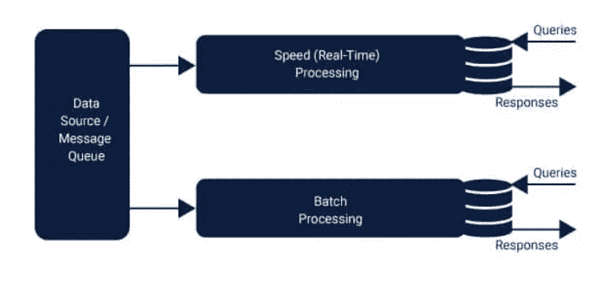

# 何时以及如何在大数据中利用 Lambda 架构

> 原文：<https://www.javatpoint.com/when-and-how-to-leverage-lambda-architecture-in-big-data>

在当前的技术环境下，大量公司被大数据所吸引。然而，在过去，大数据利用存储在 Hadoop 技术中的数据，并且必须处理延迟问题。一个全新的系统可以用于大量数据，并以高速完全解决这个问题。

在本文中，我们将尝试使理解结构变得容易，这使得使用大数据变得容易，大数据只不过是 Lambda 架构。这个设计是由詹姆斯·沃伦&内森·马尔斯设计的。

让我们看一些关于 Lambda 架构的事实。

### 这个建筑是关于什么的？

为了更好地做出业务决策并获得洞察力，系统被设计为处理种类、速度和数量。这是一种新的大数据方法，用于分析、处理和隔离这些对传统系统来说既困难又庞大的数据。混合架构有助于支持大数据系统的实时和批量数据处理。

在这个模型中，我们可以访问历史数据和新数据。为了更好地理解过去数据的移动，信息被传输到数据存储器。

这个架构背后的基本思想是建立在 Lambda 演算之上的，被称为 Lambda 架构。该架构是专门为处理不可改变的数据集而设计的，特别是为了其操作的目的。

该技术还可以解决任意计算函数的问题。一般来说，这个问题可以分为三个层次:

*   一批
*   服务
*   速度

下图将提供对上述图层的理解。类似于 Hadoop，这个批处理层被称为“数据湖”。它还充当过去的档案库，存储所有输入其中的数据。它还便于批量处理数据，并有助于生成分析结果。

为了加快数据的流式传输和排队，速度层被放入图片中。该层的功能是对实时数据进行分析计算。速度层与批处理层共享许多特性，因为它还可以计算类似的分析。唯一的区别是分析是对最近的数据进行的。根据数据的速度，数据可能仅过时一小时。

服务层是将两个层的结果结合起来生成最终结果的层。

当数据传输到系统时，它被分为速度层和批处理层。通过实时视图和批处理视图的集成来回答查询。

而批处理层扮演两个关键角色。

*   主数据集的管理。
*   批处理视图预计算。

批处理层的输出以批处理视图的模式呈现，而速度层的输出以实时视图模式的形式显示。结果然后被传递到服务层。这种索引发生在服务层，因此可以以低延迟和按需方式发出请求。

速度层，也称为流层，负责未通过批处理视图呈现的数据，因为批处理层会受到延迟的影响。该图层仅处理最近的数据，因此它可以通过创建实时视图来提供整个视图。

本质上，我们可以说在 Lambda 结构中，数据管道被分成了多个层，每个层负责一个特定的任务。在每一层中，都可以选择合适的技术。例如，在速度层，可以选择 Apache Storm、Apache Spark 流或其他技术。

在 lambda 结构中，可以快速纠正错误，因为有必要返回数据的原始版本。这是可以实现的，因为在这种情况下，数据永远不会改变，而是在程序员输入不准确的数据时添加的。他们可以删除然后重新计算数据。

### 数据湖:

这个系统最大的好处是它提供了几乎无限的内存容量和存储空间。甚至有一个内存中的数据存储，其容量为万亿字节，分布在所有集群中。这种架构具有合理的成本效益，因为它带有内置的容错功能。

借助这个巨大的数据湖集群，可以为任何企业构建数据湖。企业的全部数据都存储在集群中，并通过云共享。该架构的计算能力能够用于分析集群。通过这种容错设计，可以降低成本，因为大量重复的 ETL 过程被阻止与其他系统接口。

## λ架构的应用:

世界正在不断经历大数据领域的新发展。Lambda 架构是建立在日志插入和随之而来的分析之上的。大多数情况下，日志消息没有争议，并且以高速生成，这就是为什么它们通常被称为“快速数据”。没有硬性的法律规定每个日志条目都必须从数据到达的实体那里得到一个答案，因为它只是一个单向管道。

大数据的处理分为两个管道数据。一个管道是从各种来源收集大量数据并以分布式方式存储的地方。然后对数据进行分析，以获得做出更好的业务决策所需的精确信息。遵循的过程可以称为批处理管道。

简而言之，数据管道架构旨在收集数据并通过数据管道路由数据，以提供对业务分析和智能的洞察。它提取和转换数据，然后将其输入数据库。

使用 Lambda 架构处理数据的另一种方法是在数据运动时对数据进行分析。这个过程称为流数据管道。这是使用实时数据进行计算的地方。我们可以用来做到这一点的框架是 Apache Spark。用于此的框架是 Apache Spark。Spark，有可能将信息分成更小的批次，将它们存储在内存中并处理数据，最终将数据从内存中移除。这里使用的方法可以减少延迟，因为计算是在内存中执行的。

## λ架构的优点

Lambda 架构提供了各种各样的优势，但最重要的是无常、容错，它用于执行重新计算或预计算。

这种体系结构最显著的优点将在以下段落中描述:

*   在这个模型中，数据以原始格式存储。这有助于开发新的用户案例分析，以及通过生成基本批处理和速度视图的全新数据处理算法。这是相对于传统数据仓库的巨大优势。过去，数据模式必须更新以适应新的应用，这是一个漫长的过程。
*   重新计算是这种设计的另一个特点。这种容错能够毫无困难地修复。如果一个数据湖有大量数据，很可能会发生数据损坏和丢失，但这是无法避免的。这种设计允许回滚、刷新数据和重新计算数据来纠正这些错误。
*   该架构最重视保持输入数据的相同形式。模型的数据转换是结构的另一个重要方面。这允许跟踪 MapReduce 工作流。MapReduce 对整个数据执行批处理。数据在每个步骤中单独调试。流内数据处理面临的主要问题是再处理问题。输入数据使用此方法驱动输出。

简而言之，这种设计的好处是:

*   人为误差容限
*   硬件缺陷情况下的公差。

## Lambda 架构的缺点

为准备数据湖的企业选择 lambda 框架也会有一些负面影响，尤其是在某些方面没有被考虑的情况下。以下段落列出了其中的某些要点:

*   这种结构的不同层次会使它更加复杂。各层之间的同步可能成本很高。因此，必须谨慎处理。
*   由于不同的分散层，如速度和批次，维护和支持变得困难。
*   许多有助于构建 Lambda 架构的技术正在出现。然而，找到精通这些新技术的人并不容易。
*   对于开源技术来说，实现这种模型并不容易，在云上实现时，问题会变得更糟。
*   维护作为架构一部分的代码可能是一个挑战，因为需要在分布式环境中生成类似的结果。
*   在 Hadoop 和 Storm 等大数据框架中编码也很困难。

## Lambda 架构的统一方法

如上所述，Lambda 结构的主要缺点之一是它的复杂性。这是一个持续的麻烦的维护和安装，因为必须同步两个分布式系统。为了克服这些问题，我们将在下面讨论三种不同的方法:

*   灵活的框架和纯流模型的采用。在这种情况下，Apache、Samza 可以是一个理想的选择。它是一个可扩展的分布式流层，可用于执行批处理。
*   也可以考虑对上述讨论采取不同的方法。选择灵活的批次是一种选择。确保选择小批量的批次，使其接近实时批次。在这种情况下，可以使用阿帕奇·斯塔克或暴风的三叉戟。
*   将实时和批处理与栈技术相结合可能是一种替代方法。在这种情况下，Lambda Loop 和 SummingBird 可能是可行的选择。结果被合并到 SummingBird 中，包括即时数据和批处理数据，因为它是一个混合系统。在 Lambda 循环中，使用了相同的方法。

下图将帮助您更好地理解上述问题。

统一方法利用混合计算模型来解决大数据的数量和速度问题。该模型轻松地混合了即时数据和批量数据。

## 建筑概述

大数据系统通常对原始和部分结构化的数据进行操作。当今的组织需要能够处理批处理和实时数据的系统。Lambda 架构能够处理这两个过程。同时，它能够在这个过程中建立无常。

该结构遵循一套坚实的指导方针，是技术的激动剂。任何技术都可以集成到其中来完成任务，因为它是由不同的层组成的。就绪云组件是可访问的，可以使用 lambda 结构来使用。

该体系结构可以被描述为一个可插入的系统，当需要一个进程时可以使用。许多数据源是根据需求插入或取出的。

### 实时工作示例:

Lambda 架构已经在许多应用中证明了自己。下面列出了一些有效的示例:

*   推特和团购有很多应用。Lambda 架构可用于理解推文的含义，并用于执行情感分析。
*   Crashlytics:这里，它特别关注用于生成重要分析结果的移动分析。
*   Stack overflow 是一个非常知名的热门论坛，拥有庞大的用户。这是一个人们可以提出问题和解决方案的地方。在这个论坛中，批处理视图被用来分析投票结果。

## 结论

自有史以来，大数据技术已经普及。但是当涉及到像谷歌或脸书这样的公司的要求时，现有的技术并不适合业务需求。为了满足他们的需求，需要一个标准化和灵活的架构，这导致了 Lambda 架构的创建。

在引入该模型之后，必须采取适当的规划来将数据传输到数据湖中。由于该体系结构侧重于分析，因此可以利用传统的事务数据库将数据传输到集群中。

每年，越来越多的公司转向大数据。

* * *