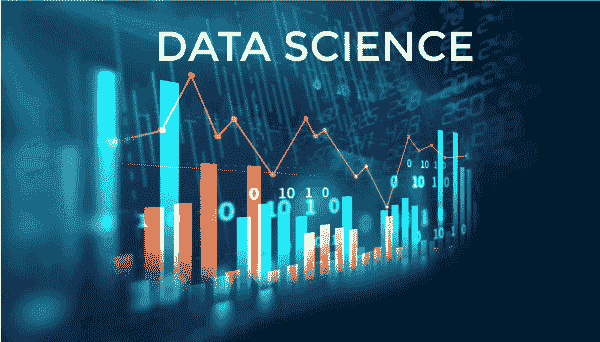
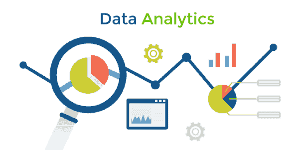

# 我们为什么要学习数据科学的 Python？

> 原文：<https://www.javatpoint.com/why-should-we-learn-python-for-data-science>

Python 是一种持续流行的编程语言。作为一种高级语言，Python 是一种强调可读性而不是复杂性的语言。它有一个易于理解的缩进系统，这使得它成为研究人员和程序员的首选语言。

这就是为什么用 Python 编程是值得研究的，以便找到一种以任何方式或形式掌握数据操作的方法。

## 为什么要学习数据科学的 Python？

Python 是世界上使用最广泛的代码语言之一。它在编码语言列表中的第一名的位置被它热情的学习者和用户群体所证实，他们正在分分钟增加。

Python 流行背后的主要原因是它的易用性和多功能性。在 2000 年代，人们对编程感到恐惧，因为 C++、Java 和 Lisp 等编程语言既复杂又困难。

Python 很容易部分掌握，因为它是一种极其高级的编程语言。它比机器使用的二进制语言更像人类语言。我们必须记住 Python 可以用英语编写的几十种保留的语法术语和格式，这使得任何人都可以在不需要访问软件的情况下理解几行代码的含义。

而且，与许多其他语言不同，我们可以开始使用 Python 来分析数据集，即使我们是没有经验的用户。这是可能的，因为预编程的语法很容易创建和执行，并在学习过程的早期产生具体的结果。后来，当我们熟悉了各种特定于我们需求的语法命令——甚至可能开始创建我们的语法——我们会惊讶于 Python 允许我们快速高效地执行操作和任务的效率。

## Python 比 R 更适合数据科学吗？

在数据科学领域，只有另一种编程语言有着良好的声誉，可以与 Python 竞争，它的 R -和不应该被 Ruby 误解。尽管每个 R 和 Python 都被分析师、数据科学家和研究人员定期使用，但它们发挥着不同的功能。

本质上，R 只用于分析数据和统计，而 Python 是一种通用语言，用于不同类型的数据科学和软件工程。

尽管它们在用法和目的上有很多相似之处，但当涉及到数据科学的四个元素时，包括探索、收集建模、可视化和收集，R 和 Python 并不完全相同。

他们考虑每个支柱的方式不同，导致从不同的角度检查信息的结果。

## 数据探索

可以将数据探索视为数据分析的小兄弟。这个过程包括分析数据，寻找共享的基本模式和特征。然而，数据探索并没有从数据中提供重要的见解，但它被用来帮助科学家理解更大的图景，并在这个过程中被遵循。

创建 r 是为了实现这一内置功能，而 Python 可以通过使用第三方库来实现类似的结果。

借助 Python，我们能够利用它的许多库，这些库允许我们在不从头开始编写代码的情况下探索我们的数据。例如，使用 Pandas，我们可以排序数据集和集合、过滤和呈现。

然而，R 也更具统计性。r 是一个过滤和显示数据以及执行统计测试的好工具。r 内置了矩阵、向量和数据帧的数据类型。Python 本身并不包含这些特性。然而，数据科学家利用这些库。数字图书馆和 Pandas 图书馆。这些库还具有基于 C 编程语言构建的优势，这意味着它们能够比 r 更快地在大型数据集上执行操作。

### 统计建模

在收集和分析我们的数据后，现在是时候开发一个合适的模型了。数据建模是创建一个模型的过程，该模型是一组抽象的规则，定义了数据元素之间的关系，通常是参考物理世界。如果模型可以用来创建关于看不见的数据的预测，这被称为机器学习。

Python 是一种语言，它允许您通过一点点努力来构建定制的数据建模。相比之下，与数据探索类似，我们可以利用预先构建的 Python 库中的软件来构建我们的模型。例如，我们可以使用 NumPy 创建数字数据模型，或者使用 scikit-learn 的机器学习算法。与 R 类似的结果将要求我们依赖于其他包，因为它的主要功能不允许建模。

每一个 Python 和 R 都能够进行统计建模。然而，R 意味着静态分析，创建报告或论文。为了实现该模型并允许它用于站点或应用内的实时决策。这是因为 Python 是一种真正的通用编程语言。因此，它可以与使用 Python 的软件框架一起使用，包括 Django 或 Flask。

没有任何额外的包，R 可以做建模(线性模型)，但是 Python 不能。

### 数据可视化

顾名思义，它通过使用图形、图表、图表、绘图和地图来直观地表示数据，以显示您的结果。虽然一开始听起来很容易，但数据可视化是一个极其微妙的过程，因为低质量可视化的结果可能会令人困惑或难以理解。

Python 在数据探索领域一般可以认为是有效的，它有部署模型的工具。然而，在数据可视化方面，使用 Python 而不是 r 要困难一些。尽管如此，还是有可能使用 Python 的一些其他外部库，如 Matplotlib 和 Seaborn，来生成反映我们结果的图表和图形。

数据可视化是 R 的最佳资产之一，因为它是为了显示统计分析的结果而开发的。这就是为什么制作圆滑公正的图形设计很容易。

## 数据科学领域需要 Python 吗？

对于数据科学的职业生涯，我们必须至少掌握两种语言中的一种，要么是 Python，要么是 R。如果用户已经熟悉使用 R 和 Python，建议在尝试另一种语言之前先探索一下。然而，如果他们是新手，他们应该从 Python 开始，因为它的灵活性。

但是，如果我们决定忽略 Python 和 R，我们可能会在职业生涯中错过许多重要的机会。此外，我们可能会花费时间和精力来解决使用 Python 无法解决的问题。

Python 具有极强的适应性和适应性——这两个特性对于频繁处理海量数据至关重要。如果我们选择使用正确的结构和语法，我们将能够使用各种算法以我们需要的方式操作我们的数据。在更严格的语言中，这是一项困难的任务，这要求我们在能够对数据应用一种新的操作或计算之前，掌握全新的技术。

Python 能够随着我们的进步而成长。即使作为一个只有几个月 Python 经验的初学者，在互联网上众多教程和教程的帮助下，我们也可以开始利用数据库并分析它们。当我们更加熟练时，我们将能够使用许多在线可用的 Python 库来减少时间和精力。此外，我们可以让自己成为我们的循环、条件和语法，以减少工作时间和代码量，并使将来分析和纠正代码错误变得更简单。

在我们寻求掌握 Python 的过程中，开设专门向数据科学家教授 Python 的课程至关重要。Python 中我们最需要的功能取决于我们的行业和应用。网上有很多免费掌握 Python 的资源。此外，我们不需要特定的软件或小工具来开始学习。我们需要的只是 Python 源代码和代码编辑器。它们都很容易获得，并且免费下载和使用。

* * *