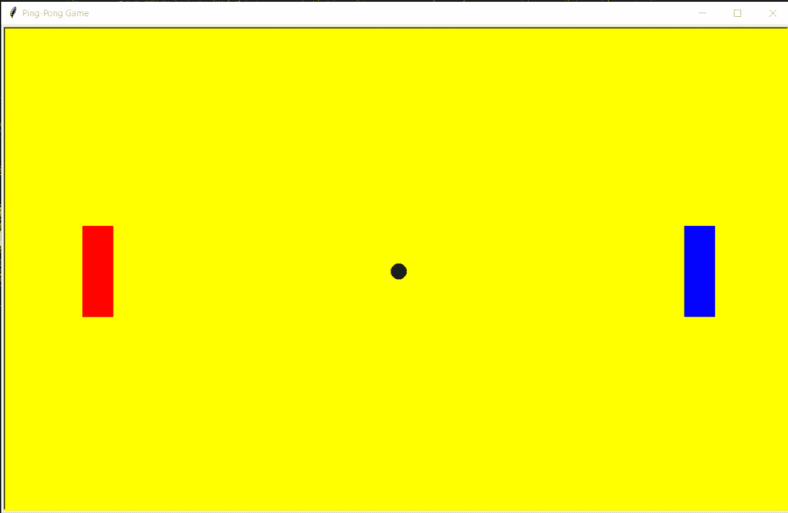
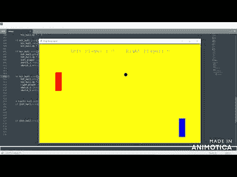

# Python 中使用`turtle`的乒乓游戏

> 原文：<https://www.javatpoint.com/ping-pong-game-using-turtle-in-python>

乒乓球比赛是阿卡迪亚最著名的比赛之一，它与乒乓球非常相似。这个游戏的规则很简单:

*   有两个玩家。
*   两人都可以控制自己这边的船桨。
*   他们可以在垂直方向上从上到下和从下到上移动桨。

球员可以用球拍在球上来回击球。

**`turtle`:**`turtle`是 Python 中的内置模块，用于图形说明。用户可以用它作为笔和面板来说明图形。

**以下是说明乒乓游戏的步骤:**

*   **步骤 1:** 用户必须为屏幕的“左侧”和“右侧”创建两个拨片。
*   **第二步:**然后用户必须创建球。
*   **第 3 步:**然后，通过按特定的键创建垂直移动桨的事件，即对于“**左桨**”:“T4”R”表示“**向上**”和“ **C** ”表示“**向下**”，对于“**右桨**”:“T14】向上键()”表示“**向上**”和“
***   **第四步:**最后，创建每个球员击不中球后更新得分的功能。**

 **### 代码 1:创建说明球和桨:

```py

import os
import turtle

# First, we will create screen
screen_1 = turtle.Screen()
screen_1.title("Ping-Pong Game")
screen_1.bgcolor("Yellow")
screen_1.setup(width = 1050, height = 650)

# Left paddle
left_paddle = turtle.Turtle()
left_paddle.speed(0)
left_paddle.shape("square")
left_paddle.color("Red")
left_paddle.shapesize(stretch_wid = 6, stretch_len = 2)
left_paddle.penup()
left_paddle.goto(-400, 0)

# Right paddle
right_paddle = turtle.Turtle()
right_paddle.speed(0)
right_paddle.shape("square")
right_paddle.color("Blue")
right_paddle.shapesize(stretch_wid = 6, stretch_len = 2)
right_paddle.penup()
right_paddle.goto(400, 0)

# Ball of circle shape
hit_ball = turtle.Turtle()
hit_ball.speed(45)
hit_ball.shape("circle")
hit_ball.color("White")
hit_ball.penup()
hit_ball.goto(0, 0)
hit_ball.dx = 5
hit_ball.dy = -5

```

**输出:**



**说明:**

首先，我们导入了`turtle`库。然后我们用`turtle`编写了背景屏幕的代码。Screen()函数。我们用乌龟创造了左右桨。Turtle()函数，并使用 goto()函数对它们进行定位。最后，我们用一只乌龟创造了这个球。Turtle()函数，并通过使用 speed()函数和其他所需参数提到了它在屏幕上的移动速度。屏幕上的球和桨的图示已经准备好了。

### 代码 2:两人乒乓球游戏的完整代码。

```py

import os
import turtle

# First, we will create screen
screen_1 = turtle.Screen()
screen_1.title("Ping-Pong Game")
screen_1.bgcolor("Yellow")
screen_1.setup(width = 1050, height = 650)

# Left paddle
left_paddle = turtle.Turtle()
left_paddle.speed(0)
left_paddle.shape("square")
left_paddle.color("Red")
left_paddle.shapesize(stretch_wid = 6, stretch_len = 2)
left_paddle.penup()
left_paddle.goto(-400, 0)

# Right paddle
right_paddle = turtle.Turtle()
right_paddle.speed(0)
right_paddle.shape("square")
right_paddle.color("Blue")
right_paddle.shapesize(stretch_wid = 6, stretch_len = 2)
right_paddle.penup()
right_paddle.goto(400, 0)

# Ball of circle shape
hit_ball = turtle.Turtle()
hit_ball.speed(45)
hit_ball.shape("circle")
hit_ball.color("Black")
hit_ball.penup()
hit_ball.goto(0, 0)
hit_ball.dx = 5
hit_ball.dy = -5

# Now, we will initialize the score
left_player = 0
right_player = 0

# Displaying of the score
sketch_1 = turtle.Turtle()
sketch_1.speed(0)
sketch_1.color("blue")
sketch_1.penup()
sketch_1.hideturtle()
sketch_1.goto(0, 260)
sketch_1.write("Left Player : 0    Right Player: 0",
             align = "center", font = ("Courier", 24, "normal"))

# Implementing the functions for moving paddle vertically
def paddle_L_up():
    y = left_paddle.ycor()
    y += 20
    left_paddle.sety(y)

def paddle_L_down():
    y = left_paddle.ycor()
    y -= 20
    left_paddle.sety(y)

def paddle_R_up():
    y = right_paddle.ycor()
    y += 20
    right_paddle.sety(y)

def paddle_R_down():
    y = right_paddle.ycor()
    y -= 20
    right_paddle.sety(y)

# Then, binding the keys for moving the paddles up and down. 
screen_1.listen()
screen_1.onkeypress(paddle_L_up, "r")
screen_1.onkeypress(paddle_L_down, "c")
screen_1.onkeypress(paddle_R_up, "Up")
screen_1.onkeypress(paddle_R_down, "Down")

while True:
    screen_1.update()

    hit_ball.setx(hit_ball.xcor() + hit_ball.dx)
    hit_ball.sety(hit_ball.ycor() + hit_ball.dy)

    # Check all the borders
    if hit_ball.ycor() > 280:
        hit_ball.sety(280)
        hit_ball.dy *= -1

    if hit_ball.ycor() < -280:
        hit_ball.sety(-280)
        hit_ball.dy *= -1

    if hit_ball.xcor() > 500:
        hit_ball.goto(0, 0)
        hit_ball.dy *= -1
        left_player += 1
        sketch_1.clear()
        sketch_1.write("Left_player : {}    Right_player: {}".format(
                      left_player, right_player), align = "center",
                      font = ("Courier", 24, "normal"))

    if hit_ball.xcor() < -500:
        hit_ball.goto(0, 0)
        hit_ball.dy *= -1
        right_player += 1
        sketch_1.clear()
        sketch_1.write("Left_player : {}    Right_player: {}".format(
                                 left_player, right_player), align = "center",
                                 font = ("Courier", 24, "normal"))

    # Collision of ball and paddles
    if (hit_ball.xcor() > 360 and
                        hit_ball.xcor() < 370) and (hit_ball.ycor() < right_paddle.ycor() + 40 and
                        hit_ball.ycor() > right_paddle.ycor() - 40):
        				hit_ball.setx(360)
        				hit_ball.dx *= -1

    if (hit_ball.xcor() < -360 and
                       hit_ball.xcor() > -370) and (hit_ball.ycor() < left_paddle.ycor() + 40 and
                       hit_ball.ycor() > left_paddle.ycor() - 40):
                       hit_ball.setx(-360)
                       hit_ball.dx *= -1

```

**输出:**



**说明:**

在上面的代码中，在用拨片和球说明了屏幕的前景后，我们将首先初始化两个玩家的分数，即 Zero。然后，我们将在屏幕上显示分数，分数会随着对面玩家错过打击而增加。然后，我们将实现垂直移动桨叶的功能。我们将绑定每个功能的按键，即“左拨片”:“上”的“R”和“下”的“C”，右拨片:“上”的“上”键和“下”的“下”键。然后，我们将发起球和球拍的击球将如何工作，就好像球击中了球拍，它将向对面的球员走去，但是如果球拍没有击中球，那么球将击中边界，对面的球员将获得分数。如果代码正确，没有发现错误，运行代码后会弹出乒乓游戏的屏幕，玩家可以玩了。球将首先投给合适的球员。

## 结论

在本教程中，我们使用内置的 Python 库，即`turtle`，在屏幕上创建了一个乒乓球游戏的简单插图。用户可以使用`turtle`库及其不同的功能创建不同的移动插图。

* * ***