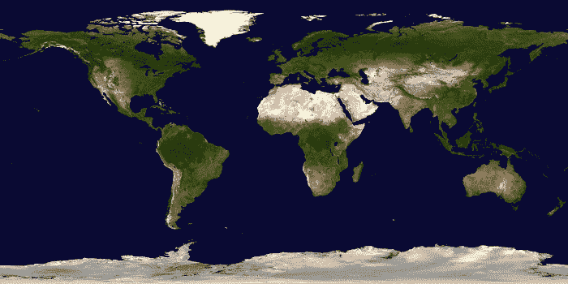
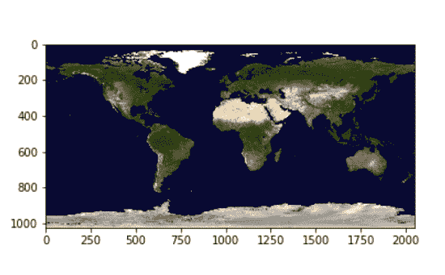

# 用 Python 中的 Matplotlib 和 GDAL 可视化 Tiff 文件

> 原文：<https://www.javatpoint.com/visualize-tiff-file-using-matplotlib-and-gdal-in-python>

文件格式 TIFF 用于存储光栅化的图像。一个名为 GDAL 地理空间数据抽象库的库是专门为读取这些栅格文件以及其他文件格式(如向量格式)而设计的。gdal 库是开源地理空间基金会的一部分。

要安装所需的模块，我们可以在终端中使用以下命令:

```py

pip install gdal
!pip3 intall matplotlib

```

我们需要 Python 中的 matplotlib 和 GDAL 模块来显示 tiff 图像。

### 方法:

*   **步骤 1:** 导入模块
*   **第二步:**我们可以数一下有多少个波段。
*   **步骤 3:** 查找 TIFF 文件中的每个栅格波段。
*   **步骤 4:** 将条带读取到 NumPy 阵列。
*   **第五步:**在 Matplotlib 的 imshow()功能中进行显示。

为了解释本教程，我们将使用以下 tiff 格式的图像:



### 逐步实施:

**步骤 1:** 导入模块并打开文件。

```py

from osgeo import gdal as GD
import matplotlib.pyplot as mplot
import numpy as npy
data_set = GD.Open(r'land_shallow_topo_2048.tif')

```

**第二步:**统计波段总数。

```py

print(data_set.RasterCount)

```

**输出:**

```py
3

```

**步骤 3:** 提取条带

我们利用 GDAL 的 GetRasterBand(int)来获取波段。需要注意的是，我们传递的值总是以 1 开始(波段索引从 1 开始)

```py

# As, there are 3 bands, We will store in 3 different variables
band_1 = data_set.GetRasterBand(1) # red channel
band_2 = data_set.GetRasterBand(2) # green channel
band_3 = data_set.GetRasterBand(3) # blue channel

```

**步骤 4:** 读取带为 NumPy 阵列。

GDAL 提供了 ReadAsArray()方法来转换 NumPy 数组中的那些波段，并返回数组。

```py

b1 = band_1.ReadAsArray()
b2 = band_2.ReadAsArray()
b3 = band_3.ReadAsArray()

```

**第五步:**使用 matplotlib 的 imshow()函数绘制数组。

为了绘制这三个数组，我们将它们按顺序堆叠起来。

```py

img_1 = npy.dstack((b1, b2, b3))
f = mplot.figure()
plt.imshow(img_1)
mplot.savefig('Tiff.png')
mplot.show()

```

**最终代码:**

```py

from osgeo import gdal as GD
import matplotlib.pyplot as mplot
import numpy as npy
data_set = GD.Open(r'land_shallow_topo_2048.tif')
print(data_set.RasterCount)
# As, there are 3 bands, we will store in 3 different variables
band_1 = data_set.GetRasterBand(1) # red channel
band_2 = data_set.GetRasterBand(2) # green channel
band_3 = data_set.GetRasterBand(3) # blue channel
b1 = band_1.ReadAsArray()
b2 = band_2.ReadAsArray()
b3 = band_3.ReadAsArray()
img_1 = npy.dstack((b1, b2, b3))
f = mplot.figure()
plt.imshow(img_1)
mplot.savefig('Tiff.png')
mplot.show()

```

**最终输出:**



## 结论

在本教程中，我们讨论了如何通过使用 Python 中的 matplotlib 和 Gly 模块来可视化 tiff 文件格式的图像。

* * *