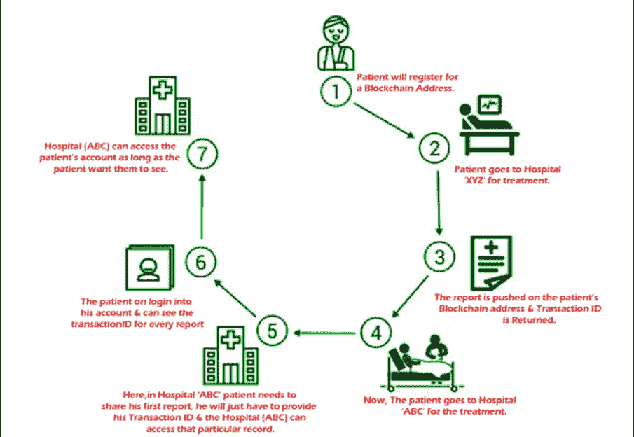
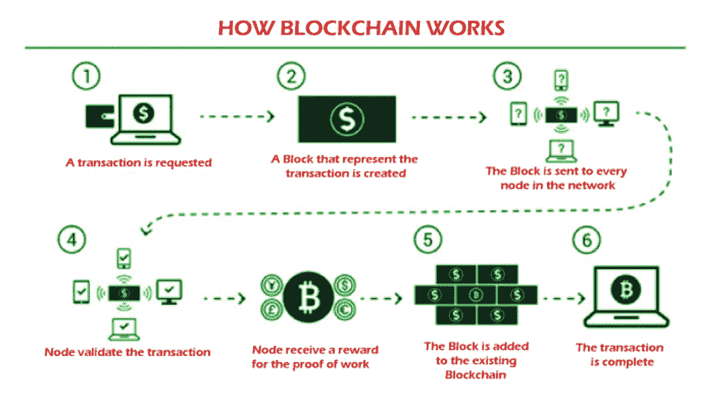
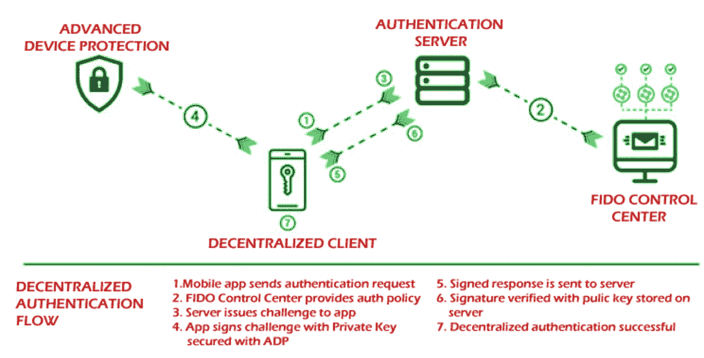
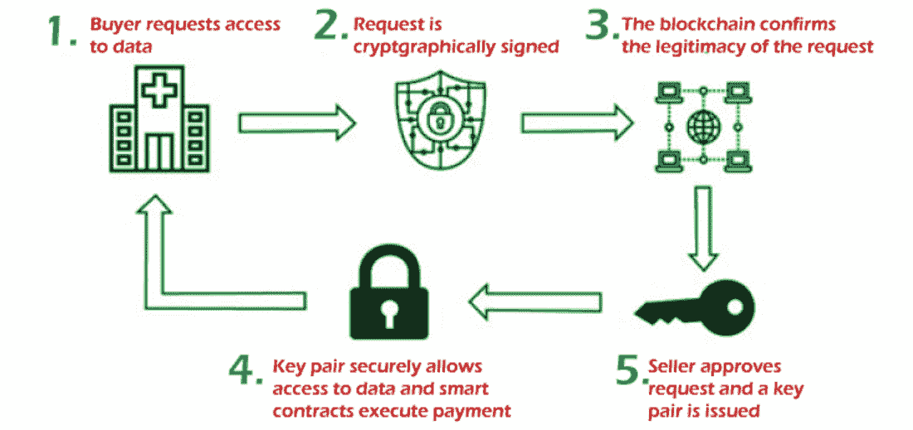

# 医疗保健中的区块链：创新与机遇

> 原文：<https://www.javatpoint.com/blockchain-in-healthcare-innovations-and-opportunities>

随着进入健康领域的巨大飞跃，它向区块链和人工智能迈出了巨大的一步。该行业引入了新技术，有助于使医疗保健行业更加安全、可靠和资源密集型。通过采用基础区块链技术，参与医疗保健的公司也正在成为市场领导者。

研究表明，全球医疗保健行业的区块链技术预计将增长 64%。无论是从实现的角度来看，未来几年对于区块链技术都至关重要。从技术角度来看，区块链提供了只有技术才能提供的独特优势。区块链是唯一能在这个规模上竞争的技术或组件。从数据安全性到连接性，区块链在这一领域远远领先于市场预期。医疗保健正在体验使用该技术并将其集成到安全隐私、隐私、合规性和法规中的诸多好处。

从成本的角度来看，通过该技术节省的成本远远超过成本。实施区块链的投资回报已经压倒性地压倒一切，因为许多公司已经接受了它，并将其作为一种不可或缺的资源来使用。区块链技术解决方案也能够在需要知道的基础上在作为整体主题一部分的特定领域实施。

### 医疗保健领域的显著增长

考虑到这种整合，许多保险公司和医疗信息技术公司正在进入市场。他们与该领域最具创新性的公司合作，同时为这些公司提供独特的优势。他们正在与国际商用机器公司、谷歌和脸书建立联系，寻找最有效的方案来增加附加值。

安泰和安歌都在与区块链合作，为该领域带来新的附加值。他们正在利用区块链的灵活性和多维能力，在行业中创造更多创新解决方案。

借助包括数据分析在内的核心技术，从患者护理到医疗保健运营的一切都可以得到改善。许多保险公司正在使用智能合同，直接从患者那里获取数据，而不需要个人详细信息。

这是与技术互动并了解其价值的更安全的方式。此外，医疗保健领域的区块链在 EHR 市场被证明是有益的。这使得医生和专家与跨关键系统共享的信息联系更加紧密。

零售连锁龙头沃尔玛还获得了利用区块链获取病历的专利，并对覆盖网络中的医院进行了全面研究。这帮助他们在该领域取得了巨大的成果，从而在医疗保健行业形成了更加连贯的渠道体系。

他们可以生产药物，发布文件，并遵守管理该行业的所有管理机构。这样一来，沃尔玛就不需要雇佣冗长的员工合同来确保他们每次都能按时交付药品。使用区块链有助于他们在医药产品的使用上更符合行业。

### 区块链和医疗保健领域的广泛研究

研究人员正在开发保存数据和使用数据库的传统方法的替代解决方案。他们正在转向整体模式，区块链作为一种可能的选择被推向市场。但是这个领域由完全掌握最新技术的技术专家主导。

科技公司正在开发利用区块链基础技术的创新方法。杜克大学的研究人员一直在努力寻找集成人工智能、区块链和新技术的新方法，以提供更高质量的医疗服务。

分析师正在查看数据，并得出结论，所有研究的影响不仅限于医疗保健领域。与医疗保健行业相关的一系列不同领域都能感受到这种影响。从医疗设备到记录存档，医疗保健领域有各种各样的可能性。

最后，这归结于我们如何从整体角度利用这些技术的潜力。我们必须将区块链的潜力与其他技术结合起来，以开发一种最佳的集成方法。

## 医疗保健中的区块链用例

### 区块链提高医疗安全

区块链已被广泛用于增加数据存储和患者记录的隐私。该技术正被用于确保医疗保健价值链的可持续性。理解这一点至关重要，因为该领域的许多专业人士也在研究这项技术的全部潜力。他们正在整个生态系统中创建基于区块链技术的细致入微的解决方案。在理想情况下，观察区块链的最佳方法是了解它如何影响医疗保健领域。

从记账到介绍患者，区块链可以帮助您了解患者旅程的各个方面。它将为价值体系提供更大的安全性，这样信息就不会被错误处理，并且所有法规都按照规范执行。它还提供了对从一端流出的信息的更大控制。

医疗保健领导者应该从全面的角度看待这项技术，并考虑所有可能的可能性。从医疗欺诈到即将到来的安全，该技术的许多应用尚未得到充分探索。当病人从一个地方旅行到下一个地方并返回时，适当的信息传递是必不可少的。这就是区块链允许通过有计划的途径共享安全数据的原因。

区块链的本质保证了没有一两个节点可以将所有信息存储在一个地方。分布式分类账也保证了数据的完整性。这意味着网络中的每个位置都对网络的整体成功负有同等责任。就将数据存储在传统服务器之外而言，区块链也可以促进这一点。

### 扫描医疗保健领域的欺诈行为

国家医疗保健反欺诈协会(NHCAA)披露，医疗保健欺诈的财务成本每年接近 100 亿美元。这包括处方药配送系统、药物和其他助长医疗保健行业欺诈的系统。这导致许多代理商发布假药，在许多情况下，还发布假设备。

医疗保健中有很多种欺诈，但目标是一样的——降低成本以提供更低的质量。这是医疗系统内信任和信心等领域的一个主要问题。假设信任在医疗保健领域受到侵蚀，导致安全问题，并可能导致规模扩大。造假者可以利用这些漏洞从该系统中获利。反措施机制也已经到位，不能及时解决这些问题。

这就是区块链能够在该领域提供透明度的地方。

**1。更好的安全性和监控**

区块链为模型提供了更大的保证。医生、医疗专业人员以及研究人员可以根据他们的认证级别访问足够的数据。区块链将对照认证和安全协议的更高标准进行检查。该信息被存储。因为检索不到一个小时，区块链可以实现更快的身份验证，这让黑客望而却步。合适的个人将被授予在最合适的时间访问合适的数据和文件的权限。

全球医疗保健领导者默克创造了其正在申请专利的技术，用于通过区块链认证医疗设备和处方药的真实性。这是默克与假冒经销商和毒贩斗争的最前沿方式之一。它通过在数字世界中创建物体物理形态的电子指纹来实现这一点。通过身份验证后，代理需要寻找匹配的指纹。由于增强的身份验证模型，这为整个板提供了更高的安全性。

**2。大规模追踪包裹和医疗分区**

区块链技术可以大规模限制药物的获取。区块链可用于查找定义发送方和接收方角色的包装信息。区块链采用的整体战略将允许跨所有级别的更好集成。当一个包裹从一个特定的设施中取出时，它会留下一个跟踪号。区块链检索元数据、名称、发送标识和其他数据，以允许所有相关数据。总的来说，这使得整个企业更加安全。

**3。使用扫描仪进行源头欺诈检测**

在偏远地区，对假药的检查往往不够或根本不存在。这为造假者创造了一个从这种情况中获利的绝佳机会。这就是区块链能够向负责人提供正确的跟踪和识别信息的原因。因为不管单个服务器是否出现故障，这都是一种更有效的资源，所以网络是可以运行的。数据存储在整个分类账中，一旦问题得到解决，就更容易访问。

### 使用区块链的患者识别

截止到今天，区块链最直接的应用之一是识别病人的模型。患者越来越迷失方向，每分钟都有更多的信息被发布。由于区块链提供了更高的安全性，这导致区块链的接受度增加。分析师估计，仅在去年一年，就有超过 610 万条记录因无意中破坏安全和主要信息技术系统管理不善而被曝光。

勒索软件或恶意软件是新闻，许多企业无法辨别如何处理信息。由于数据分布在不同的医疗保健提供商和组织中，因此最好使用分布式分类账，而不是存储数据的传统数据仓库。

尽管生态系统对于维持至关重要，但它也是一个与业务极其相关的不断变化的领域。它将医疗保健行业转变为一个信息驱动的行业，也是一个技术进步的领域。区块链非常适合这种模式，因为它提供了在技术环境中运行的高度可扩展的解决方案。

区块链领域有许多公司与医院密切合作，以确保患者数据得到有效利用。从运营角度来看，这是管理医院活动的更好方法。与标准流程相比，区块链的可靠性和一致性无可匹敌。

患者身份识别是最重要的领域之一，通过医疗保健中的互动来保护隐私。越来越多的公司呼吁确保对患者更好的安全和保护。通过区块链进行身份识别正在成为一种可行的选择。从合规的角度来看，这是合乎逻辑的。整个医疗保健系统尽可能保持安全并保护所有数据。这是处理医疗保健等复杂领域，同时保护所有信息安全的最有效方法。

### 与互联医疗合作伙伴相关的安全风险

随着医疗保健部门变得更加互联，使用区块链来保护所有参与者至关重要。从濒临死亡的病人到现场的医生，确保各方在网络区块链安全方面意见一致至关重要。此外，这是一种安全的新技术，因为世界上有许多邪恶的组织希望访问受保护的数据。

最重要的是把风险降到最低。以下策略可以实现这一点:

**1。构建强大的私有区块链网络**

拥有适当的基础设施来创建有效且安全的区块链网络至关重要。私有区块链将能够保护数据并保护分类账。区块链可以为所有相关方提供更多的安全保障，并创造一个更具协作性的环境。数据在不同位置之间顺畅流动，无需担心黑客攻击或其他未经授权的访问点。从合规的角度来看，这是更进一步。这是向你的利益相关者展示你是一家更受监管的公司的一种方式。

**2。具有分散授权的区块链区块链**

尽管区块链非常安全，但访问和授权需要付出一些努力。这就是生物认证发挥作用的地方。供参考的图表如下所示。认证服务器和客户端都连接到区块链；但是，只有在提供了附加参数的情况下，才允许访问。这可能是一个面向访问的客户端或生物力学起源的元素。它可能是物理认证的模型，也可能是探索的额外途径。

**3。映射流程和全球政策**

为了使区块链真正可持续，建立在您选择的框架内有效的坚实政策是至关重要的。全球政策对于维护整个世界至关重要，因为它们有助于确保一致性。虽然公司之间的合规框架不同，但目标是相似的。可以定义这些目标，以便实施更好的安全措施，并确保员工的安全。当政策不断变化时，这一点至关重要，区块链实施的性质也在不断变化。

**4。通过分类帐验证网络间的交换**

如果在一个特定的系统上有一个分类账备份，那么它会被自动检查以获得相关的数据。这将创建无法访问的层安全性。因此，不要将此分类帐的访问权限授予网络之外的任何人，这一点非常重要。这对于确保区块链安全的完整性至关重要，因为任何违规都可能导致恶意方未经授权的访问。尽管设备的授权级别很高，但维护区块链的稳定副本也很重要。这是确保您的资产得到保护并避免在发生泄漏时陷入危险的最有效方法。虽然大多数公司都专注于增强合规性，但也有少数公司开发了提供更多安全性的工具。

### 通过区块链整合医疗保健系统

区块链对于连接分布在一个生态系统中的所有部分至关重要。该系统也足够强大，可以处理过多的数据。信息消耗的速度更快，而且总体上有保护。医生掌握了他所需要的所有信息。研究人员可以访问匿名的患者和医疗保健信息。制药商获得授权，生产各种应用的药物。这是一个集成系统，使用区块链是安全的。

如果没有区块链，网络中的每一个元素都可能容易受到攻击。每个节点代表一个接入点。它只需要从过去的一台计算机或一个没有加密的网络从头到尾安装。此外，人们更加关注节点的保护，这最终可以通过使用区块链来实现。

无论使用什么设备，只有当设备连接到互联网时，才允许访问。这就形成了一个安全层来抵御黑客。

社会工程有可能被用来获取重要信息，但这种可能性非常小。数据可能会泄露。有了适当的训练和正确的指导方针，这应该不成问题。当公司内部对正在实施的安全措施存在巨大混乱时，就会发生社会工程。区块链是一项很好的技术，每个员工都可以简单地了解这项技术。

### 利用区块链降低风险

区块链技术可以帮助降低在医疗保健领域工作的相关风险。在某些情况下，组织内的数据系统或网络可能会出现故障，或者可能会发生 DDoS 攻击。如果它们不是目标，那么攻击在资源方面可能会很昂贵，修复起来也很耗时。因此，拥有适当的工具来处理此类攻击可能产生的任何问题是至关重要的。

企业可以在所有行业实施区块链相关技术，以提高安全性。这在第三方供应商不符合总体准则的情况下尤其重要。同样重要的是，如果系统中已经有合作伙伴或客户不遵循安全管理的最佳实践。此外，他们可能会在其安全策略中制造弱点，从而使黑客得以利用。

一个简单的黑客或间谍软件电子邮件帐户可能足以破坏整个模型。它可能是改进的和一致的攻击格式的基础，在引入第一个占位符后可以长期使用。

黑客能够对系统发起大规模的蜂巢攻击，然后彻底摧毁它。这可以通过黑客的一点悟性和大量努力来实现。区块链是充分保护自己的好软件。医疗保健专业人员在为安全平台实施区块链时可以确保安全。

虽然最大限度地降低风险至关重要，但设计持续几年以上的安全功能也同样重要。这是因为区块链在这个过程中不断发展和创造新的格式。医疗保健公司需要跟上不断发展的技术集成，并全面理解什么是技术。这是一种提高安全性和远离黑客的方法。随着区块链的发展，公司本身也会发展。这将允许更全面的集成，并帮助企业即使在最复杂的技术进步中也能保持安全。

数字化可以成为这一领域的催化剂，因为它提供了基础架构来促进更好的集成。但企业必须迅速认识到出现的问题。他们需要制定最佳策略，全面降低风险。

### 新兴技术的区块链

例如，可穿戴设备和互联健康设备需要获得区块链所能提供的规模、基础设施和安全性。区块链技术将使连接技术和构建强大的生态系统变得更加容易。对于依赖植入技术、可穿戴技术或连接附件的患者来说，区块链可以是一种更安全的数据链接方式。

当数据流经系统时，它通过连接系统中的不同路由来实现这一点。网络本身变得更加动态，导致几个节点参与到系统中。区块链可能成为移动对象的互连性和安全性的主要来源。从药物到医疗设备的一切都可以通过区块链生态系统联系起来，并在整个生态系统中广泛利用。

从更广的角度来看，选择区块链是明智的。区块链技术使您更容易加入网络中过多的物联网和可穿戴设备部分。到 2022 年，市场上的联网设备将超过 500 亿台，因此越来越需要通过区块链连接这些设备。每个患者的信息，包括健康、体能和重要指标，都可以以闪电般的速度共享。区块链能够比传统数据库更快地实现简化的数据共享和相关信息的检索。

### 区块链和合规(HIPAA、GDPR 等)。)

在区块链和医疗保健领域，尊重是一个必不可少的方面。区块链领域有许多参与者，随着时间的推移，建立协议变得越来越复杂。监管机构出台了更多关于区块链整合的规定，并更加关注患者的隐私。

隐私至关重要，尤其是在最近发生数据泄露和泄露事件之后。随着法规遵从性变得越来越主流，关于保护私人信息的最有效方法的信息也越来越多。区块链在所有这些领域都很突出，提供了更好的整体体验。为了运行一个能够覆盖医疗保健部门所有部门的成功网络，管理区块链网络至关重要。

合规性是需要关注的一个重要方面。这是一个值得关注的主要领域，区块链正在成为这一领域的创新者。通过引入更有效的安全措施并强调可以改进的领域，区块链正在全球范围内提高合规性。

当企业对区块链领域进行广泛的风险分析时，存在需要立即填补的空白。这有助于保持符合《重债穷国倡议》以及 GDPR。由于信息是安全的，数据的传输可以得到保护。这都是关于分享重要信息以及他们在网络上分享信息的效率。

为了使区块链安全，需要在其中内置某种形式的安全性。这包括对法规遵从性的要求，这些要求必须放在用于创建法规遵从性的技术之外。从身份验证到使用端到端加密，各种其他与端点相关的工具都可以与其他工具结合使用。虽然每个 HIPAA 和 GDPR 规范数据管理，但了解可能影响您在医疗保健领域业务的细节是至关重要的。

PHI 存储，特别是 EHR 平台，受到合规机构的监督。这些平台可以通过区块链得到增强，并通过规范行动的规则得到保护。此外，如果对规则和条例有一个广泛的了解，这些情况会更安全。随着区块链年复一年的发展，合规部门有望发布适当的指导方针。其结果将是一个更安全的市场，并为该领域的每个人提供更大的安全性。

区块链面临的主要挑战是实现有效的合规性。虽然纸上谈兵很简单，但说到区块链的实用性，它面临着比传统数据系统更严重的问题。区块链的紧迫性在于，它实现了跨所有领域的更大集成。因为每天都有更多的黑客攻击发生，公司正在寻求投资更多的区块链集成。从安全角度来看，区块链更有意义。

但是，企业必须确保在使用区块链时遵守法规。区块链必须与现有协议一起使用，并且在医疗保健领域更加灵活。这将有助于所有部门更多地采用，并使整个过程更加规范。

### 医疗保健中的高级人工智能和网络安全

医疗保健组织必须能够遵守当前实施的安全措施。区块链是技术领域的领导者，是首选和安全领域的佼佼者。它还包括第三方必须提供的额外援助。它还涵盖了与医疗保健相关的技术，如人工智能，以及必须使用区块链保护的互联小工具。

区块链是一种很好的方式，可以提供公司所需的大量安全基础设施，以保持法规遵从性。由于黑客不断开发和发展，使用复杂的人工智能进行大规模和前所未有的攻击总是有危险的。这就是为什么医疗保健公司正在结合最新的人工智能和区块链的力量来增强他们的安全性。他们不再单独使用技术来对抗对方。他们通过在整个过程中集成区块链来做到这一点。

保护保健提供者的程序要简单得多。创建这些措施需要大量的工作。然而，现在需要以一种更合适的方式。根据研究，71%的法律主管认为他们客户的基础设施不够安全。他们需要更好的保护来抵御黑客和恶意软件，它们可以攻击网络的每个部分。

网络安全的人工智能可以通过将区块链整合到系统中来实现。德勤的一项研究证实，他们研究的科技公司认为他们的系统不够强大，无法抵御攻击。74%的参与者表示，他们希望实施区块链来提高安全性。

随着技术的发展和系统的进化，清楚地看到主题是什么是至关重要的。当研究部门能够快速访问数据，并能够开发必要的工具来确保系统正确集成时，另一方面，如果患者有效地获得高质量的医疗保健，这对区块链来说是一个胜利。区块链技术能够改善医疗保健行业的所有领域，包括隐私和监管。它的设计是可扩展的，全球许多企业都在实现这一点。他们也在开发其他国家和企业可以效仿的解决方案。

区块链是一个蓬勃发展的社区，由于其在加密货币中日益流行，它不断创新。这意味着技术进步将发展到更高的水平。它在人工智能和机器学习领域也有潜力。当开发者社区聚集在一起开发新技术时，出现的结果会更先进。这意味着尽早投资区块链有更好的回报。这就是为什么医疗保健提供商应该在他们的竞争对手和该领域的其他公司首先实现他们的目标时就开始他们的区块链计划。医疗保健必须转变为安全可靠的数字环境。

## 结论

区块链是引入卫生部门的最具创新性的技术之一。区块链的主要优势超越了整合问题以及因开发人才和具体情况而可能出现的问题。此外，区块链已经发展到医疗保健专业人员频繁使用该技术的地步。他们正在以更快的速度处理数据，传输的数据是可互操作的。此外，技术使人们能够更多地使用安全工具，这使得医疗保健用户在交易中保持安全。医疗行业内的数据共享从未如此简单。

* * *