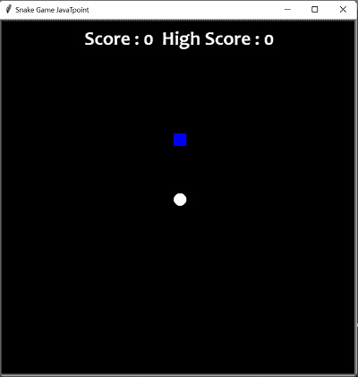
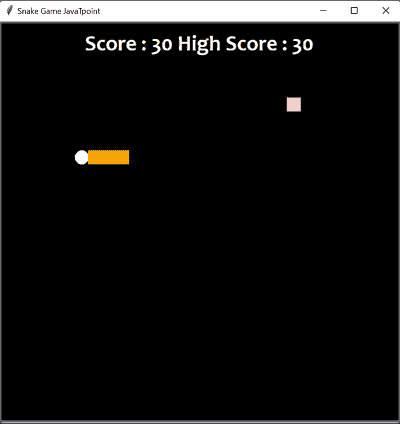

# 使用海龟模块的 Python 中的蛇游戏

> 原文：<https://www.javatpoint.com/snake-game-in-python-using-turtle-module>

蛇是一款街机迷宫游戏，由格莱姆林工业公司开发，世嘉公司于 1976 年 10 月出版。它被认为是一款优秀的游戏，已经在大众中流行了好几代。蛇的游戏可以通过四个方向按钮来控制方向。玩这个游戏的目的是通过抓取食物或水果来获得最高分。如果蛇撞到墙或自己，玩家就倒霉了。

对于 Python 初学者和那些试图在自己的领域创造更简单的东西的人来说，可以测试这个程序。这个名为海龟的模块是专门为初学者设计的，他们可以玩这个项目并提交一个项目的程序。本项目使用 Python 3.0 编写。

因此，我们将用这些模块创建一个基于 **Python** 的游戏。

*   **Turtle:** 这是一个安装好的 Python 库，通过为用户提供一个虚拟画布，用户可以绘制图案和图像。
*   **时间:**用于计算事件发生之日起的秒数。
*   **Random:** 这是一个通过使用`random`模块在 Python 中创建随机数的函数。

### 支持

下面的代码可以通过使用专门为 Python 程序设计的崇高文本应用轻松工作。

此外，还可以使用 VSCode 来使用这个程序。利用 VSCode 的扩展安装 Python3。然后，以您的 _filename.py 格式保存 Python3 程序

以下是使用海龟模块制作蛇游戏的分步方法:

**第一步。**给程序增加模块，然后给每个游戏一个初始值。

```py

import turtle as ttl
import time
import random as rdm

delay = 0.1
score = 0
high_score = 0

```

**第二步:**我们将创建这个游戏的显示，也就是游戏的屏幕，在这里我们将创建蛇的头部和食物项目，供蛇在游戏中食用，并将分数显示在游戏的顶部。

```py

# Here we will creating a window screen
w_n = ttl.Screen()
w_n.title("Snake Game JavaTpoint")
w_n.bgcolor("black")

# The width and height can be put as user's choice
w_n.setup(width = 650, height = 650)
w_n.tracer(0)

# Here, we will create the head of the snake
head1 = ttl.Turtle()
head1.shape("circle")
head1.color("white")
head1.penup()
head1.goto(0, 0)
head1.direction = "Stop"

# Here, we will create the food in the game
food1 = ttl.Turtle()
colors = rdm.choice(['pink', 'yellow', 'blue'])
shapes = rdm.choice(['triangle', 'square', 'circle'])
food1.speed(0)
food1.shape(shapes)
food1.color(colors)
food1.penup()
food1.goto(0, 100)

pen1 = ttl.Turtle()
pen1.speed(0)
pen1.shape("square")
pen1.color("white")
pen1.penup()
pen1.hideturtle()
pen1.goto(0, 250)
pen1.write("Score: 0  High Score: 0", align ="center",
          font = ("Consolas", 22, "bold"))

```

**输出:**



**第三步:**我们来验证控制蛇运动的按键。当我们点击游戏中常用的术语，如“e”、“s”、“f”和“v”，我们将能够控制蛇在屏幕上的移动。

```py

# Here, we will assign the key directions
def group1():
    if head1.direction != "down":
        head1.direction = "up"

def go_down():
    if head1.direction != "up":
        head1.direction = "down"

def go_left():
    if head1.direction != "right":
        head1.direction = "left"

def go_right():
    if head1.direction != "left":
        head1.direction = "right"

def move1():
    if head1.direction == "up":
        y1 = head1.ycor()
        head1.sety(y1 + 20)
    if head1.direction == "down":
        y1 = head1.ycor()
        head1.sety(y1 - 20)
    if head1.direction == "left":
        x1 = head1.xcor()
        head1.setx(x1 - 20)
    if head1.direction == "right":
        x1 = head1.xcor()
        head1.setx(x1 + 20)

w_n.listen()
w_n.onkeypress(group1, "e")
w_n.onkeypress(go_down, "v")
w_n.onkeypress(go_left, "s")
w_n.onkeypress(go_right, "f")

```

**第四步:**我们将设计一个游戏，其中会发生以下事情:

*   吃了水果后，蛇的身体会膨胀。
*   给蛇的尾巴上色。
*   当水果吃完后，分数就会被记录下来。
*   检查蛇的头部是否与身体或屏幕侧面碰撞。
*   碰撞后游戏会立即自动重启。
*   每次打开窗户，这种水果的新设计和形状就会显现出来。
*   分数将被重置为零，最高分数将一直保持到窗口没有关闭。

```py

# Code for main gameplay
while True:
    w_n.update()
    if head1.xcor() > 295 or head1.xcor() < -295 or head1.ycor() > 290 or head1.ycor() < -295:
        time.sleep(1)
        head1.goto(0, 0)
        head1.direction = "Stop"
        colors = rdm.choice(['pink', 'blue', 'yellow'])
        shapes = rdm.choice(['square', 'circle'])
        for segment1 in segments1:
            segment1.goto(1050, 1050)
        segments1.clear()
        score = 0
        delay = 0.1
        pen1.clear()
        pen1.write("Score : {} High Score : {} ".format(
            score, high_score), align = "center", font = ("Consoles", 22, "bold"))
    if head1.distance(food1) < 20:
        x = rdm.randint(-275, 275)
        y = rdm.randint(-275, 275)
        food1.goto(x, y)

        # Here, we are adding segment
        new_segment1 = ttl.Turtle()
        new_segment1.speed(0)
        new_segment1.shape("square")
        new_segment1.color("orange")  # tail colour
        new_segment1.penup()
        segments.append(new_segment1)
        delay -= 0.001
        score += 10
        if score > high_score:
            high_score = score
        pen1.clear()
        pen1.write("Score: {} High Score: {} ".format(
            score, high_score), align = "center", font = ("Consoles", 22, "bold"))
    # Checking for head collisions with body segments
    for index in range(len(segments1)-1, 0, -1):
        x = segments1[index-1].xcor()
        y = segments1[index-1].ycor()
        segments1[index].goto(x, y)
    if len(segments1) > 0:
        x1 = head1.xcor()
        y1 = head1.ycor()
        segments1[0].goto(x1, y1)
    move()
    for segment1 in segments1:
        if segment1.distance(head1) < 20:
            time.sleep(1)
            head1.goto(0, 0)
            head1.direction = "stop"
            colors = rdm.choice(['pink', 'blue', 'yellow'])
            shapes = rdm.choice(['square', 'triangle'])
            for segment1 in segments1:
                segment1.goto(1050, 1050)
            segment1.clear()

            score = 0
            delay = 0.1
            pen1.clear()
            pen1.write("Score: {} High Score: {} ".format(
                score, high_score), align = "center", font = ("Consoles", 22, "bold"))
    time.sleep(delay)

w_n.mainloop()

```

## 下面是蛇游戏代码的完整实现

```py

import turtle as ttl
import time
import random as rdm

delay = 0.1
score = 0
high_score = 0

# Here we will be creating a window screen
w_n = ttl.Screen()
w_n.title("Snake Game JavaTpoint")
w_n.bgcolor("black")

# The width and height can be put as user's choice
w_n.setup(width = 650, height = 650)
w_n.tracer(0)

# Here, we will create the head of the snake
head1 = ttl.Turtle()
head1.shape("circle")
head1.color("white")
head1.penup()
head1.goto(0, 0)
head1.direction = "Stop"

# Here, we will create the food in the game
food1 = ttl.Turtle()
colors = rdm.choice(['pink', 'yellow', 'blue'])
shapes = rdm.choice(['triangle', 'square', 'circle'])
food1.speed(0)
food1.shape(shapes)
food1.color(colors)
food1.penup()
food1.goto(0, 100)

pen1 = ttl.Turtle()
pen1.speed(0)
pen1.shape("square")
pen1.color("white")
pen1.penup()
pen1.hideturtle()
pen1.goto(0, 250)
pen1.write("Score: 0, High Score: 0", align = "center",
          font = ("Consoles", 22, "bold"))
# Here, we will assign the key directions
def group1():
    if head1.direction != "down":
        head1.direction = "up"

def go_down():
    if head1.direction != "up":
        head1.direction = "down"

def go_left():
    if head1.direction != "right":
        head1.direction = "left"

def go_right():
    if head1.direction != "left":
        head1.direction = "right"

def move():
    if head1.direction == "up":
        y1 = head1.ycor()
        head1.sety(y1 + 20)
    if head1.direction == "down":
        y1 = head1.ycor()
        head1.sety(y1 - 20)
    if head1.direction == "left":
        x1 = head1.xcor()
        head1.setx(x1 - 20)
    if head1.direction == "right":
        x1 = head1.xcor()
        head1.setx(x1 + 20)

w_n.listen()
w_n.onkeypress(group1, "e")
w_n.onkeypress(go_down, "v")
w_n.onkeypress(go_left, "s")
w_n.onkeypress(go_right, "f")

segments1 = []

# Code for main gameplay
while True:
    w_n.update()
    if head1.xcor() > 290 or head1.xcor() < -290 or head1.ycor() > 290 or head1.ycor() < -290:
        time.sleep(1)
        head1.goto(0, 0)
        head1.direction = "Stop"
        colors = rdm.choice(['pink', 'blue', 'yellow'])
        shapes = rdm.choice(['square', 'triangle'])
        for segment1 in segments1:
            segment1.goto(1050, 1050)
        segments1.clear()
        score = 0
        delay = 0.1
        pen1.clear()
        pen1.write("Score: {} High Score: {} ".format(
            score, high_score), align = "center", font = ("candara", 24, "bold"))
    if head1.distance(food1) < 20:
        x1 = rdm.randint(-275, 275)
        y1 = rdm.randint(-275, 275)
        food1.goto(x1, y1)

        # Here, we are adding segment
        new_segment1 = ttl.Turtle()
        new_segment1.speed(0)
        new_segment1.shape("square")
        new_segment1.color("orange")  # tail colour
        new_segment1.penup()
        segments1.append(new_segment1)
        delay -= 0.001
        score += 10
        if score > high_score:
            high_score = score
        pen1.clear()
        pen1.write("Score : {} High Score : {} ".format(
            score, high_score), align = "center", font = ("Consoles", 22, "bold"))
    # Checking for head collisions with body segments
    for index in range(len(segments1)-1, 0, -1):
        x1 = segments1[index - 1].xcor()
        y1 = segments1[index - 1].ycor()
        segments1[index].goto(x1, y1)
    if len(segments1) > 0:
        x1 = head1.xcor()
        y1 = head1.ycor()
        segments1[0].goto(x1, y1)
    move()
    for segment1 in segments1:
        if segment1.distance(head1) < 20:
            time.sleep(1)
            head1.goto(0, 0)
            head1.direction = "stop"
            colors = rdm.choice(['pink', 'blue', 'yellow'])
            shapes = rdm.choice(['square', 'triangle'])
            for segment1 in segments1:
                segment1.goto(1050, 1050)
            segment1.clear()

            score = 0
            delay = 0.1
            pen1.clear()
            pen1.write("Score: {} High Score: {} ".format(
                score, high_score), align = "center", font = ("Consoles", 22, "bold"))
    time.sleep(delay)

w_n.mainloop()

```

**输出:**



* * *