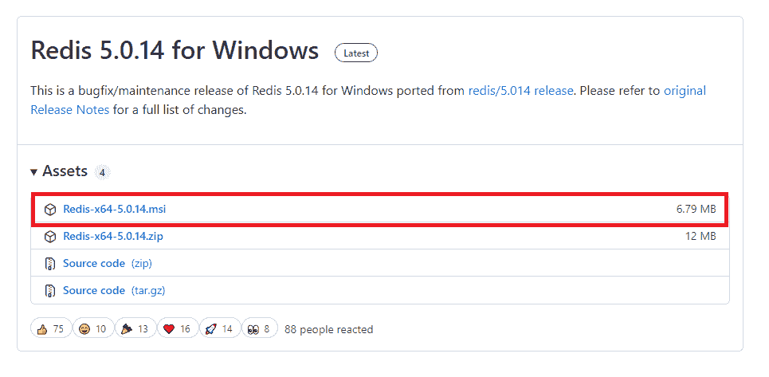
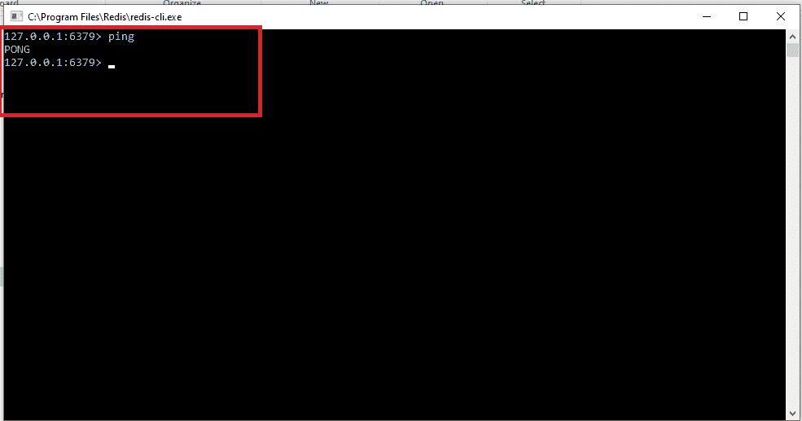

# Celery 教程：Python 开发人员必须学习的技术

> 原文：<https://www.javatpoint.com/celery-tutorial-using-python>

在本教程中，我们将讨论最流行的、Python 开发人员必须学习的技术。Python 开发人员协会中的每个人都已经了解了 Celery，或者可能已经实现了至少一次。

在快速互联网时代，用户希望瞬间加载页面，几秒钟就能得到结果。小任务可以在一秒或几微秒内执行，但重任务可能需要几秒甚至一分钟。

那么问题来了，当我们复杂的任务还在加载的时候，我们如何提供快速的用户体验呢？

下面是异步编程的作用。Celery 用于任务的并行执行。

当中央处理器处于理想状态时，Celery 提供了在后台运行程序/作业的工具。在深入探讨这个话题之前，让我们先了解一下 Celery 的核心概念，以及我们为什么要使用它。

在本教程中，我们将讨论 Celery 的以下概念。

*   Celery 是什么？
*   它是如何工作的？
*   什么是任务队列？
*   什么是消息代理？
*   这为什么有用？
*   它是如何工作的？
*   Celery 的特点
*   Celery 入门

## Celery 是什么？

Celery 是一个开源的 Python 库，用于异步运行任务。它是一个任务队列，保存任务，并以适当的方式将其分配给工人。它主要关注实时操作，但也支持调度(运行定期间隔任务)。它惊人地增强了最终用户的活动。Celery 介绍了**rabbtmq****Redis 等各种消息经纪人。**

Celery 结合了各种网络框架，包括 Flask、Pylons、web2py、Tryton 和 Tornado。

## 为什么有用？

假设我们需要每分钟(小时)访问一次 API，或者我们想在一天结束时发送多封电子邮件。Celery 可以很容易地安排这类周期性任务。

让我们看另一个场景:用户发送请求，页面加载时间过长。同时，Celery 通过在同一台服务器或不同的服务器上运行部分延期任务的功能来减少页面加载时间。

Celery 的工人可以通过回调更新用户界面，处理文件，发送电子邮件，修改数据库等等。

Celery 的主要优点是我们的应用可以继续响应客户端请求。因此最终用户不必不必等待。

## Celery 是如何工作的？

在传统的 HTTP 请求-响应周期中，当我们通过客户端向服务器发送请求时，服务器向客户端发送响应。它适用于小任务，但当我们试图加载大任务时，它可能会变得很慢。因此，我们需要实现一个可以减少加载时间的功能。

让我们了解 Celery 的工作场景。

Celery 通过信息相互作用；通常经纪人是客户和工人之间的中间人。Celery 的内向型工作被确认为生产者和消费者模式。Celery 有三大高级元素。

**生产者-** 生产者是管理网络请求的**【网络节点】**。当应用正在处理时，任务被分配给 Celery 意味着被强制进入任务队列。

**消费者-** 消费者是**【工人节点】**监控队列头，工人承担任务并执行。工人也可以执行各种任务；因此，他们也可以扮演生产者的角色。

**Queue -** 它基本上是一个消息代理，充当生产者和消费者之间的桥梁。它本质上是在 web 应用和 Celery 工人之间传递消息。Celery 得到了 RabbitMQ 和 Redis 的广泛支持，也帮助了动物园管理员，亚马逊 SQS，但能力有限。

## Celery 的特点

Celery 是一种方便的结构，通过延迟的任务减少生产负荷，因为它准备异步和计划的工作。以下是 Celery 的一些重要特征。

*   **开源库-** Python Celery 是开源免费软件。这个特性吸引了组织或开发人员使用 Celery 来解决他们的任务，而无需支付一分钱。
*   **直接安装-** 这是一个轻量级的简单库，可以轻松安装。我们可以使用**“pip install-U Celery”命令从终端[安装](https://docs.celeryproject.org/en/stable/getting-started/introduction.html#installation)。**
*   **调度-** 我们可以使用**日期时间**模块以及**Celery 节拍**来指定运行任务的特定时间。Celery 拍可以定期触发任务。我们可以基于简单的时间间隔对重复事件使用周期性任务。
*   **经纪人支持-** Celery 支持多个消息经纪人，通俗的说就是**rabbtmq**，它也支持亚马逊 SQS，但是在某些功能上有所欠缺**(监控和远程控制)。**
*   **与网络框架的集成-** Celery 还与各种 Python 网络框架相结合，如金字塔、挂架、Django、Tornado、Trylons 和 Flask。
*   **Fast -** Celery 可以在一分钟内处理数百万个任务。
*   **作品流-** 它可以使用一组被称为**“画布”的高级原语来组合简单和复杂的作品流。**

## Celery 入门

在本教程中，我们将使用 Django 实现 Celery，在这里我们将创建一个简单的任务队列。让我们从下面的步骤开始。

### 创建一个 Django 项目

首先，我们将在**Celery _django** 文件夹中创建一个名为**learn _ Celery**的 Django 项目。但首先我们将创建虚拟环境。所有依赖项都将存储在虚拟环境中。

> c:\用户\用户\桌面\Celery _django>python -m venv myenv

创建虚拟环境后，我们将使用以下命令激活。

> c:\用户\用户\桌面\Celery _ django > my env/bin/激活

使用以下命令安装 Django。

### pip 安装 django

安装**Django 后，**创建项目。我们正在使用下面的命令创建名为**学习 Celery**的项目。

> c:\用户\用户\桌面\Celery _ django > django-管理员开始项目学习-Celery

如果您不熟悉如何在 **Django、**中创建项目或应用，可以访问我们的 [Django 教程。](https://www.javatpoint.com/djano-tutorial)现在，我们准备在虚拟环境中安装 Celery。

### 装置

我们可以使用下面的命令安装 Celery。

> pip 安装 Celery

Celery 安装完成后，我们将在 Django 项目中配置 Celery。

### Celery 配置

打开项目的 settings.py 文件并添加以下配置。我们使用 redis 作为消息代理。

> #Celery 设置 Celery _ BROKER _ URL = ' redis://127 . 0 . 0 . 1:6379 'Celery _ ACCEPT _ CONTENT =[' application/JSON ']Celery _RESULT_SERIALIZER = 'json 'Celery _TASK_SERIALIZER = 'json 'Celery _TIMEZONE = 'Asia/Kolkata '

### 选择经纪人

代理是使应用、系统和服务能够通信和共享信息的独立服务。让我们简化这个术语，我们通过消息队列将任务分配给工作人员。消息队列是一种先进先出的数据结构，这意味着首先存储的消息将首先被执行。所有任务将按照我们添加的顺序执行。

在本教程中，我们将使用 Redis 消息代理。

**Windows 中的 Redis 安装**

在 Mac/Ubuntu 中安装 Redis 非常简单，但对 Window 来说有点棘手。所以这里我们描述如何在 Windows 中安装 redis。

*   访问 Github 链接[https://github.com/tporadowski/redis/releases](https://github.com/tporadowski/redis/releases)，点击 [Redis-x64-5.0.14.msi](https://github.com/tporadowski/redis/releases/download/v5.0.14/Redis-x64-5.0.14.msi) 。它将下载。msi 文件。
    
*   点击下载的设置。它会自动将 redis 安装在你的 C: drive 系统中。安装完成后，打开 redis-cli 并键入 PING。
    

运行 Celery 程序也需要 Redis 依赖。我们可以使用下面的命令安装 redis 依赖项。

> pip 安装重定向器

安装完成后，使用以下命令启动服务器。

> redis 服务器

我们可以通过在终端中键入以下命令来测试 Redis 是否正常工作。

> redis-cli ping

如果用 **PONG** 回复，工作正常。

> PS D:\celery> redis-cli ping PONG

#### 注意-Celery 和 Redis 可以使用下面给出的单个命令来安装。

> pip install -U Celery[Redis]

### 创建 Celery. py 文件

现在打开 Django 项目中的 Celery. py 文件，并添加下面的代码。

**Celery 皮**

```py

import os

from celery import Celery
from celery.schedules import crontab

# Set the default Django settings module for the 'celery' program.
os.environ.setdefault('DJANGO_SETTINGS_MODULE', 'learn_django.settings')

#pass the project name in Celery(project_name)
app = Celery('learn_django')

# Using a string here means the worker doesn't have to serialize
# the configuration object to child processes.
# - namespace='CELERY' means all celery-related configuration keys
#   should have a `CELERY_` prefix.
app.config_from_object('django.conf:settings', namespace='CELERY')

#Celery Beat Settings
app.conf.beat_schedule = {
    'send-mail-every-day-at-8' :  {
        'task': 'emailExample.tasks.send_mail_func',
        'schedule': crontab(hour = 15, minute = 42),

    }

}

# Load task modules from all registered Django apps.
app.autodiscover_tasks()

@app.task(bind=True)
def debug_task(self):
    print(f'Request: {self.request!r}')

```

### 创建 Celery 任务

Celery 任务可以在 Django 应用/项目的 **tasks.py** 中创建。我们使用下面的命令在工作目录中创建一个应用。

```py

C:\Users\User\Desktop\celery_django>python manage.py startapp celeryApp .

```

一旦创建了应用，创建一个**任务。复制**文件并创建一个任务。这些任务是用 Celery 调用的常规 Python 函数。例如，我们创建了一个函数来打印 1 到 10 的整数。

```py

rom celery import shared_task

@shared_task(bind=True)
def test_func(self):
    for i in range(10):
        print(i)
    return "Completed"

```

现在在 view.py 文件中创建一个视图。

**view.py**

```py

from django.http import HttpResponse
# importing task from tasks.py file
from .tasks import test_func

# Create your views here.

def test(request):
    # call the test_function using delay, calling task
    test_func.delay()
    return HttpResponse("Done")

```

现在我们将把这个视图映射到 urls.py 文件中的 URL。

**celery app/URL . py**

```py

from django.urls import path

urlpatterns = [
    path('', test, name='test'),

```

#### 注意-要查看 Celery 结果，请安装以下第三方应用并在 settings.py 文件中注册。

```py

pip install django-celery-result

```

现在，我们准备执行第一个异步任务。现在运行 **python manage.py runserver** ，点击本地主机链接 http://127.0.0.1:8000/。

### 本地经营 Celery

现在打开新终端，导航到项目目录，激活虚拟环境。要启动 Celery 工人，请运行以下命令。

```py

PS D:\celeryPython> celery -A CeleryDjango.celery worker --pool=solo -l info

```

正如我们所看到的，我们的 Celery 已经开始并准备执行后台工作。默认情况下，Redis 消息代理运行在 6379 端口上。

```py

[2022-01-07 23:10:27,920: INFO/MainProcess] Connected to redis://127.0.0.1:6379//
[2022-01-07 23:10:27,936: INFO/MainProcess] mingle: searching for neighbors
[2022-01-07 23:10:29,007: INFO/MainProcess] mingle: all alone
[2022-01-07 23:10:29,029: WARNING/MainProcess] C:\Users\DEVANSH SHARMA\.virtualenvs\celeryPython-O5XHNBO2\lib\site-packages\celery\fixups\django.py:203: UserWarning: Using settings.DEBUG leads to a memory
            leak, never use this setting in production environments!
  warnings.warn('''Using settings.DEBUG leads to a memory

```

每次当我们访问 http://127.0.0.1:8000/向 Django 服务器发出请求时，我们应该会看到响应，Celery 会在后台异步执行我们在 **task.py** 文件中定义的任务。可以在 Celery 终端监控。


## 结论

Celery 是一个强大的作业队列，可以在后台运行任务。它最常用于发送频繁的电子邮件。但是，它可以多种方式使用。我们可以排队；在手头长期运行的任务上使用数据块，并定义执行任务的时间。

在本教程中，我们使用 Django 以 Celery 为例。我们已经定义了 Celery 的基本概念及其工作原理。我们还指定了如何与 Django 一起实现 Celery。您可以参考本教程，并使用 Celery 来运行您的异步任务。

* * *