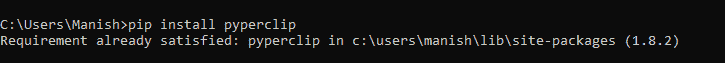

# Python `pyperclip`模块


很明显，在过去很多时候，我们需要将一些东西，一些文本或信息，从一个地方复制或粘贴到另一个地方。复制粘贴被认为是最简单、最容易、最省时的过程。我们很难想象，如果我们不得不一遍又一遍地写每件事，而不是使用复制粘贴选项，我们将在日常生活中花费多少时间。是的，不像很多次那样手动地一遍又一遍地复制粘贴和写同样的东西似乎非常困难和令人恼火。但值得庆幸的是，我们有这个选项，从而节省了大量的时间和精力，我们可以优化这些时间和精力来执行其他重要的任务。现在，我们中的许多人会开始思考，除了传统的复制粘贴选项之外，我们是否有更多的复制粘贴选项。这个问题的答案是一个混合的反应，是的，我们有其他的选择，我们可以用来从一个地方复制粘贴一些回形针到另一个地方。许多编程语言为我们提供了内置复制和粘贴选项的包和库，我们可以使用这些选项将消息或文本从一个地方(应用)复制和粘贴到另一个地方。如果我们没有传统的复制或粘贴消息的选项，我们可以使用这些功能来执行这项任务。

具体说到 Python，它有一个非常丰富的库，并且它附带了许多模块和包，这些模块和包具有可用于执行复制和粘贴任务的功能。使用这些模块及其功能非常简单，我们可以很容易地使用这些 Python 模块的功能来执行需要复制粘贴的任务。一个这样的 Python 模块是 `pyperclip`模块，它对于执行需要复制和粘贴功能的任务也非常有帮助。为了更好地了解本模块，我们将在本教程中学习本模块。通过将本模块导入示例程序，我们将在本教程中了解它的功能、安装和工作。

## Python 的 `pyperclip`模块介绍

pyperclip 是 Python 的跨`platform`模块，内置了很多功能，我们可以使用 `pyperclip`模块的所有这些功能来执行需要复制粘贴功能的任务。这个模块的一个优点是它可以完美地与 Python 的两个版本(Python 2 和 Python 3)一起工作。这是该模块的最大优势之一，因为许多 Python 模块并不兼容这两个 Python 版本，并且只能与这两个 Python 版本中的任何一个完美兼容。Python 的 `pyperclip`模块旨在提供跨平台复制和粘贴消息或文本的选项。当我们将程序的输出复制或发送到剪贴板时，我们可以非常容易地将其粘贴到多个平台上，就像我们可以使用该模块的功能将程序的输出粘贴到电子邮件、多个应用、文字处理器和许多其他地方一样。这增加了今天这个模块的重要性，因为我们需要将给定 Python 程序的输出发送给多个应用。现在，我们将继续学习本模块，并通过在本教程的示例程序中使用本模块的功能来了解本模块的工作原理。

## Python 中的 `pyperclip`模块:安装

在这一部分中，我们将了解 `pyperclip`模块的安装过程。`pyperclip`模块不是 Python 的内置包，因此，如果我们想在示例程序中使用该模块的功能，我们必须执行该模块的安装过程，并在我们的系统中安装该模块。我们有多种选择和方法可以用来在我们的机器上安装 `pyperclip`模块，但是安装这个模块的 pip 安装程序方法是最简单的。因此，我们将在本部分中使用 pip installer 方法在我们的系统中安装 `pyperclip`模块，只有在此之后，我们才能在示例程序中使用该模块的功能。首先，我们必须将下面的 pip 命令写入系统的命令提示符 Shell 中，以使用 pip 安装方法:

```py

pip install pyperclip

```

写完上面给出的 pip 命令后，我们必须按下“**进入**”来启动 `pyperclip`模块的安装过程。一旦安装过程开始，将需要一段时间在我们的系统中安装该模块的所有依赖项。



正如我们所看到的，成功安装的消息现在显示在屏幕上，这意味着 `pyperclip`模块成功安装在我们的系统中。这就是我们如何使用 pip 安装程序方法在系统中安装 Python 的 `pyperclip`模块。

## Python 中的 `pyperclip`模块:实现

既然我们已经完成了 `pyperclip`模块的安装部分，现在是我们继续这个模块的实现部分的时候了，这样我们都可以对这个模块如何工作以及如何在 Python 程序中使用这个模块的功能有一个基本的了解。`pyperclip`模块基本自带两个内置功能: **copy ()** 和 **paste()** 功能。我们可以在 Python 程序中使用这两个函数来执行所有需要复制&粘贴功能的任务。现在，我们将通过使用 `pyperclip`模块的这两个功能，将用户输入的文本复制到另一个变量中来理解这个模块的功能。

**看下面的示例程序，了解 `pyperclip`模块的实现:**

**示例 1:** 看看下面的 Python 程序，我们在其中使用了 `pyperclip`模块的 **copy()** 和 **paste()** 功能:

```py

# Importing the pyperclip module
import pyperclip as ppr
# Taking an input text from the user
inputText = input("Please provide an input text that will be copied into second variable: ")
# Copying the input text to the program's clipboard 
ppr.copy(inputText) 
# Pasting the copied text into the second variable
secVar = ppr.paste() 
# Printing the pasted text from clipboard in the output
print("The text which is provided by you in the input variable: ", secVar)

```

**输出:**

```py
Please provide an input text that will be copied into second variable: A Sample Text
The text which is provided by you in the input variable: A Sample Text

```

我们可以看到，程序中输入的给定文本被成功复制到程序中，同样的文本被打印在输出中。这就是我们如何在任何 Python 程序中使用 `pyperclip`模块的 **copy()** 和 **paste()** 功能将文本或消息从一个地方复制到另一个地方。

**说明:**我们首先在示例程序中将 `pyperclip`模块导入为 ppr，以便在程序中使用该模块的功能。之后，我们从用户那里获取了一个输入文本，我们将把它复制到程序的第二个变量中。然后，我们使用了 `pyperclip`模块的 **copy()** 函数，并在函数中提供了输入文本变量作为参数。通过在 **copy()** 函数中提供这个变量作为参数，这个变量中的文本将被复制到程序的剪贴板中。然后，我们使用该模块的**粘贴()**功能将剪贴板中的复制文本粘贴到程序的第二个变量中。输入变量中的文本成功复制到第二个变量后，我们已经打印了第二个变量中的文本来验证这一点。

我们现在已经学习了如何使用这个模块的功能将任何文本或消息从一个地方或应用复制到另一个地方或应用。这个模块更吸引人的一点是，不管我们复制的是什么数据类型，当我们粘贴复制的消息时，它都会被转换成字符串数据类型。这适用于我们将使用本模块的**复制()**和**粘贴()**功能复制的每个数据类型文本。

**我们可以通过查看以下示例程序来说明 `pyperclip`模块的这一特性:**

**示例 2:** 看看下面的 Python 程序，其中我们复制了一个输入 int 数据类型的文本:

```py

# Importing the pyperclip module
import pyperclip as ppr
# Taking an input int data-type text from user
inputText = int(input("Please provide an integer type input text that will be copied into second variable: "))
# Copying the input text to program's clipboard 
ppr.copy(inputText) 
# Pasting the copied text into second variable
secVar = ppr.paste() 
# Printing the pasted text from clipboard in the output
print("The text which is provided by you in the input variable: ", secVar)
# Illustrating the data-type change by printing data-type of both variable
type1 = type(inputText)
print("The data-type of input text provided by user: ", type1)
type2 = type(secVar)
print("The data-type of text that is copied into second variable: ", type2)

```

**输出:**

```py
Please provide an integer type input text that will be copied into second variable: 524
The text which is provided by you in the input variable: 524
The data-type of input text provided by user: <class 'int'>
The data-type of text that is copied into the second variable: <class 'str'>

```

如我们所见，输入的整数文本被复制到第二个变量中，并且该文本的数据类型被更改为字符串数据类型。这就是我们如何用 `pyperclip`模块的函数来说明复制文本的数据类型的变化。

* * *