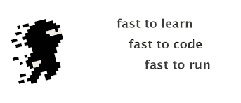
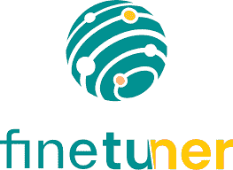

# 2022 年 Python 十大学习库

> 原文：<https://www.javatpoint.com/python-top-10-libraries-to-learn-in-2022>

在编程世界中，Python 是需求最大、效率最高的编程语言。有许多原因使 Python 成为一种非常受欢迎的语言。吸引人的一点是它不可思议的延展性。Python 提供了数千个库，减少了行数。Python 在全球拥有庞大的社区，其社区一直在不断更新其功能和库。

在本教程中，我们将讨论之前推出的 Python Top 10 库。我们没有列出所有人都知道的典型图书馆(熊猫、pytorch、numpy 或 Tensorflow)。

*   尴尬阵列
*   八月
*   堂皇地
*   中心
*   Jupytext
*   明显地
*   LightBGM
*   强哥忍者
*   sqlmmodel
*   不等边的

**奖励库**

*   纪娜和微调器

## 顶级 Python 库

我们列出了一些顶级 Python 库，这些库在未来几年可能会非常受欢迎，并在职业生涯中提供了扩展。下面是最近发布的前 10 个 Python 库。

### 1.尴尬阵列

我们大多数人可能都熟悉 **numpy** 及其数组。这是 **numpy** 的主要数据结构和一个价值网格。Numpy 数组允许对数据部分进行矢量化操作，这会影响低级库中的并行性和优化。因此，对于一个循环，它们的执行速度比 Python 快得多。

但是 Numpy 数组在表达变长结构方面有所欠缺。虽然我们可以将 **dtype** 设置为**对象，**这还不够。

在这种情况下，笨拙的库可以帮助我们。笨拙的数组看起来像下面的常规数组；它们是嵌套的树状数据结构(JSON)。它们类似于 Numpy 数组，例如将数据存储在连续的内存中。它们使用编译后的矢量化代码进行操作。

我们参考了尴尬的图书馆的官方文件。让我们理解下面的例子-

**示例-**

```py

import awkward as ak
array = ak.Array([
    [{"x": 1.1, "y": [1]}, {"x": 2.2, "y": [1, 2]}, {"x": 3.3, "y": [1, 2, 3]}],
    [],
    [{"x": 4.4, "y": [1, 2, 3, 4]}, {"x": 5.5, "y": [1, 2, 3, 4, 5]}]
])

```

*   **使用常规 Python 进行循环**

```py

import numpy as np

output = []
for sublist in array:
    tmp1 = []
    for record in sublist:
        tmp2 = []
        for number in record["y"][1:]:
            tmp2.append(np.square(number))
        tmp1.append(tmp2)
    output.append(tmp1)

```

**输出:1**

```py
[[[], [4], [4, 9]], [], [[4, 9, 16], [4, 9, 16, 25]]]   

```

*   **使用尴尬阵**

```py

output = np.square(array["y", ..., 1:])
print(output)

```

**输出:2**

```py
[[[], [4], [4, 9]], [], [[4, 9, 16], [4, 9, 16, 25]]]

```

正如我们所看到的，两个代码片段生成了相同的输出，但是第二个代码片段只用了一行。它速度更快，占用的内存更少。

### 2.格拉迪欧


如果你属于数据科学领域，一定要熟悉 **Streamlight。** Streamlight 将数据脚本集成到可共享的网络应用中，这样用户就可以将他们的输出演示为实际的应用，而不是木星笔记本。成绩是用友好的网络界面演示机器学习模型的最快方法。它使 ML 构建器的演示比 Streamlight 更容易和更快。

Radio 允许我们创建特定于机器学习模型的网络用户界面。

用户可以通过使用滑块更改参数、上传图像、编写文本和录制语音来修改应用。

毫无疑问，Gradio 使模型更容易访问，这对数据科学家来说是最重要的。

### 3.中心

有一种普遍的看法；通常，数据科学家花费大部分时间调整模型或规划解决新问题的最佳方法。那是错误的；数据科学家将大部分时间花在获取数据、安排不正确的格式和编写样板代码上。

基础结构代码对于处理数据的重要质量也是必不可少的。

Hub 是一种数据集格式，具有简单的应用编程接口，用于存储、创建和协作任何大小的人工智能数据集。我们可以存储任何数据集，而不用担心数据大小。许多科技巨头都在使用 Hub，如谷歌、Waymo、牛津大学、红十字会和 Omdena。

Hub 附带了 Pytorch 和 Tensorflow 的内置集成。它以压缩格式存储数据(卡盘数组)。我们还可以存储任何存储选项，例如 AWS S3、GCP 存储桶，或者可以考虑本地存储。Hub 工作缓慢，这意味着只有在需要时才会提取数据。主要优势之一是，我们不需要多 TB 来处理多 TB 数据集。

### 4\. 8 月


AugLy 用于训练计算机视觉中的鲁棒模型。从标记的数据中获得最重要的洞察力非常重要。此外，数据增强是 2021 年极大推动 SOTA 发展的各种学科的核心。

AugLy 是由 Meta(脸书)发明的，这是一个数据增强库，目前支持四种模式(音频、图像、文本和视频)和 100 多种增强。我们可以用元数据配置扩展，并对它们进行压缩以获得期望的结果。

AugLy 库旨在用于在模型训练中扩充我们的数据。在翻转、调整大小或颜色抖动方面还有许多其他库。让我们举一个现实生活中的 Aug 库的例子——把一个图像变成一个 meme，在图像/视频上叠加文本/表情符号，把一些图像变成 Instagram 过滤器，等等。

### 5.jupytext


Jupyter 笔记本是一个非常有用的工具，但是我们不想在网络浏览器中写入数据。这是 Jupyter 笔记本的缺点。此外，它还会在版本控制方面产生问题。Jupytext 消除了这些限制，允许我们将笔记本保存为几种语言的减价或脚本。它以纯文本形式提供结果，使得在版本控制中共享它们变得容易。其他人可以合并更改，甚至可以使用 IDEs 和它们漂亮的自动完成功能。它是 2022 年数据科学家的必备工具。

### 6.明显地


一组 ML 工程师和数据科学家创建了一个机器学习模型，hat 模型毫不费力地接收和发送数据。但是在生产的时候，很多事情都会出问题。发生这种情况的原因有很多。

它是一个开源的 Python 包，用于估计和探索机器学习模型的数据漂移。它不是检测数据中的异常，而是帮助我们检测数据漂移和目标漂移。它有助于在验证期间评估 ML 模型，并在生产中监控它们。

显然，它可以生成可视化报告，数据科学家可以交叉检查以确保一切正常。

### 7.莱特格姆


LightGBM 是一个最有效和梯度提升的机器学习框架，它使用基于树的学习算法。它允许程序员使用重新定义的基本模型和决策树，并开发新的算法。许多其他库，如 XGBoost 和 CatBoost，可以应用相同的方法，但是 LightGBM 具有一些高级优势。它提供了最佳的速度和内存使用，并提供了更好的准确性。这个库能够大规模处理数据。

### 8 .强哥忍者



Django 是一个最流行的包含电池的框架，用于构建 web 应用。如果开发人员想要创建一个 RESTful APIs，他们会转向 Django Rest 框架。但是有一个新的竞争者被称为姜戈忍者。这是一个用 Django 构建 API 的快速网络框架。Django Ninja 提供了创建 API 的简单方法，在这里我们可以对参数进行类型转换和验证。它由多家公司在直播项目中使用。它还与 Django 和 ORM 集成在一起，因此我们可以轻松利用 Python/Django。

### 9.sqlmmodel

SQLModel 是一个库，它使用 Python 对象的 Python 代码与 SQL 数据库交互。它基于 Python 注释，并得到 **Pydantic** 和 **SQLAlchemy 的支持。**为编辑器提供了很大的支持，调试花费的时间更少。这个库非常简单，用户友好。主要优点是；与 **FastAPI、Pydantic、**和 **SQLAlchemy 有很好的兼容性。**如果你熟悉数据库的基础知识，你可以很容易地通过这个库了解到。

### 10.不等边的

Scalene 是一个集成的高性能内存 GPU/CPU 剖析器，可以做几件事。它能够处理多线程代码，并提供比其他分析器好得多的细节。使用它时，我们不需要在脚本中进行更改，可以从 scalene 命令执行脚本。它只是以 HTML 文档或文本的形式给出结果，以跟踪每行代码使用的 CPU 和内存。

## 奖金库

### 纪娜和微调器



我们大多数人都在使用像谷歌这样的搜索引擎，但是你有没有注意到搜索引擎是如何变得比几年前更好的。场景背后发生了革命性的事情，正在慢慢取代传统的基于关键词的搜索方式。

一种新的搜索方式被称为神经搜索。神经搜索将整个文本输入神经网络，神经网络将变成向量。为了简化，在基于关键词的搜索中，文本被放入离散的标记中，并用于匹配。神经搜索不仅仅局限于文本数据。它可以用任何数据类型(图像、音频和视频)来实现。

纪娜提供了一个革命性的解决方案，使开发人员能够在几分钟内构建可扩展的深度学习搜索应用。从代码和部署的角度来看，它提供了实现神经搜索系统的工具。它是可扩展的和云原生的。

另一方面，微调器允许我们对神经网络表示进行微调，以获取最适合神经搜索任务的结果。

## 结论

还有其他几个流行且有用的库可以成为技术领域的里程碑。但是我们已经解释了几个重要的、通用的库，它们可以在不久的将来被广泛使用。Python 是数据科学活动中最常用的语言。Python 专家将使用上述大多数工具来提高产品质量。

* * *