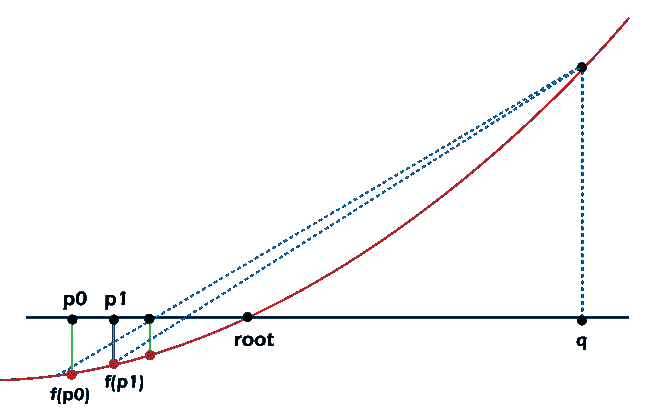
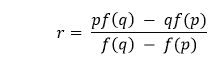
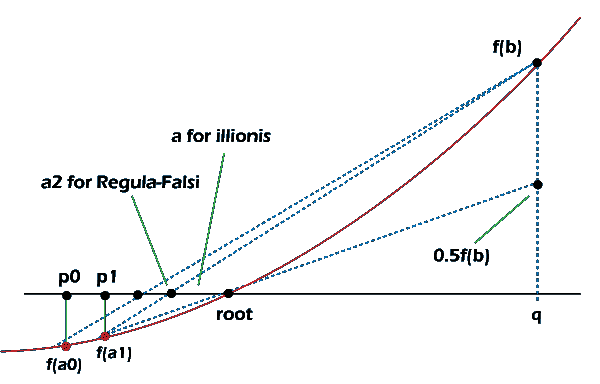
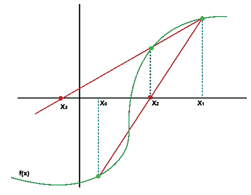
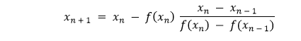
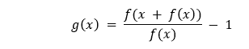
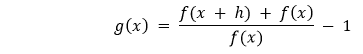
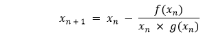

# Python 中有效的根搜索算法

> 原文：<https://www.javatpoint.com/effective-root-searching-algorithms-in-python>

作为数据科学家和计算机科学家，我们经常在日常生活中处理根搜索算法，即使我们没有意识到这一点。这些算法被设计成定位特定值、局部/全局最大值或最小值的附近。

我们利用根搜索算法来搜索特定值、局部/全局最大值或最小值的接近度。

在数学中，求根通常意味着我们试图求解一个像 f(X) = 0 这样的方程组。这将使根搜索算法也成为非常有效的搜索算法。我们要做的就是定义 g(X) = f(X) - Y，其中 Y 是搜索目标，而不是像 g(X) = f(X) - Y = 0 那样求解 X。

**这些方法主要分为两个不同的家族:**

1.  **括号逼近**(例如二等分算法)
2.  **迭代方法**(例如牛顿法、割线法、斯特芬森法等等)

在下面的教程中，我们将了解 Python 编程语言中一些算法的实现，并将它们相互比较。这些算法如下:

1.  二分算法
2.  正则-法尔西算法
3.  伊利诺伊算法
4.  割线算法
5.  斯特芬森算法

在我们开始之前，让我们假设我们有一个连续的函数 f，并且想要搜索一个值 y。因此，我们正在求解方程:f(x) - y = 0。

## 理解等分算法

二分算法，也因其离散版本(二分搜索)或树变体(二叉查找树)而闻名，是一种在边界内搜索目标值的有效算法。因此，这种算法也被称为寻找算法根的包围方法。

**关键强度:**

1.  二分算法是一种稳健的算法，保证了对目标值的合理收敛速度。

**关键弱点:**

1.  该算法需要知道根的估计面积。比如 3 ≤ π ≤ 4。
2.  这个算法很好用；估计区域中只有一个根。

假设我们知道 x 在 f(p)和 f(q)之间，这就形成了搜索括号。算法将检查 x 是否大于或小于 f((p + q) / 2)，这是括号的中点。

当搜索一个连续函数时，很可能，我们将永远无法定位精确的值(例如，定位？).需要一定的误差范围来检查支架的中点。当计算值接近目标值时，我们可以将误差幅度视为提前停止。例如，如果误差幅度为 0.001%，3.141624 是否足够接近？，约 3.1415926...

如果计算值足够接近目标值，则搜索完成，否则，如果 x 小于 f((p + q) / 2，则搜索下半部分的值，反之亦然。

现在让我们考虑下面的代码片段，它在 Python 中演示了同样的内容。

**示例:**

```py

def bisectionAlgorithm(f, p, q, y, margin = .00_001):
    ''' Bracketed approach of Root-finding with bisection method
    Arguments
    ----------
    f: callable, continuous function
    p: float, lower bound to be searched
    q: float, upper bound to be searched
    y: float, target value
    margin: float, error margin in absolute term

    Return Values
    ----------
    A float r, where f(r) is within the margin of y
    '''

    if (lower := f(p)) > (upper := f(q)):
        p, q = q, p
        lower, upper = upper, lower

    assert y >= lower, f"y is smaller than the lower bound. {y} < {lower}"
    assert y <= upper, f"y is larger than the upper bound. {y} > {upper}"

    while 1:
        r = (p + q) / 2
        if abs((y_r := f(r)) - y) < margin:
            # found!
            return r
        elif y < y_r:
            p, upper = r, y_r
        else:
            q, lower = r, y_r

```

**说明:**

在上面的代码片段中，我们将一个函数定义为**等分算法**，该算法接受一些参数，如 **f、p、q、y** 和 **margin** ，其中 **f** 是一个可调用的连续函数， **p** 是一个浮点值和要搜索的下限， **q** 也是一个浮点值和要搜索的上限， **y** 又是一个浮点值和目标值然后我们使用 **if** 条件语句来检查分配给 **f(p)** 的下界是否大于分配给 **f(q)** 的上界，对于这种情况， **p** 和 **q** 的值等于 **q** 和 **p** 并且上下等于上下。然后我们使用**断言**关键字来调试 **y** 的值。然后我们使用了**而**循环，其中我们定义了 **r** 的值等于 **p** 和 **q** 的平均值。在这个循环中，我们还使用了 **if-elif-else** 条件语句来检查分配给 **f(r) - y** 的 **y_r** 是否小于边距，并返回相同的 **r** 。

## 理解虚假位置算法

类似于二等分算法，伪位置算法，也称为雷古拉法西，利用包围方法。但是与二等分算法不同，它并不使用每次迭代都将问题空间分成两半的强力方法。相反，该算法迭代地绘制一条从 f(p)到 f(q)的直线，并将截距与目标值进行比较。然而，不能保证搜索效率总是得到提高。例如，下图描述了如何只有下限以降低的速率增加，而上限保持不变。



**图 1:** 停滞边界减缓收敛

**关键强度:**

1.  这种算法通常比二等分算法收敛得更快。
2.  Regula Falsi 的好处是，随着括号变小，连续函数将收敛到一条直线。

**关键弱点:**

1.  当算法达到停滞界限时，Regula Falsi 也显示出较慢的收敛速度。
2.  该算法需要知道根的近似面积。比如 3 ≤ π ≤ 4。

Regula Falsi 和平分算法在实现上的显著区别是 r 不再是 p 和 q 的中点；然而，据估计:



让我们考虑下面的代码片段来证明这一点:

**示例:**

```py

def regulaFalsiAlgorithm(f, p, q, y, margin = .00_001):
    ''' Bracketed approach of Root-finding with regula-falsi method
    Arguments
    ----------
    f: callable, continuous function
    p: float, lower bound to be searched
    q: float, upper bound to be searched
    y: float, target value
    margin: float, error margin in absolute term

    Return Values
    ----------
    A float r, where f(r) is within the margin of y
    '''

    assert y >= (lower := f(p)), f"y is smaller than the lower bound. {y} < {lower}"
    assert y <= (upper := f(q)), f"y is larger than the upper bound. {y} > {upper}"

    while 1:
        r = ((p * (upper - y)) - (q * (lower - y))) / (upper - lower)
        if abs((y_r := f(r)) - y) < margin:
            # found!
            return r
        elif y < y_r:
            q, upper = r, y_r
        else:
            p, lower = r, y_r

```

**说明:**

在上面的代码片段中，我们定义了一个函数为 **regulaFalsiAlgorithm** ，该函数接受一些参数，如 **f、p、q、y** 和 **margin** ，其中 **f** 是一个可调用的连续函数， **p** 是一个浮点值和要搜索的下限， **q** 也是一个浮点值和要搜索的上限， **y** 又是一个浮点值然后我们使用**断言**关键字来调试 **y** 的值。然后我们使用了**和**循环，在该循环中我们定义了 **r** 的值。在这个循环中，我们还使用了 **if-elif-else** 条件语句来检查分配给 **f(r) - y** 的 **y_r** 是否小于边距，并为其返回 **r** 。

## 理解伊利诺伊算法(修正的雷古拉·法西)

为了越过停滞边界，我们可以插入一个条件规则，当一个边界保持停滞两轮。就拿前面的例子来说，由于 q 已经两轮没有移动了，并且 r 还没有靠近根 x，所以在下一轮的时候，线会画到 f(q) / 2，而不是 f(q)。如果下界是停滞界，那么下界也是如此。



**图 2:** 伊利诺伊算法避免了长时间停滞，收敛速度更快。

**关键强度:**

1.  伊利诺伊算法比二等分算法和雷古拉法西算法收敛更快。
2.  我们可以通过将停滞界限与目标值的距离减半来避免停滞界限。

**关键弱点:**

1.  当算法达到停滞界限时，该算法也表现出较慢的收敛。
2.  该算法需要知道根的估计面积。比如 3 ≤ π ≤ 4。

**示例:**

```py

def illinoisAlgorithm(f, p, q, y, margin = .00_001):
    ''' Bracketed approach of Root-finding with illinois method
    Arguments
    ----------
    f: callable, continuous function
    p: float, lower bound to be searched
    q: float, upper bound to be searched
    y: float, target value
    margin: float, error margin in absolute term

    Return Values
    ----------
    A float r, where f(r) is within the margin of y
    '''

    assert y >= (lower := f(p)), f"y is smaller than the lower bound. {y} < {lower}"
    assert y <= (upper := f(q)), f"y is larger than the upper bound. {y} > {upper}"

    stagnant = 0

    while 1:
        r = ((p * (upper - y)) - (q * (lower - y))) / (upper - lower)
        if abs((y_r := f(r)) - y) < margin:
            # found!
            return r
        elif y < y_r:
            q, upper = r, y_r
            if stagnant == -1:
                # Lower bound is stagnant!
                lower += (y - lower) / 2
            stagnant = -1
        else:
            p, lower = r, y_r
            if stagnant == 1:
                # Upper bound is stagnant!
                upper -= (upper - y) / 2
            stagnant = 1

```

**说明:**

在上面的代码片段中，我们定义了一个函数为 **illinoisAlgorithm** ，它接受一些参数，如 **f、p、q、y** 和 **margin** ，其中 **f** 是一个可调用的连续函数， **p** 是一个浮点值和要搜索的下限， **q** 也是一个浮点值和要搜索的上限， **y** 又是一个浮点值和目标值，【T12 然后我们使用**断言**关键字来调试 **y** 的值。然后，我们将变量定义为等于零的**停滞**。然后我们使用了**和**循环，在该循环中我们定义了 **r** 的值。在这个循环中，我们还使用了 **if-elif-else** 条件语句来检查分配给 **f(r) - y** 的 **y_r** 是否小于边距，并为其返回 **r** 。

## 理解割线法(拟牛顿法)

到目前为止，我们一直在实施括号方法。如果我们不知道括号的位置呢？在这种情况下，割线法可能会有所帮助。割线法是一种迭代算法，从两个值开始，并试图向目标值收敛。虽然我们可以在算法收敛的同时获得更好的性能，并且不需要知道粗略的根位置，但是如果两个初始值离真正的根太远，我们可能会遇到发散的风险。

**关键强度:**

1.  割线方法不需要由根组成的括号。
2.  这种方法不需要知道根的估计面积。

**关键弱点:**

1.与所有早期的方法不同，割线法不能保证收敛性。

割线方法从检查两个用户定义的种子开始。假设我们想求 x <sup>2</sup> - math.pi = 0 的根，从 x_0 = 4 和 x_1 = 5 开始；我们的种子将分别是 4 粒和 5 粒。(注:这个过程类似于像 x 一样搜索 x <sup>2</sup> = math.pi)



**图 3:** 割线基于 x1 和 x2 定位 x3 的方法

然后，我们通过在 f(x_0)和 f(x_1)之间画一条直线来定位目标值为 x_2 的截距，就像我们在 Regula Falsi 算法中所做的那样。如果 f(x_2)没有足够接近目标值，我们必须重复该步骤并定位 x_3。通常，我们可以使用以下公式计算下一个 x:



让我们考虑下面的代码片段来证明这一点:

**示例:**

```py

def secantAlgorithm(f, x0, x1, y, iterations, margin = .00_001):
    ''' Iterative approach of Root-finding with secant method
    Arguments
    ----------
    f: callable, continuous function
    x0: float, initial seed
    x1: float, initial seed
    y: float, target value
    iterations: int, maximum number of iterations to avoid indefinite divergence
    margin: float, margin of error in absolute term
    Return Values
    ----------
    A float x2, where f(x2) is within the margin of y
    '''

    assert x0 != x1, "Two different initial seeds are required."

    if abs((y0 := f(x0) - y)) < margin:
        # found!
        return x0
    if abs((y1 := f(x1) - y)) < margin:
        # found!
        return x1

    for i in range(iterations):
        x2 = x1 - y1 * (x1 - x0) / (y1 - y0)
        if abs((y2 := f(x2) - y)) < margin:
            # found!
            return x2
        x0, x1 = x1, x2
        y0, y1 = y1, y2
    return x2

```

**说明:**

在上面的代码片段中，我们将一个函数定义为 **secantAlgorithm** ，该函数接受一些参数，如 **f、x0、x1、y、迭代**和 **margin** ，其中 **f** 是一个可调用的连续函数， **x0** 和 **x1** 是浮点值和初始种子， **y** 又是一个浮点值，目标值， **迭代**为整数值，存储最大迭代次数的值，避免不定发散，**余量**为绝对项误差余量，也是浮点值。 然后我们使用**断言**关键字来检查 **x0** 的值是否不等于 **x1** 的值。然后，我们使用 **if** 条件语句检查分配给 **f(x0) - y** 的 **y0** 是否小于**边距**变量，并返回相同的 **x0** 变量。我们再次使用 **if** 条件语句检查分配给 **f(x1) - y** 的 **y1** 是否小于**边距**变量，并返回相同的 **x1** 变量。最后，我们使用【T44 for】循环来迭代存储在**迭代**变量中的值，并定义公式来寻找根。在循环中，我们再次使用了 **if** 条件语句并返回 **x2** 。

## 理解斯特芬森方法

割线法通过消除由根组成的括号的要求，进一步改进了 Regula Falsi 算法。让我们回想一下，直线只是两个 x 值的切线(即导数)的一个天真值(或者在 Regula Falsi 和 Illinois 算法的情况下是上下界)。随着搜索的收敛，这个值将是完美的。在斯特芬森算法中，我们将尝试用更好的导数值来代替直线，以进一步改进割线法。

**关键强度:**

1.  Steffensen 的方法不需要包含根的括号。
2.  该方法也不需要根的估计面积的知识。
3.  如果可能的话，这种方法比割线法收敛得更快。

**关键弱点:**

1.  如果初始种子离真正的根太远，Steffensen 的方法不能保证收敛。
2.  连续函数的求值将是割线法的两倍，以便更好地计算导数。

我们可以在斯特芬森算法的帮助下，通过基于用户定义的初始种子 x0 计算以下内容来更好地估计导数。



这相当于下面的式，其中 h = f(x):



取 h 到 0 的极限，我们将得到？(?).

然后，我们将使用广义评估斜率函数，按照与割线法相同的步骤定位下一步:



让我们考虑下面的代码片段来证明这一点:

**示例:**

```py

def steffensenAlgorithm(f, x, y, iterations, margin = .00_001):
    ''' Iterative approach of Root-finding with steffensen's method
    Arguments
    ----------
    f: callable, continuous function
    x: float, initial seed
    y: float, target value
    iterations: int, maximum number of iterations to avoid indefinite divergence
    margin: float, error margin in absolute term
    Return Values
    ----------
    A float x2, where f(x2) is within the margin of y
    '''

    assert x != 0, "Initial seed can't be zero."

    if abs((yx := f(x) - y)) < margin:
        # found!
        return x

    for n in range(iterations):
        g = (f(x + yx) - y) / yx - 1
        if g * x == 0:
            # Division by zero, search stops
            return x
        x -= (f(x) - y) / (g * x)
        if abs((yx := f(x) - y)) < margin:
            # found!
            return x
    return x

```

**说明:**

在上面的代码片段中，我们定义了一个函数为 **secantAlgorithm** ，它接受一些参数，如 **f，x0，x1，y，迭代，**和 **margin** ，其中 **f** 是一个可调用的连续函数， **x0** 和 **x1** 是浮点值和初始种子， **y** 又是一个浮点值，目标值， **迭代**为整数值，存储最大迭代次数的值，避免不定发散，**余量**为绝对项误差余量，也是浮点值。 然后我们使用**断言**关键字来检查初始种子是否不等于零。然后我们使用 **if** 条件语句检查分配给 **f(x) - y** 的 **yx** 是否小于**边距**变量，并返回相同的 **x** 变量。最后，我们使用【T30 for-循环来迭代存储在**迭代**变量中的值，并定义公式来寻找根。在循环中，我们再次使用了 **if** 条件语句并返回 **x** 。

## 结论

在上面的教程中，我们已经了解了用于搜索根的以下五种算法的优点、缺点和实现。

1.  二分算法
2.  雷古拉法尔西算法
3.  伊利诺伊算法
4.  割线算法
5.  斯特芬森算法

现在让我们考虑下表，它显示了我们已经实现的算法的比较。

|  | 二分算法 | 雷古拉法尔西算法 | 伊利诺伊算法 | 割线算法 | 斯特芬森算法 |
| **接近** | 支架 | 支架 | 支架 | 重复的 | 重复的 |
| **收敛** | 担保 | 担保 | 担保 | 不保证 | 不保证 |
| **根部大致位置的知识** | 需要 | 需要 | 需要 | 不需要 | 不需要 |
| **初始种子数量** | Two | Two | Two | Two | one |
| **缓慢收敛的风险** | 无法使用 | 停滞界限 | 无法使用 | 初始种子离根不够近 | 初始种子离根不够近 |
| **减少问题空间的方法** | 暴力减半 | 有限差分近似导数 | 有限差分近似导数 | 有限差分近似导数 | 有限差分近似导数 |
| **收敛速度** | 线性的 | 线性的 | 超线性的 | 超线性的 | 二次的 |

一旦我们熟悉了这些算法，本教程就没有涉及到许多其他要探索的寻根算法。其中一些是牛顿-拉夫森法、逆二次插值、布伦特法等等。继续探索，将上述算法添加到工具库中。

* * *