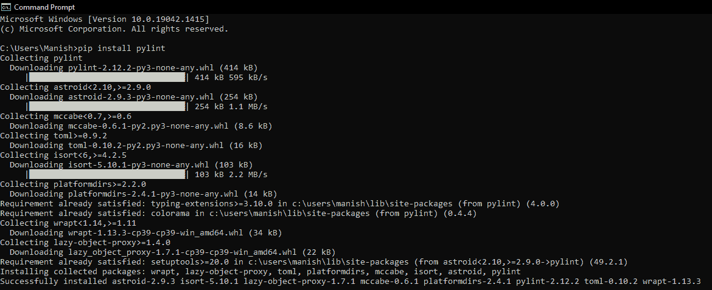
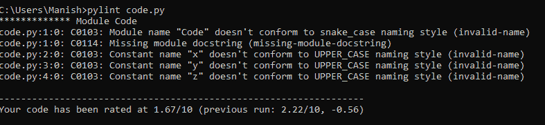
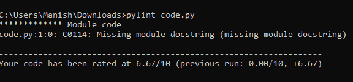

# Python PyLint 模块

> 原文：<https://www.javatpoint.com/python-pylint-module>

Word 编程总是与 word 错误联系在一起，因为在编码过程中，我们都会遇到错误，这是非常常见的。错误对所有程序员来说都很常见，这不仅是初学者面临的问题。即使是编程多年的程序员，在程序中也容易遇到这些错误。错误是编程不可或缺的一部分。但这并不意味着当我们在程序中遇到任何错误时，我们不必采取任何行动。错误可以有多种类型，所有这些类型都会导致程序运行不正常。错误是我们期望从特定程序中得到的期望输出的障碍。因此，我们也应该记住，学习错误解决方法也是学习编程的一部分。当我们的程序遇到错误时，我们必须学习多种方法、途径和函数。此外，在当今时代，当我们生活在一个互联互通的世界中时，我们不得不面对的另一个主要问题是理解他人的程序。在很多情况下，我们不得不使用对方的程序，在那个时候，如果我们遇到任何错误，我们就很难解决这些错误。这甚至更难，因为首先，我们必须了解其他程序的功能，以及该特定程序是如何与其中的给定逻辑和功能一起工作的。只有在那之后，我们才有可能了解程序错误发生在哪个部分。

如今，每当我们面对别人程序中的错误时(有时也针对自己编写的程序)，我们大多数人都会开始上网。当我们不能理解程序是如何工作的或者程序的逻辑和流程是什么时，这可能是一个很好的选择。但是这个问题也伴随着很多错误在互联网上找不到的问题，然后，我们必须再次回到程序中去理解它的逻辑。这在很多情况下都是成立的，因为我们的每一个书面代码或具有相似逻辑的程序都不可能在互联网上发布。因此，作为一名程序员，我们也有责任编写代码，让每个使用这个程序的人都能阅读和理解。许多编程语言提供了多个包和库来解决我们在编码时可能面临的所有这些问题。使用这些包，我们可以很容易地在我们的程序中找到所有这样的错误和问题。如果我们专门讨论 Python，它还为我们提供了多个包，我们可以在 Python 程序中使用这些包来查找给定程序中的所有此类错误和问题。Python 提供的这类模块之一是 pylint 模块，我们可以用它来查找给定的 Python 程序中的错误和问题。因此，我们将在本教程中了解 Python 的 pylint 模块，并了解如何使用该模块找出给定 Python 程序中的错误和问题。

## Python 的 PyLint 模块介绍

PyLint 是一个 Python 程序，它的开发目的是为我们在处理其他 Python 程序时面临的常见问题提供解决方案。这个模块非常类似于 Python 的其他程序检查器模块，如 mypy、flake8、pyflakes 和 pychecker。当我们开始使用别人写的程序时，会出现许多不同的问题，我们所有人在过去肯定也遇到过许多这样的问题。我们在使用其他程序时面临的一些常见问题包括代码的文档字符串、程序中没有注释、没有解释性的东西、程序的格式以及许多其他问题。Python 的 pylint 模块旨在通过使用该模块执行程序来为所有这些问题提供解决方案。pylint 模块是一个命令行模块，我们可以在系统的命令提示符 Shell 中使用它。当我们使用这个模块在终端 Shell 中执行程序时，pylint 模块提供了程序的分数。如果一个程序的分数太低，说明这个程序需要改进，因此，在执行之后，这个模块也会提供建议。这些建议主要集中在我们如何提高程序的分数上，它们也显示了给定程序的可读性有多强。

## 皮托管模块的功能:

pylint 模块更像是一个工具，而不是 Python 模块。以下是一些常见的描述，建议我们使用 pylint 模块作为工具:

*   当我们使用 pylint 模块在终端 Shell 中执行 Python 程序时，它会列出我们在 Python IDE 中运行该程序时可能遇到的程序中的所有错误。
*   本模块建议如何更新程序中的某些特定块，以便更好地阅读和理解程序。
*   这个模块寻找程序中的编码气味，这就是它如何迫使用户在给定的程序中执行编码标准。
*   除了上述功能，pylint 模块还提供了对给定程序复杂性的详细检查。

## Python 的 PyLint 模块:安装

pylint 模块非常容易使用，但是在我们开始使用这个模块之前，我们必须首先确保这个模块是否存在于我们的系统中。这是因为 pylint 模块不是 Python 的内置模块，这意味着它不会随着 Python 源代码的安装而安装。因此，如果我们的系统中没有 pylint 模块，我们必须通过执行该模块的安装过程来安装该模块。我们可以使用多种方法来安装 pylint 模块，但是安装这个模块的 pip installer 方法不仅简单，而且非常容易。因此，在本教程的安装部分，我们将使用 pip 安装方法在机器中安装 pylint 模块。我们也可以指定我们想要安装 pylint 模块的目录(在命令提示符 shell 内部)，但是建议我们应该在默认目录中安装这个模块。

**要使用 pip 安装方式安装 pylint 模块，首先我们要打开我们系统的命令提示符 shell，在里面写下下面给定的命令:**

```py

pip install pylint

```

写完上面给出的 pip 命令后，我们可以通过按下‘enter’键给出命令开始安装过程，它将开始这个模块的安装过程。一旦安装过程开始，我们必须等待一段时间，因为这个模块带有多个预嵌入的依赖项，下载所有这些依赖项需要时间。



正如我们所看到的,“成功安装”消息现在显示在我们终端 Shell 的屏幕上，这意味着 pylint 模块已成功安装。我们也可以通过在命令提示符 shell 中检查这个模块的版本来验证这一点，或者一旦我们开始用这个模块执行代码，它就会被自动验证。

#### 注意:如果在运行给定的 pip 命令后显示“需求已经满足”，这意味着这个 pylint 模块已经存在于我们的系统中，我们可以直接开始使用它。

## Python 的 PyLint 模块:实现

要开始使用这个 pylint 模块，我们首先要编写一些示例程序，我们将在终端 Shell 中使用这个模块来执行这些程序。当我们使用这个模块执行程序时，程序中出现的任何错误或问题都会显示在命令提示终端的屏幕上，就像其他模块中显示的输出一样。因此，我们将编写非常基础和幼稚的程序，以便更好地理解这个模块的工作和功能。

**首先，我们必须用 Python 脚本编写下面给出的示例程序:**

```py

# Two variables
var1 = 24
var2 = 26
# Printing Addition
print (var1 + var2)

```

一旦我们编写了上面提到的示例程序，我们就必须将这个名为‘code . py’的 Python 脚本保存在安装 pylint 模块的同一个目录中；否则，我们将无法使用 pylint 模块执行该程序。

**现在，我们必须打开系统的命令提示符 Shell，并编写以下命令，这样我们就可以使用 pylint 模块执行示例程序:**

```py

pylint code.py

```

当我们按下“回车键”时，pylint 模块将执行给定的示例程序，结果将显示在屏幕上，如下所示:



如果我们仔细注意节目的评分，就会发现节目的评分很低。但是在这里，我们也应该记住一件事，低的执行分数并不总是意味着给定的程序是错误的。说到我们这个特殊的程序，我们已经保存在‘code . py’里面了，这个程序的分数也很低(1.67/10)。很多时候我们也可以看到节目的评分是负数。但是所有这些并不意味着程序包含错误，就像我们在示例程序中看到的那样。当我们在 Python IDE 上运行我们的示例程序时，它不会产生任何错误，并成功地在输出中产生所需的结果。因此，我们的示例程序的低分是什么意思，我们可以做些什么来提高这个分数。

首先，我们需要理解，我们在用 pylint 模块运行示例程序后看到的分数是程序清晰度的指标。这个分数表明，如果其他人正在阅读这个程序，他们理解这个示例程序会有多困难。该节目的低分表示该节目对其他人来说非常不清楚，而该节目的高分表示该节目非常清楚并且是常规形式的。除了分数之外，pylint 模块还为我们提供了多种建议，我们可以在程序中实施和使用这些建议来提高其清晰度和分数。命令提示符 shell 中的程序报告可以认为是对程序的完整分析，这将有助于我们在程序中犯更少的错误，并理解其他程序。每条信息，或者我们可以说节目分析报告中提供的建议，都是基于节目的风格、惯例和流畅度。

任何程序中不同类型的问题都由分析报告中的不同消息表示。正如我们在示例程序的分析报告中看到的，程序中有一些不同 id 和字母的建议。这些标识和字母用于向用户指示不同类型的建议。例如，如果代码中的一行包含错误，它将显示不同的建议标识，或者当一行代码包含复杂性时，它将由不同的建议标识来指示。因此，对于我们来说，这些建议的标识变得非常重要，这样我们就可以轻松地解释它们，并根据这些建议在程序中进行更改。因为我们会发现，分析报告中给出的每个建议的每个 ID 都以字母开头，其余的都是 ID 中的数字。建议中的字母表示我们的 Python 程序中需要的不同类型的改进(包括程序中存在的任何错误)。我们还可以说，建议标识中的字母表示消息对象的类型。与此同时，字母后面的数字提供了关于建议类型和计划中所需改进的深入细节。以下是对不同建议标识的描述，在使用 pylint 模块运行我们的 Python 程序后，我们可以在分析报告中看到:

| 没有 | 消息的关键字 | 字母表的对象扩展形式 | 建议对象的说明 |
| **1** | C | 惯例 | 当我们的程序没有遵循编写代码的标准规则以便所有人都能轻松理解时，我们会在结果分析报告中看到建议标识将以字母 C 开头。 |
| **2** | E | 错误 | 当程序的特定行包含一些错误时，我们程序的结果分析报告中的建议标识将以“E”消息对象开始，并且该错误将在程序的成功执行中产生问题。 |
| **3** | F | 致命的 | 当程序包含这种类型的错误时，我们将在程序的结果分析报告中看到建议标识以“F”消息对象开始，这阻止了 pylint 模块进一步执行程序。 |
| **4** | 稀有 | 重构 | 建议标识的“R”字母对象显示在我们程序的结果分析报告中，用于指示“不良代码气味” |
| **5** | W | 警告 | 在我们程序的结果分析报告中，以“W”消息对象开头的建议标识表明，在给定的代码行中存在一些特定于 Python 的相关问题。 |

这是 5 种特定于问题的消息对象，当我们在带有 pylint 模块的终端 Shell 中运行程序时，我们可以在结果分析报告中显示的建议标识中看到它们。

当我们使用 pylint 模块运行 Python 程序时，有一些非常常见的建议标识。一旦我们理解了这些建议标识，我们将很容易提高我们程序的分数，并使它对其他人来说更加清晰。我们也可以在处理其他人的代码时使用这些技术或建议，这样我们就可以很容易地理解给定的复杂程序。**以下是一些常见的建议标识及其解释，这样我们可以更好地理解它们:**

**(i)建议 ID C0326:** 这个建议 ID 出现在报告分析中，当时我们在那一行代码中出现了一个坏的空白错误。这意味着我们必须在变量名和“=”符号之间留出一个空格，实际上我们并没有提供。当一个运算符紧接在一个标识符之后使用时，这个规则或建议适用于我们在程序中所做的所有变量声明。

**(ii)建议 ID C0304:** 当我们出现漏行错误时，该建议 ID 出现在结果分析中。这意味着这个消息对象建议我们必须在程序中添加一个缺失的行，以便它看起来更清晰，所有人都可以理解。当这个建议 ID 出现在我们程序的结果分析报告中时，我们必须在程序的末尾添加一个空行。

**(iii)建议 ID C0114:** 当我们出现 made docstring 错误时，这个建议 ID 会出现在我们程序的结果分析报告中。显示这个消息对象意味着在我们的程序中存在一个丢失模块文档字符串的问题。而且，我们可以通过在程序的开始或顶部添加一个 docstring 来解决这个问题。这个文档字符串将会指出我们的程序是为了什么目的而设计的，以及程序的逻辑是什么。这不仅有助于我们提高节目的评分，而且使节目易于理解。

**(iv)建议 ID C0103:** 如果这个建议 ID 或消息对象已经出现在结果分析报告中我们代码的任何一行，这意味着我们有一个无效的名称错误。无效名称错误建议标识表明我们在程序中使用的变量或标识符的名称无效或不符合正确的编码约定。这通常发生在我们以小写字母开始编写变量或标识符名称时。我们可以通过定义程序中每个变量或标识符的名称来纠正这个问题，从大写字母开始。

#### 注意:但实际上人们认为我们在 Python 程序中使用的类名应该使用 CamelCasing 的书写风格，这意味着类名以大写字母开头。如果我们想避免在程序的结果分析报告中显示最后一种类型的消息对象或建议 id，我们将不得不在 pylint 模块中添加一个正则表达式。因为我们程序中的这个正则表达式实际上可以被 pylint 模块接受，所以变量名的字母以小写形式出现。

这都是关于 pylint 模块的一些常见的建议标识，帮助我们提高程序的分数，降低程序的复杂度。我们将使用这些建议标识的解释来更好地与他人的程序合作并理解它们。现在，我们将使用这些消息对象的解释来提高我们的示例程序的分数，我们已经在这个实现部分使用了它。当我们使用 pylint 模块执行我们的程序时，我们将根据结果分析报告中显示的建议标识修改我们的示例程序。**看看下面修改后的程序，其中我们根据 pylint 模块提供的建议进行了修改:**

```py

''' 
This is an example Python program that is written for the purpose of displaying addition results two variable numbers in the program 
'''
Var1 = 24
Var2 = 26
print('The Addition of Two Numbers Given in the Example Program:', Var1 + Var2)

```

让我们首先用 Python 运行这个示例程序，检查这个程序是否没有错误。当我们用 Python IDE 运行这个程序时，**它将在输出中产生以下结果:**

```py
The Addition of Two Numbers Given in the Example Program: 26

```

如我们所见，程序显示的输出没有错误，这意味着我们的示例程序没有错误。现在，我们将在带有 pylint 模块的终端 Shell 中运行这个程序来检查它的分数。当我们在系统的命令提示符 Shell 中使用 pylint 模块执行程序时，请查看下面这个示例程序的结果分析报告:



我们可以看到，我们节目的评分提高了很多，这意味着我们的节目变得比以前更清晰了。这就是我们如何使用结果分析报告中给出的建议标识来修改或更改我们的 Python 程序。

## 结论

本文介绍了 Python 的 pylint 模块、安装过程及其实现。这个模块帮助我们处理其他人的复杂 Python 程序。我们可以使用 Python 的 pylint 模块来使我们的程序没有错误，并使它们更容易理解。当我们发现其他程序复杂和不可理解时，我们也可以以同样的方式使用这个模块。

* * *