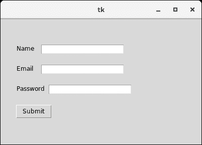
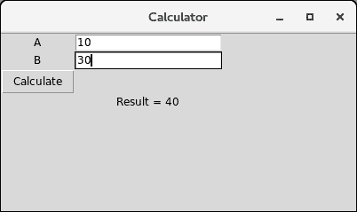

# Python tkinter 入口

> 原文：<https://www.javatpoint.com/python-tkinter-entry>

入口小部件用于向用户提供单行文本框，以接受来自用户的值。我们可以使用入口小部件来接受来自用户的文本字符串。它只能用于用户的一行文本。对于多行文本，我们必须使用文本小部件。

下面给出了使用入口小部件的语法。

### 句法

```py

w = Entry (parent, options) 

```

下面列出了可能的选择。

| 塞内加尔 | [计]选项 | 描述 |
| one | 锥齿轮 | 小部件的背景色。 |
| Two | 弹底引信（base detonating 的缩写） | 小部件的边框宽度，以像素为单位。 |
| three | 光标 | 鼠标指针将变为设置为箭头、点等的光标类型。 |
| four | 导出选择 | 默认情况下，写在输入框内的文本将自动复制到剪贴板。我们可以将 exportselection 设置为 0，以避免复制。 |
| five | 细粒 | 它表示文本的颜色。 |
| six | 字体 | 它表示文本的字体类型。 |
| seven | 高亮背景 | 它表示当小部件没有输入焦点时在遍历高亮区域显示的颜色。 |
| eight | 高亮颜色 | 它表示当小部件具有输入焦点时，在小部件周围绘制的遍历高亮矩形所使用的颜色。 |
| nine | 高光厚度 | 它表示一个非负值，表示当小部件具有输入焦点时，围绕小部件外部绘制的高亮矩形的宽度。 |
| Ten | 插入背景 | 它表示在插入光标覆盖的区域中用作背景的颜色。该颜色通常会覆盖小部件的正常背景。 |
| Eleven | insertborderwidth | 它表示一个非负值，表示围绕插入光标绘制的三维边框的宽度。该值可以具有 Tk_GetPixels 可接受的任何形式。 |
| Twelve | 插入时间 | 它表示一个非负整数值，指示插入光标在每个闪烁周期中应保持“关闭”的毫秒数。如果这个选项是零，那么光标不会闪烁:它一直亮着。 |
| Thirteen | 插入时间 | 指定一个非负整数值，指示插入光标在每个闪烁周期中应保持“开启”的毫秒数。 |
| Fourteen | 插入宽度 | 它表示指示插入光标总宽度的值。该值可以具有 Tk_GetPixels 可接受的任何形式。 |
| Fifteen | 证明合法 | 它指定如果文本包含多行，文本的组织方式。 |
| Sixteen | 减轻 | 它指定边框的类型。它的默认值是 FLAT。 |
| Seventeen | 选择背景 | 所选文本的背景色。 |
| Eighteen | selectborderwidth | 所选任务周围显示的边框宽度。 |
| Nineteen | 选择前景 | 所选任务的字体颜色。 |
| Twenty | 显示 | 它用于显示其他类型的输入文本，而不是字符串。例如，使用星号(*)键入密码。 |
| Twenty-one | textvariable | 它被设置为 StringVar 的实例，以从条目中检索文本。 |
| Twenty-two | 宽度 | 显示的文本或图像的宽度。 |
| Twenty-three | xscrollcommand | 如果我们希望用户输入比小部件实际宽度更多的文本，条目小部件可以链接到水平滚动条。 |

### 例子

```py

# !/usr/bin/python3

from tkinter import *

top = Tk()

top.geometry("400x250")

name = Label(top, text = "Name").place(x = 30,y = 50)

email = Label(top, text = "Email").place(x = 30, y = 90)

password = Label(top, text = "Password").place(x = 30, y = 130)

sbmitbtn = Button(top, text = "Submit",activebackground = "pink", activeforeground = "blue").place(x = 30, y = 170)

e1 = Entry(top).place(x = 80, y = 50)

e2 = Entry(top).place(x = 80, y = 90)

e3 = Entry(top).place(x = 95, y = 130)

top.mainloop()

```

**输出:**



## 入口小部件方法

Python 提供了各种方法来配置小部件中写入的数据。入口小部件提供了以下方法。

| 塞内加尔 | 方法 | 描述 |
| one | 删除(第一个，最后一个=无) | 它用于删除小部件中的指定字符。 |
| Two | get() | 它用于获取小部件内部编写的文本。 |
| three | 索引 | 它用于更改插入光标的位置。我们可以指定要放置光标的字符的索引。 |
| four | 指数 | 它用于将光标放在写入指定索引的字符的左侧。 |
| five | 插入(索引) | 它用于将指定的字符串插入到位于指定索引处的字符之前。 |
| six | 选择 _ 调整(索引) | 它包括选择出现在指定索引处的字符。 |
| seven | 选择 _ 清除() | 如果进行了某些选择，它将清除选择。 |
| eight | select_form(索引) | 它将定位索引位置设置为索引指定的字符。 |
| nine | select_present() | 如果选择了条目中的某些文本，则返回真，否则返回假。 |
| Ten | 选择范围(开始、结束) | 它选择存在于指定范围之间的字符。 |
| Eleven | 选择 _ 到(索引) | 它选择从开始到指定索引的所有字符。 |
| Twelve | xview(索引) | 它用于将条目小部件链接到水平滚动条。 |
| Thirteen | xview_scroll(数字，什么) | 它用于使条目水平滚动。 |

### 一个简单的计算器

```py

import tkinter as tk
from functools import partial

def call_result(label_result, n1, n2):
    num1 = (n1.get())
    num2 = (n2.get())
    result = int(num1)+int(num2)
    label_result.config(text="Result = %d" % result)
    return

root = tk.Tk()
root.geometry('400x200+100+200')

root.title('Calculator')

number1 = tk.StringVar()
number2 = tk.StringVar()

labelNum1 = tk.Label(root, text="A").grid(row=1, column=0)

labelNum2 = tk.Label(root, text="B").grid(row=2, column=0)

labelResult = tk.Label(root)

labelResult.grid(row=7, column=2)

entryNum1 = tk.Entry(root, textvariable=number1).grid(row=1, column=2)

entryNum2 = tk.Entry(root, textvariable=number2).grid(row=2, column=2)

call_result = partial(call_result, labelResult, number1, number2)

buttonCal = tk.Button(root, text="Calculate", command=call_result).grid(row=3, column=0)

root.mainloop()

```

**输出:**

