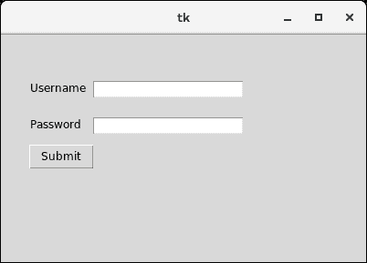

# Python Tkinter 标签


标签用于指定我们可以放置文本或图像的容器框。这个小部件用于向用户提供关于 python 应用中使用的其他小部件的信息。

可以指定各种选项来配置标签中显示的文本或部分文本。

下面给出了使用标签的语法。

### 句法

```py

w = Label (master, options)

```

下面列出了可能的选择。

| 塞内加尔 | [计]选项 | 描述 |
| one | 锚 | 它指定文本在提供给小部件的大小内的确切位置。默认值为“中心”，用于将文本置于指定空间的中心。 |
| Two | 锥齿轮 | 小部件后面显示的背景颜色。 |
| three | 位图 | 它用于将位图设置为指定的图形对象，以便标签可以表示图形而不是文本。 |
| four | 弹底引信（base detonating 的缩写） | 它表示边框的宽度。默认值为 2 像素。 |
| five | 光标 | 鼠标指针将变为指定的光标类型，即箭头、点等。 |
| six | 字体 | 小部件内所写文本的字体类型。 |
| seven | 细粒 | 小部件内所写文本的前景色。 |
| eight | 高度 | 小部件的高度。 |
| nine | 图像 | 要显示为标签的图像。 |
| Ten | 证明合法 | 如果文本包含多行，它用于表示文本的方向。它可以设置为左对齐，右对齐，居中对齐。 |
| Eleven | 垫板 | 文本的水平填充。默认值为 1。 |
| Twelve | 帕迪 | 文本的垂直填充。默认值为 1。 |
| Thirteen | 减轻 | 边框的类型。默认值为“平面”。 |
| Fourteen | 文本 | 这被设置为可能包含一行或多行文本的字符串变量。 |
| Fifteen | textvariable | 小部件内部编写的文本被设置为控制变量 StringVar，以便可以相应地访问和更改。 |
| Sixteen | 强调 | 我们可以在文本的指定字母下显示一行。将此选项设置为该行将显示的字母编号。 |
| Seventeen | 宽度 | 小部件的宽度。它被指定为字符数。 |
| Eighteen | 包装长度 | 我们可以将标签文本分成若干行，每一行都有指定给该选项的字符数，而不是只有一行。 |

### 例 1

```py

# !/usr/bin/python3

from tkinter import *

top = Tk()

top.geometry("400x250")

#creating label
uname = Label(top, text = "Username").place(x = 30,y = 50)

#creating label
password = Label(top, text = "Password").place(x = 30, y = 90)

sbmitbtn = Button(top, text = "Submit",activebackground = "pink", activeforeground = "blue").place(x = 30, y = 120)

e1 = Entry(top,width = 20).place(x = 100, y = 50)

e2 = Entry(top, width = 20).place(x = 100, y = 90)

top.mainloop()

```

**输出:**

