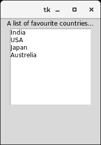
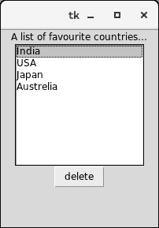
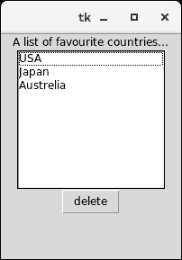

# Tkinter 列表框


列表框小部件用于向用户显示列表项。我们只能在列表框中放置文本项，并且所有文本项都包含相同的字体和颜色。

用户可以根据配置从列表中选择一个或多个项目。

下面给出了使用列表框的语法。

```py

w = Listbox(parent, options) 

```

下面列出了可能的选择。

| 塞内加尔 | [计]选项 | 描述 |
| one | 锥齿轮 | 小部件的背景色。 |
| Two | 弹底引信（base detonating 的缩写） | 它表示边框的大小。默认值为 2 像素。 |
| three | 光标 | 鼠标指针看起来像点、箭头等光标类型。 |
| four | 字体 | 列表框项目的字体类型。 |
| five | 细粒 | 文本的颜色。 |
| six | 高度 | 它表示列表框中显示的行数。默认值为 10。 |
| seven | 高亮颜色 | 小部件处于焦点下时列表框项目的颜色。 |
| eight | 高光厚度 | 高光的厚度。 |
| nine | 减轻 | 边框的类型。默认值为 ENDEN。 |
| Ten | 选择背景 | 用于显示选定文本的背景色。 |
| Eleven | 选择模式 | 它用于确定可以从列表中选择的项目数量。它可以设置为浏览、单个、多个、扩展。 |
| Twelve | 宽度 | 它以字符表示小部件的宽度。 |
| Thirteen | xscrollcommand | 它用于让用户水平滚动列表框。 |
| Fourteen | yscrollcommand | 它用于让用户垂直滚动列表框。 |

## 方法

有以下与列表框相关联的方法。

| 塞内加尔 | 方法 | 描述 |
| one | 激活(索引) | 它用于选择指定索引处的行。 |
| Two | curselection() | 它返回一个包含所选元素行号的元组，从 0 开始计数。如果未选择任何内容，将返回一个空元组。 |
| three | 删除(第一个，最后一个=无) | 用于删除给定范围内存在的行。 |
| four | 获取(第一个，最后一个=无) | 它用于获取给定范围内存在的列表项。 |
| five | 指数(一) | 它用于将带有指定索引的行放在小部件的顶部。 |
| six | 插入(索引，&midast;元素) | 它用于在指定索引之前插入具有指定元素数的新行。 |
| seven | 最近的(y) | 它返回列表框小部件 y 坐标最近的一行的索引。 |
| eight | 参见(索引) | 它用于调整列表框的位置，使索引指定的行可见。 |
| nine | 大小() | 它返回列表框小部件中的行数。 |
| Ten | xview() | 这用于使小部件水平滚动。 |
| Eleven | xview_moveto 分数 | 它用于使列表框可水平滚动列表框中最长线条的宽度部分。 |
| Twelve | xview_scroll(数字，什么) | 它用于使列表框水平滚动指定的字符数。 |
| Thirteen | yview() | 它允许列表框垂直滚动。 |
| Fourteen | yview_moveto(分数) | 它用于使列表框垂直滚动列表框中最长线条的宽度部分。 |
| Fifteen | yview_scroll(数字，什么) | 它用于使列表框垂直滚动指定的字符数。 |

### 例 1

```py

# !/usr/bin/python3

from tkinter import *

top = Tk()

top.geometry("200x250")

lbl = Label(top,text = "A list of favourite countries...")

listbox = Listbox(top)

listbox.insert(1,"India")

listbox.insert(2, "USA")

listbox.insert(3, "Japan")

listbox.insert(4, "Austrelia")

lbl.pack()
listbox.pack()

top.mainloop()

```

**输出:**



### 示例 2:从列表中删除活动项目

```py

# !/usr/bin/python3

from tkinter import *

top = Tk()

top.geometry("200x250")

lbl = Label(top,text = "A list of favourite countries...")

listbox = Listbox(top)

listbox.insert(1,"India")

listbox.insert(2, "USA")

listbox.insert(3, "Japan")

listbox.insert(4, "Austrelia")

#this button will delete the selected item from the list 

btn = Button(top, text = "delete", command = lambda listbox=listbox: listbox.delete(ANCHOR))

lbl.pack()

listbox.pack()

btn.pack()
top.mainloop()

```

**输出:**



按下删除按钮后。

