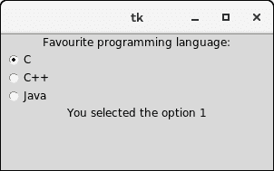

# Python Tkinter Radiobutton

> 哎哎哎:# t0]https://www . javatppoint . com/python-tkinter-radio button

Radiobutton 小部件用于在 python 应用中实现多项选择中的一项。它向用户显示多个选项，用户只能从中选择一个。我们可以将不同的方法与每个单选按钮相关联。

我们可以在单选按钮上显示多行文本或图像。为了跟踪用户的选择 radiobutton，它与一个变量相关联。每个按钮显示该特定变量的单个值。

下面给出了使用单选按钮的语法。

### 句法

```py

w = Radiobutton(top, options)

```

| 塞内加尔 | [计]选项 | 描述 |
| one | 活动背景 | 小部件具有焦点时的背景颜色。 |
| Two | 活动前景 | 小部件文本具有焦点时的字体颜色。 |
| three | 锚 | 如果小部件包含的空间超过了文本的要求，则它表示文本在小部件中的确切位置。默认值为“中心”。 |
| four | 锥齿轮 | 小部件的背景色。 |
| five | 位图 | 它用于在小部件上显示图形。它可以设置为任何图形或图像对象。 |
| six | 边框宽度 | 它表示边框的大小。 |
| seven | 命令 | 该选项设置为每次 radiobutton 的状态改变时必须调用的过程。 |
| eight | 光标 | 鼠标指针变为指定的光标类型。可以设置为箭头、圆点等。 |
| nine | 字体 | 它表示小部件文本的字体类型。 |
| Ten | 细粒 | 小部件文本的正常前景色。 |
| Eleven | 高度 | 小部件的垂直尺寸。它被指定为行数(不是像素)。 |
| Twelve | 高亮颜色 | 它表示小部件具有焦点时焦点高亮的颜色。 |
| Thirteen | 高亮背景 | 小部件没有焦点时焦点高亮显示的颜色。 |
| Fourteen | 图像 | 如果我们想在 radiobutton 上显示图像而不是文本，可以将其设置为图像对象。 |
| Fifteen | 证明合法 | 它表示多行文本的对齐方式。它可以设置为中心(默认)、左或右。 |
| Sixteen | 垫板 | 小部件的水平填充。 |
| Seventeen | 帕迪 | 小部件的垂直填充。 |
| Eighteen | 减轻 | 边框的类型。默认值为“平面”。 |
| Nineteen | 选择颜色 | 单选按钮被选中时的颜色。 |
| Twenty | 选择的 | 选择 radiobutton 时要在其上显示的图像。 |
| Twenty-one | 状态 | 它表示单选按钮的状态。收音机按钮的默认状态是正常。但是，我们可以将其设置为 DISABLED，使 radiobutton 无响应。 |
| Twenty-two | 文本 | 要在单选按钮上显示的文本。 |
| Twenty-three | textvariable | 它是 String 类型，表示小部件显示的文本。 |
| Twenty-four | 强调 | 这个选项的默认值是-1，但是，我们可以将这个选项设置为要加下划线的字符数。 |
| Twenty-five | 价值 | 当用户打开 radiobutton 时，每个 radio button 的值都被分配给控制变量。 |
| Twenty-six | 可变的 | 它是用于跟踪用户选择的控制变量。它在所有单选按钮之间共享。 |
| Twenty-seven | 宽度 | 小部件的水平尺寸。它表示为字符数。 |
| Twenty-eight | 包装长度 | 我们可以通过将该选项设置为所需的行数来将文本换行，以便每行只包含该数量的字符。 |

## 方法

radiobutton 小部件提供了以下方法。

| 塞内加尔 | 方法 | 描述 |
| one | 取消选择() | 它用于打开收音机按钮。 |
| Two | 闪光灯() | 它用于在 radiobutton 的活动颜色和正常颜色之间闪烁几次。 |
| three | 调用() | 它用于在单选按钮的状态发生更改时调用任何关联的过程。 |
| four | 选择() | 它用于选择单选按钮。 |

### 例子

```py

from tkinter import *

def selection():
   selection = "You selected the option " + str(radio.get())
   label.config(text = selection)

top = Tk()
top.geometry("300x150")
radio = IntVar()
lbl = Label(text = "Favourite programming language:")
lbl.pack()
R1 = Radiobutton(top, text="C", variable=radio, value=1,
                  command=selection)
R1.pack( anchor = W )

R2 = Radiobutton(top, text="C++", variable=radio, value=2,
                  command=selection)
R2.pack( anchor = W )

R3 = Radiobutton(top, text="Java", variable=radio, value=3,
                  command=selection)
R3.pack( anchor = W)

label = Label(top)
label.pack()
top.mainloop()

```

**输出:**

