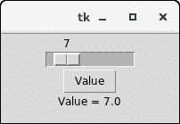

# Python Tkinter 标尺

> 原文：<https://www.javatpoint.com/python-tkinter-scale>

Scale 小部件用于将图形滑块实现到 python 应用中，以便用户可以在滑块上显示的值范围内滑动，并从中选择一个值。

我们可以根据标尺的分辨率控制最小值和最大值。当用户被迫从给定的值范围中仅选择一个值时，它提供了条目小部件的替代。

下面给出了使用缩放小部件的语法。

### 句法

```py

  w = Scale(top, options) 

```

下面列出了可能的选择。

| 塞内加尔 | [计]选项 | 描述 |
| one | 活动背景 | 小部件具有焦点时的背景颜色。 |
| Two | 锥齿轮 | 小部件的背景色。 |
| three | 弹底引信（base detonating 的缩写） | 小部件的边框大小。默认值为 2 像素。 |
| four | 命令 | 它被设置为每次我们移动滑块时调用的过程。如果滑块快速移动，回调会在它稳定下来时完成。 |
| five | 光标 | 鼠标指针变为分配给该选项的光标类型。它可以是箭头、点等。 |
| six | 数字 | 如果用于控制刻度数据的控制变量是字符串类型，则该选项用于指定数字刻度转换为字符串时的位数。 |
| seven | 字体 | 小部件文本的字体类型。 |
| eight | 细粒 | 文本的前景色。 |
| nine | 从 _ | 它用于表示小部件范围的一端。 |
| Ten | 高亮背景 | 小部件没有焦点时的高亮颜色。 |
| Eleven | 高亮颜色 | 小部件具有焦点时的高亮颜色。 |
| Twelve | 标签 | 这可以设置为一些文本，这些文本可以显示为带有刻度的标签。如果标尺是水平的，它显示在左上角；如果标尺是垂直的，它显示在右上角。 |
| Thirteen | 长度 | 它表示小部件的长度。如果刻度是水平的，它表示 X 维度；如果刻度是垂直的，它表示 y 维度。 |
| Fourteen | 东方 | 根据标尺的类型，可以将其设置为水平或垂直。 |
| Fifteen | 减轻 | 它表示边框的类型。默认值为 FLAT。 |
| Sixteen | 反复地 | 此选项告知在滑块开始重复向该方向移动之前，按钮将被按下的持续时间。默认值为 300 ms。 |
| Seventeen | 解决 | 它被设置为刻度值的最小变化。 |
| Eighteen | 显示价值 | 默认情况下，刻度值以文本形式显示。我们可以将此选项设置为 0 以隐藏标签。 |
| Nineteen | 滑动长度 | 它表示滑块窗口沿标尺长度的长度。默认值为 30 像素。但是，我们可以将其更改为适当的值。 |
| Twenty | 状态 | 默认情况下，缩放小部件处于活动状态。我们可以将其设置为禁用，使其无响应。 |
| Twenty-one | 聚焦 | 默认情况下，焦点在缩放小部件之间循环。如果我们不想发生这种情况，可以将此选项设置为 0。 |
| Twenty-two | 售票间隔 | 刻度值以指定刻度间隔的倍数显示。tickinterval 的默认值为 0。 |
| Twenty-three | 到 | 它表示一个浮点或整数值，用于指定由刻度表示的范围的另一端。 |
| Twenty-four | troughcolor | 它表示通道的颜色。 |
| Twenty-five | 可变的 | 它表示刻度的控制变量。 |
| Twenty-six | 宽度 | 它表示小部件贯穿部分的宽度。 |

## 方法

| 塞内加尔 | 方法 | 描述 |
| one | get() | 它用于获取标尺的当前值。 |
| Two | 设置(值) | 它用于设置刻度的值。 |

* * *

### 例子

```py

from tkinter import *

def select():
   sel = "Value = " + str(v.get())
   label.config(text = sel)

top = Tk()
top.geometry("200x100")
v = DoubleVar()
scale = Scale( top, variable = v, from_ = 1, to = 50, orient = HORIZONTAL)
scale.pack(anchor=CENTER)

btn = Button(top, text="Value", command=select)
btn.pack(anchor=CENTER)

label = Label(top)
label.pack()

top.mainloop()

```

**输出:**

