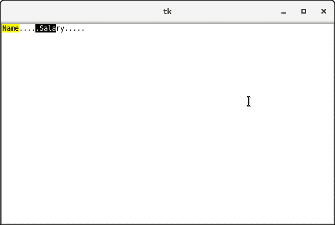

# Tkinter 文本


文本小部件用于在 Python 应用上显示文本数据。但是，Tkinter 为我们提供了用于实现单行文本框的 Entry 小部件。

文本小部件用于显示具有各种样式和属性的多行格式文本。文本小部件主要用于向用户提供文本编辑器。

文本小部件还便于我们使用标记和标签来定位文本的特定部分。我们也可以将窗口和图像与文本一起使用，因为它也可以用于显示格式化的文本。

下面给出了使用文本小部件的语法。

### 句法

```py

w = Text(top, options)

```

下面列出了可用于文本小部件的可能选项。

| 塞内加尔 | [计]选项 | 描述 |
| one | 锥齿轮 | 小部件的背景色。 |
| Two | 弹底引信（base detonating 的缩写） | 它表示小部件的边框宽度。 |
| three | 光标 | 鼠标指针变为指定的光标类型，即箭头、点等。 |
| four | 导出选择 | 选定的文本将导出到窗口管理器中的选择中。如果我们不想导出文本，可以将其设置为 0。 |
| five | 字体 | 文本的字体类型。 |
| six | 细粒 | 小部件的文本颜色。 |
| seven | 高度 | 以线条表示的小部件的垂直尺寸。 |
| eight | 高亮背景 | 小部件没有焦点时的高亮颜色。 |
| nine | 高光厚度 | 聚焦高光的厚度。默认值为 1。 |
| Ten | 高亮颜色 | 小部件具有焦点时焦点高亮显示的颜色。 |
| Eleven | 插入背景 | 它表示插入光标的颜色。 |
| Twelve | insertborderwidth | 它表示光标周围边框的宽度。默认值为 0。 |
| Thirteen | 插入时间 | 闪烁周期中插入光标关闭的时间量(毫秒)。 |
| Fourteen | 插入时间 | 闪烁周期中插入光标打开的时间量(毫秒)。 |
| Fifteen | 插入宽度 | 它表示插入光标的宽度。 |
| Sixteen | 垫板 | 小部件的水平填充。 |
| Seventeen | 帕迪 | 小部件的垂直填充。 |
| Eighteen | 减轻 | 边框的类型。默认值为 ENDEN。 |
| Nineteen | 选择背景 | 所选文本的背景色。 |
| Twenty | selectborderwidth | 选定文本周围边框的宽度。 |
| Twenty-one | spacing1 | 它指定文本每行上方的垂直间距。默认值为 0。 |
| Twenty-two | spacing2 | 此选项指定当逻辑换行时，要在显示的文本行之间添加多少额外的垂直空间。默认值为 0。 |
| Twenty-three | spacing3 | 它指定要在文本的每一行下方插入的垂直间距。 |
| Twenty-four | 状态 | 如果状态设置为禁用，小部件对鼠标和键盘无响应。 |
| Twenty-five | 制表符 | 此选项控制如何使用制表符来定位文本。 |
| Twenty-six | 宽度 | 它以字符表示小部件的宽度。 |
| Twenty-seven | 包 | 此选项用于将较宽的行包装成多行。将此选项设置为单词，以便在单词后面换行，以适合可用空间。默认值是 CHAR，它会打断任何字符处变得太宽的行。 |
| Twenty-eight | xscrollcommand | 要使文本小部件水平滚动，我们可以将此选项设置为滚动条小部件的 set()方法。 |
| Twenty-nine | yscrollcommand | 要使文本小部件垂直滚动，我们可以将此选项设置为滚动条小部件的 set()方法。 |

## 方法

我们可以对文本小部件使用以下方法。

| 塞内加尔 | 方法 | 描述 |
| one | delete（startindex， endindex） | 此方法用于删除指定范围的字符。 |
| Two | get(startindex，endindex) | 它返回指定范围内的字符。 |
| three | 指数 | 它用于获取指定索引的绝对索引。 |
| four | 插入(索引，字符串) | 它用于在给定的索引处插入指定的字符串。 |
| five | 参见(索引) | 它根据指定索引处的文本是否可见，返回布尔值 true 或 false。 |

## 标记处理方法

标记用于标记关联文本字符之间的指定位置。

| 塞内加尔 | 方法 | 描述 |
| one | 索引(标记) | 它用于获取指定标记的索引。 |
| Two | 标记 _ 重力(标记，重力) | 它用于获得给定标记的重力。 |
| three | mark _ names() | 它用于获取文本小部件中的所有标记。 |
| four | 标记集(标记，索引) | 它用于通知给定标记的新位置。 |
| five | 标记 _ 取消设置(标记) | 它用于从文本中删除给定的标记。 |

## 标签处理方法

标签是给文本各个区域的名称。标签用于分别配置文本的不同区域。下面给出了标签处理方法的列表和描述。

| 塞内加尔 | 方法 | 描述 |
| one | tag_add(tagname、startindex 和 endindex) | 此方法用于标记指定范围内的字符串。 |
| Two | 标记 _ 配置 | 此方法用于配置标记属性。 |
| three | 标记 _delete(标记名称) | 此方法用于删除给定的标记。 |
| four | tag_remove(tagname、startindex 和 endindex) | 此方法用于从指定范围中移除标记。 |

### 例子

```py

from tkinter import *

top = Tk()
text = Text(top)
text.insert(INSERT, "Name.....")
text.insert(END, "Salary.....")

text.pack()

text.tag_add("Write Here", "1.0", "1.4")
text.tag_add("Click Here", "1.8", "1.13")

text.tag_config("Write Here", background="yellow", foreground="black")
text.tag_config("Click Here", background="black", foreground="white")

top.mainloop()

```

**输出:**

