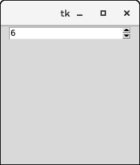

# Python tkinter 旋转框


旋转框小部件是条目小部件的替代。它向用户提供值的范围，用户可以从中选择一个。

它用于给用户一些固定数量的值可供选择的情况。

我们可以使用各种选项来装饰这个小部件。下面给出了使用自旋盒的语法。

### 句法

```py

w = Spinbox(top, options) 

```

下面列出了可能的选择。

| 塞内加尔 | [计]选项 | 描述 |
| one | 活动背景 | 小部件具有焦点时的背景颜色。 |
| Two | 锥齿轮 | 小部件的背景色。 |
| three | 弹底引信（base detonating 的缩写） | 小部件的边框宽度。 |
| four | 命令 | 与小部件相关联的回调，每次调用小部件的状态时都会调用该回调。 |
| five | 光标 | 鼠标指针变为分配给该选项的光标类型。 |
| six | 禁用的背景 | 小部件禁用时的背景色。 |
| seven | 禁用的前景 | 小部件禁用时的前景色。 |
| eight | 细粒 | 小部件的正常前景色。 |
| nine | 字体 | 小部件内容的字体类型。 |
| Ten | 格式 | 该选项用于格式字符串。它没有默认值。 |
| Eleven | 从 _ | 它用于显示小部件的起始范围。 |
| Twelve | 证明合法 | 它用于指定多行小部件内容的对齐方式。默认值为左。 |
| Thirteen | 减轻 | 它用于指定边框的类型。默认值为 ENDEN。 |
| Fourteen | 反复地 | 该选项用于控制按钮自动重复。该值以毫秒为单位给出。 |
| Fifteen | 重复服务器 | 它类似于 repeatdelay。该值以毫秒为单位给出。 |
| Sixteen | 状态 | 它表示小部件的状态。默认值为“正常”。可能的值有正常、禁用或“只读”。 |
| Seventeen | textvariable | 它就像一个控制变量，用于控制小部件文本的行为。 |
| Eighteen | 到 | 它指定小部件值的最大限制。另一个由 from 选项指定。 |
| Nineteen | 生效 | 此选项控制如何验证小部件值。 |
| Twenty | validatecommand | 它与用于验证小部件内容的函数回调相关联。 |
| Twenty-one | 价值观念 | 它表示包含这个小部件的值的元组。 |
| Twenty-two | 断续器 | 它与验证命令相同。 |
| Twenty-three | 宽度 | 它表示小部件的宽度。 |
| Twenty-four | 包 | 此选项将向上和向下按钮包装在旋转框中。 |
| Twenty-five | xscrollcommand | 这个选项被设置为 scrollbar 的 set()方法，使这个小部件可以水平滚动。 |

## 方法

有以下与小部件相关联的方法。

| 塞内加尔 | [计]选项 | 描述 |
| one | delete（startindex， endindex） | 此方法用于删除指定范围内的字符。 |
| Two | get(startindex，endindex) | 它用于获取指定范围内的字符。 |
| three | 标识(x，y) | 它用于标识指定范围内的小部件元素。 |
| four | 指数 | 它用于获取给定索引的绝对值。 |
| five | 插入(索引，字符串) | 此方法用于在指定的索引处插入字符串。 |
| six | 调用(元素) | 它用于调用与小部件相关联的回调。 |

### 例子

```py

from tkinter import *

top = Tk()

top.geometry("200x200")

spin = Spinbox(top, from_= 0, to = 25)

spin.pack()

top.mainloop()

```

**输出:**

