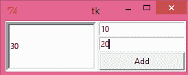

# tkinter panedwindow

> 哎哎哎:# t0]https://www . javatppoint . com/python-tkinter-panel dwindw

PanedWindow 小部件就像一个容器小部件，它包含一个或多个水平或垂直排列的子小部件(窗格)。用户可以通过鼠标移动分隔线来调整子窗格的大小。

每个窗格只包含一个小部件。PanedWindow 用于实现 python 应用中的不同布局。

下面给出了使用 PanedWindow 的语法。

### 句法

```py

w= PanedWindow(master, options) 

```

下面列出了可能的选择。

| 塞内加尔 | [计]选项 | 描述 |
| one | 锥齿轮 | 它表示小部件没有焦点时的背景颜色。 |
| Two | 弹底引信（base detonating 的缩写） | 它表示小部件的 3D 边框大小。默认选项指定槽不包含边框，而箭头和滑块包含 2 像素的边框大小。 |
| three | 边框宽度 | 它表示小部件的边框宽度。默认值为 2 像素。 |
| four | 光标 | 当鼠标指针在窗口上时，它会更改为指定的光标类型。 |
| five | 手柄 | 此选项表示把手和窗扇末端之间的距离。对于水平方向，它是窗扇顶部和把手之间的距离。默认值为 8 像素。 |
| six | 手柄尺寸 | 它表示手柄的大小。默认大小为 8 像素。然而，手柄永远是方形的。 |
| seven | 高度 | 它表示小部件的高度。如果我们不指定高度，它将根据子窗口的高度来计算。 |
| 8 方向如果我们想并排放置子窗口，方向将设置为水平。如果我们想从上到下放置子窗口，可以将其设置为垂直。 |
| nine | 减轻 | 它表示边框的类型。默认值为 FLAT。 |
| Ten | saaspad | 它代表每个窗框周围要做的填充。默认值为 0。 |
| Eleven | 生鱼片 | 它表示每个窗框周围的边框类型。默认值为 FLAT。 |
| Twelve | 窗扇宽度 | 它表示窗扇的宽度。默认值为 2 像素。 |
| Thirteen | showhandle | 它被设置为“真”以显示手柄。默认值为假。 |
| Fourteen | 宽度 | 它表示小部件的宽度。如果我们不指定小部件的宽度，它将根据子小部件的大小来计算。 |

## 方法

以下是与 PanedWindow 关联的方法。

| 塞内加尔 | 方法 | 描述 |
| one | 添加(子，选项) | 它用于向父窗口添加窗口。 |
| Two | get(startindex，endindex) | 此方法用于获取指定范围内的文本。 |
| three | 配置(选项) | 它用于配置具有指定选项的小部件。 |

### 例子

```py

# !/usr/bin/python3
from tkinter import *

def add():
    a = int(e1.get())
    b = int(e2.get())
    leftdata = str(a+b)
    left.insert(1,leftdata)

w1 = PanedWindow()
w1.pack(fill = BOTH, expand = 1)

left = Entry(w1, bd = 5)
w1.add(left)

w2 = PanedWindow(w1, orient = VERTICAL)
w1.add(w2)

e1 = Entry(w2)
e2 = Entry(w2)

w2.add(e1)
w2.add(e2)

bottom = Button(w2, text = "Add", command = add)
w2.add(bottom)

mainloop()

```

**输出:**

