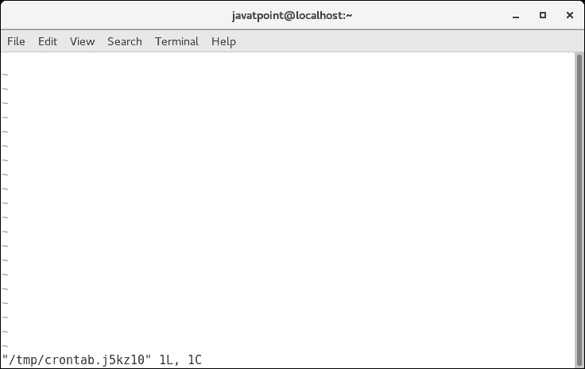
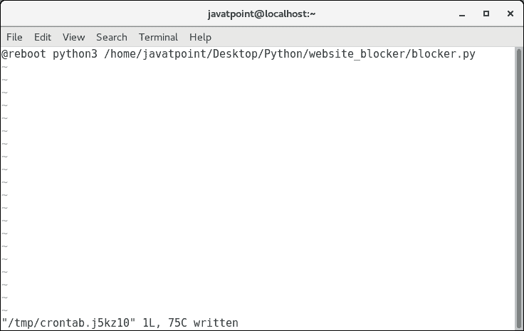
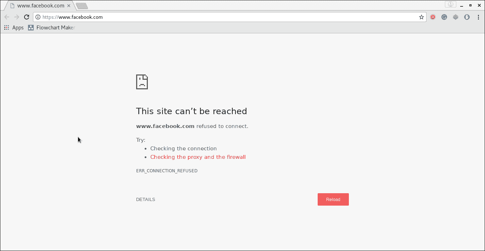

# Linux 上的脚本部署

> 原文：<https://www.javatpoint.com/python-website-blocker-script-deployment-on-linux>

因此，我们已经完成了运行良好的 python 脚本(blocker.py)。这是在系统启动时部署该脚本的时间。

部署脚本在启动时运行的过程取决于操作系统。在教程的这一部分，我们将描述 Linux 和 windows 的过程。

## 程序

要计划一个脚本在 Linux 上启动时运行，我们需要配置 **crontab** 计划中的条目。

crontab 可以定义为包含要定期运行的命令的列表。crontab 代表 cron 表，cron 表是一个固定的计划，根据该计划，脚本会定期执行。

遵循以下步骤。

**第一步:**

用-e 标志打开 crontab。在 Linux 上的终端上运行以下命令。

```py

$ sudo crontab -e 

```

这将打开一个如下所示的 crontab 文件。



**第二步**

现在将下面一行添加到文件中并保存它。

```py

@reboot python3 /home/javatpoint/Desktop/Python/website_blocker/blocker.py

```



**第三步**

立即重新启动系统。在重新启动时，我们的脚本拦截器. py 计划在系统启动时运行。从现在开始，我们处于工作时间。让我们试着在浏览器上打开脸书。



如上图所示，www.facebook.com 网站被拒绝连接。因此，我们的脚本在系统启动时运行良好，因为网站被拒绝连接。