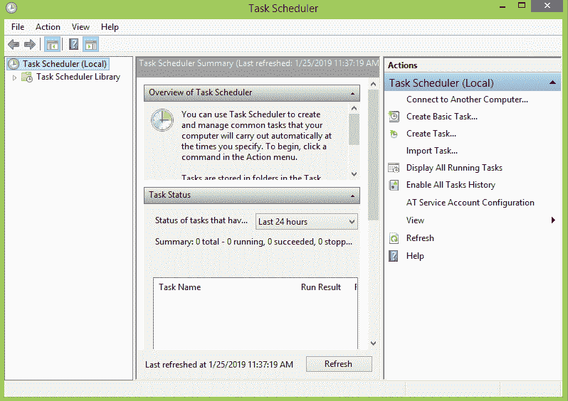
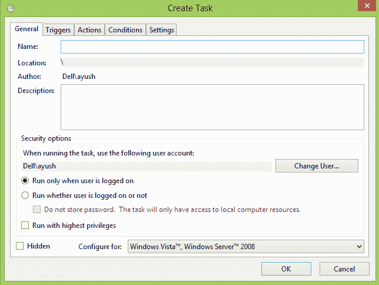
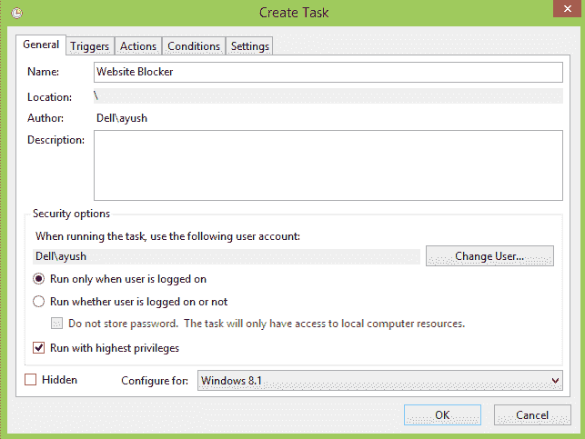
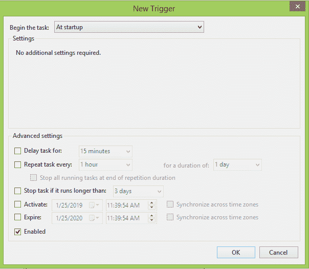
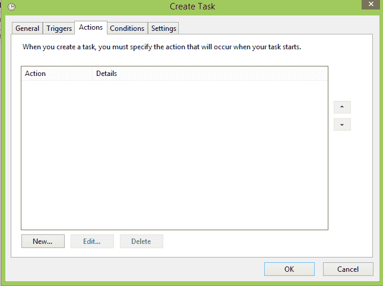
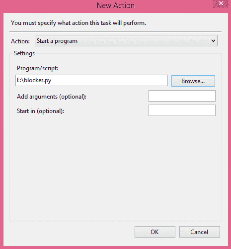
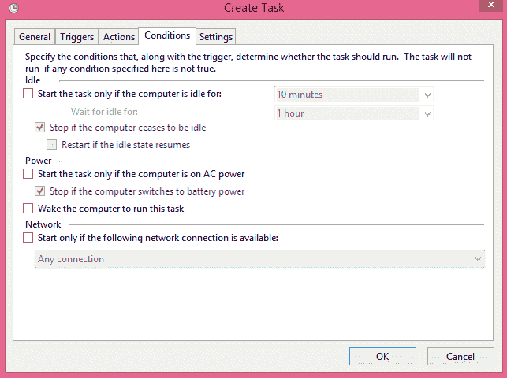
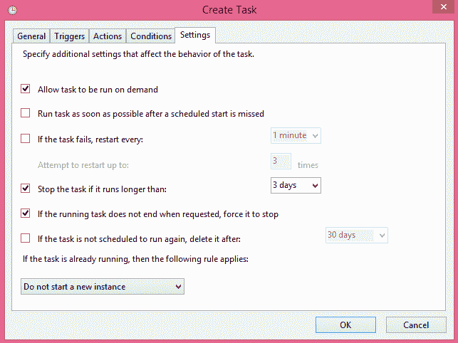
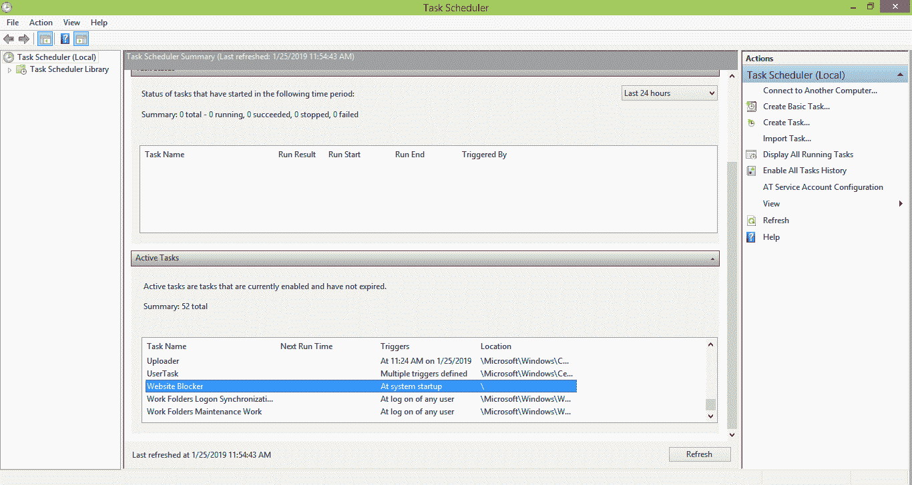
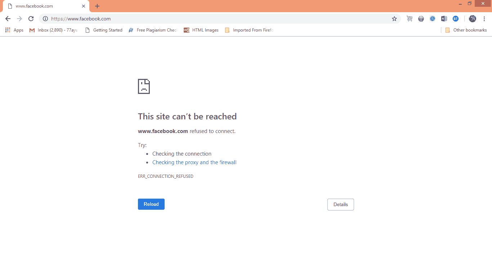

# Windows 上的脚本部署

> 原文：<https://www.javatpoint.com/python-website-blocker-script-deployment-on-windows>

教程的这一部分说明了如何在启动时部署 python 脚本，这样我们就不需要一直打开终端来运行脚本。

让我们首先将主机文件路径从“/etc/hosts”更改为“C:\System32\drivers\etc\hosts”，因为主机文件存储在 windows 上的这个位置。

要在窗口上安排任务，我们需要打开任务计划程序，如下图所示。

点击**创建任务..**在应用的右窗格中给出。

将打开以下窗口。

配置属性，并为脚本提供名称和其他必需的属性。务必勾选复选框“以最高权限运行”。

转到触发器并创建一个新的触发器，如下图所示。

从下拉列表中选择“启动时”选项，以便脚本可以在启动时运行。

现在，转到操作，通过单击新建创建一个新操作。

将打开以下窗口。从下拉列表中选择“**启动程序**”动作，浏览脚本路径，即 blocker.py(我这里是 E:\blocker.py)，点击确定。

现在，点击条件并取消选择第二个选项，该选项显示“**”只有在计算机使用交流电源的情况下才启动任务。**”

现在，转到设置并单击确定，如下图所示。

现在，我们在系统启动时安排了任务网站拦截器。我们可以在任务列表中检查这一点，如下图所示。

现在，我们需要重新启动系统，使脚本在系统启动时处于活动状态。

现在重新启动系统，并尝试访问被封锁的网站 www.facebook.com，因为我们现在在工作时间。

它将显示如下所示的显示。

因此，我们已经让我们的脚本在系统启动时正常工作，并自动阻止对 www.facebook.com(或您想要的任何网站)的访问。