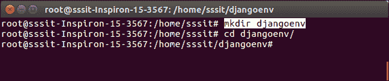

# Django 虚拟环境设置

> 原文：<https://www.javatpoint.com/django-virtual-environment-setup>

虚拟环境是 Django 用来执行应用的环境。建议在单独的环境中创建和执行一个 Django 应用。Python 提供了一个工具 **virtualenv** 来创建一个隔离的 Python 环境。我们将使用这个工具为我们的 Django 应用创建一个虚拟环境。

要设置虚拟环境，请执行以下步骤。

**1。安装包**

首先，使用以下命令安装 **python3-venv** 包。

```py

$ apt-get install python3-venv

```


**2。创建目录**

```py

$ mkdir djangoenv

```

之后，使用**CD djangenv 将目录更改为新创建的目录。**



**3。创建虚拟环境**

```py

$ python3 -m venv djangoenv

```

**4。激活虚拟环境**

创建虚拟环境后，使用以下命令将其激活。

```py

$ source djangoenv/bin/activate

```


至此，虚拟环境已经启动。现在，我们可以使用它来创建 Django 应用。

## 安装 Django

在虚拟环境中安装 Django。要安装 Django，请使用以下命令。

```py

$ pip install django

```


Django 已成功安装。现在，我们可以在单独的环境中创建一个新项目并构建新的应用。