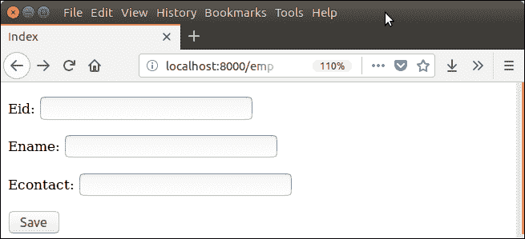
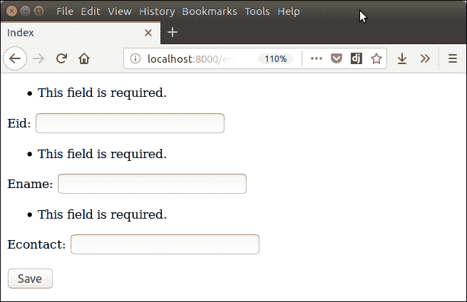

# Django 表单验证

> 原文：<https://www.javatpoint.com/django-form-validation>

Django 提供了自动验证表单数据的内置方法。Django 表单仅在包含 CSRF 令牌时提交。它使用一种简单明了的方法来验证数据。

**is_valid()** 方法用于对表单的每个字段进行验证，它在 Django Form 类中定义。如果数据有效，则返回真，并将所有数据放入 cleaned_data 属性中。

让我们来看一个接受用户输入并验证输入的例子。

### Django 验证示例

本示例包含以下文件和代码。

**// models.py**

```py

from django.db import models
class Employee(models.Model):
    eid = models.CharField(max_length=20)
    ename = models.CharField(max_length=100)
    econtact = models.CharField(max_length=15)
    class Meta:
        db_table = "employee"

```

现在，创建一个包含以下代码的表单。

**// forms.py**

```py

from django import forms
from myapp.models import Employee

class EmployeeForm(forms.ModelForm):
    class Meta:
        model = Employee
        fields = "__all__"

```

## 实例化表单

实例化表单，检查请求是否是 post。使用 **is_valid()** 方法对数据进行验证。

**//view . py**

```py

def emp(request):
    if request.method == "POST":
        form = EmployeeForm(request.POST)
        if form.is_valid():
            try:
                return redirect('/')
            except:
                pass
    else:
        form = EmployeeForm()
    return render(request,'index.html',{'form':form})

```

显示表单和错误的索引模板。

**//index.html**

```py

<!DOCTYPE html>
<html lang="en">
<head>
    <meta charset="UTF-8">
    <title>Index</title>
</head>
<body>
<form method="POST" class="post-form" enctype="multipart/form-data">
        
        {{ form.as_p }}
        <button type="submit" class="save btn btn-default">Save</button>
</form>
</body>
</html>

```

启动服务器并访问表单。



它验证每个字段，如果验证失败，就会抛出错误。

