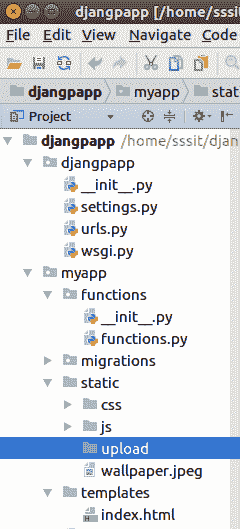
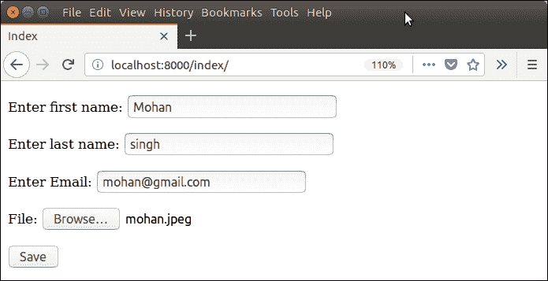

# Django 文件上传

> 原文：<https://www.javatpoint.com/django-file-upload>

使用 Django 将文件上传到服务器是一项非常简单的任务。Django 提供了内置的库和方法来帮助将文件上传到服务器。

**形式。FileField()** 方法用于创建文件输入并将文件提交给服务器。处理文件时，确保 HTML 表单标签包含**enctype = " multipart/form-data "**属性。

让我们看一个上传文件到服务器的例子。本示例包含以下文件。

**模板(index.html)**

它将创建一个包含文件输入组件的 HTML 表单。

```py

<body>
<form method="POST" class="post-form" enctype="multipart/form-data">
        
        {{ form.as_p }}
        <button type="submit" class="save btn btn-default">Save</button>
</form>
</body>

```

**表格(forms.py)**

```py

from django import forms
class StudentForm(forms.Form):
    firstname = forms.CharField(label="Enter first name",max_length=50)
    lastname  = forms.CharField(label="Enter last name", max_length = 10)
    email     = forms.EmailField(label="Enter Email")
    file      = forms.FileField() # for creating file input

```

**视图(View . py)**

这里，有一个额外的参数**请求。构造器中需要**文件。此参数包含上传的文件实例。

```py

from django.shortcuts import render
from django.http import HttpResponse
from myapp.functions.functions import handle_uploaded_file
from myapp.form import StudentForm
def index(request):
    if request.method == 'POST':
        student = StudentForm(request.POST, request.FILES)
        if student.is_valid():
            handle_uploaded_file(request.FILES['file'])
            return HttpResponse("File uploaded successfuly")
    else:
        student = StudentForm()
        return render(request,"index.html",{'form':student})

```

**指定 URL (urls.py)**

```py

from django.contrib import admin
from django.urls import path
from myapp import views
urlpatterns = [
    path('admin/', admin.site.urls),
    path('index/', views.index),
]

```

**上传脚本(functions.py)**

该功能用于读取上传的文件并存储在提供的位置。将此代码放入 **functions.py** 文件。但是首先在项目中创建这个文件。

```py

def handle_uploaded_file(f):
    with open('myapp/static/upload/'+f.name, 'wb+') as destination:
        for chunk in f.chunks():
            destination.write(chunk)

```

现在，创建一个目录**上传**来存储上传的文件。我们的项目结构如下所示。



最初，这个目录是空的。因此，让我们向它上传一个文件，稍后它将包含上传的文件。

**启动服务器**

```py

python manage.py runserver

```

**输出**



提交此表格，查看**上传**文件夹。现在，它包含上传的文件。

