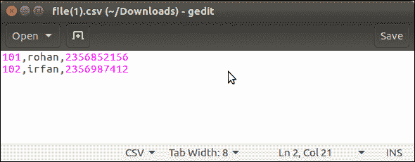

# Django CSV 输出

> 原文：<https://www.javatpoint.com/django-csv-output>

Django 使用 Python 内置的 CSV 库来创建动态 CSV(逗号分隔值)文件。我们可以在项目的视图文件中使用这个库。

让我们看一个例子，这里我们有一个 Django 项目，我们正在实现这个特性。创建视图函数 **getfile()** 。

### Django CSV 示例

在本例中，我们使用静态数据创建 CSV。

**//view . py**

```py

import csv

def getfile(request):
    response = HttpResponse(content_type='text/csv')
    response['Content-Disposition'] = 'attachment; filename="file.csv"'
    writer = csv.writer(response)
    writer.writerow(['1001', 'John', 'Domil', 'CA'])
    writer.writerow(['1002', 'Amit', 'Mukharji', 'LA', '"Testing"'])
    return response

```

・T0️ // urls.py ・T1️

提供函数的 url。

```py

path('csv',views.getfile)

```

在浏览器中执行时，它会呈现一个 CSV 文件。请看例子。


除了静态数据，我们还可以从数据库中获取 CSV。请看下面的例子，我们使用**员工**模型从表中获取数据。

## 使用数据库的动态 CSV

**//view . py**

```py

from myapp.models import Employee import csv
def getfile(request):
    response = HttpResponse(content_type='text/csv')
    response['Content-Disposition'] = 'attachment; filename="file.csv"'
    employees = Employee.objects.all()
    writer = csv.writer(response)
    for employee in employees:
        writer.writerow([employee.eid,employee.ename,employee.econtact])
    return response

```

**输出:**


保存文件，并在包含以下数据的文本编辑器中打开。



该数据是从雇员表中检索的，该表的快照如下所示。


我们已经看到，这个库对于创建动态 CSV 文件非常有用。现在，当需要时，将其实现到 Django 项目中。