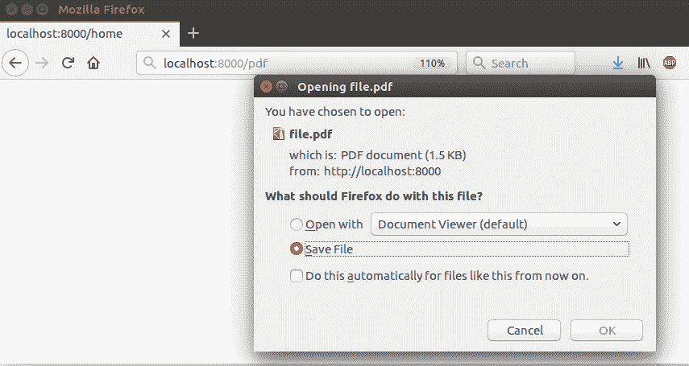
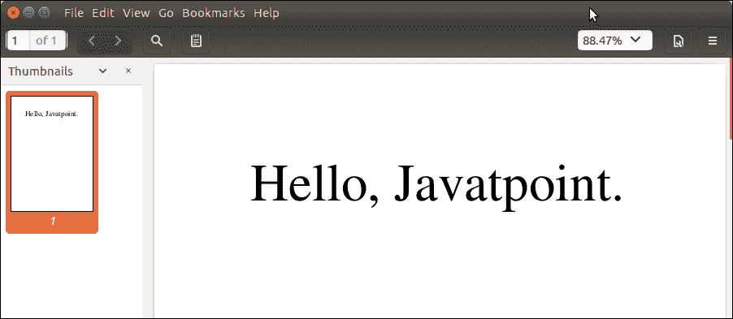

# Django PDF

> 原文：<https://www.javatpoint.com/django-pdf-output>

在这里，我们将学习如何使用 Django 视图设计和生成 PDF 文件。为了生成 PDF，我们将使用 **ReportLab** Python PDF 库来创建定制的动态 PDF。

它是一个开源库，可以在 Ubuntu 中使用以下命令轻松下载。

```py

$ pip install reportlab

```

安装后，我们可以通过视图文件中的 import 关键字导入它。

下面是一个简单的 PDF 示例，其中我们正在输出一个字符串消息“Hello form javatpoint”。该库提供了用于生成自定义 PDF 的画布和工具。请看例子。

**//view . py**

```py

from reportlab.pdfgen import canvas
from django.http import HttpResponse

def getpdf(request):
    response = HttpResponse(content_type='application/pdf')
    response['Content-Disposition'] = 'attachment; filename="file.pdf"'
    p = canvas.Canvas(response)
    p.setFont("Times-Roman", 55)
    p.drawString(100,700, "Hello, Javatpoint.")
    p.showPage()
    p.save()
    return response

```

首先，提供 MIME(内容)类型作为应用/pdf，以便输出生成为 pdf 而不是 HTML，

设置内容处理，其中提供作为附件的标题和输出文件名。

将 response 参数传递给画布和拉绳，以编写应用于 save()方法并返回响应的字符串。

・T0️ // urls.py ・T1️

```py

path('pdf',views.getpdf)

```

在 urls.py 中设置上述代码调用 view 函数。

运行服务器并在创建 pdf 文件的浏览器上访问此视图。请看例子。

**输出:**



生成一个 PDF 文件并准备下载。下载文件并打开它，它显示了我们写的字符串消息。



除此之外，这个库还包含许多其他动态设计和生成 PDF 的方法。