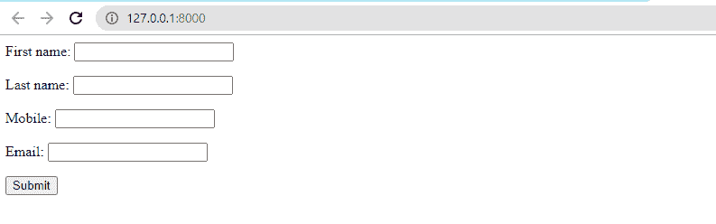
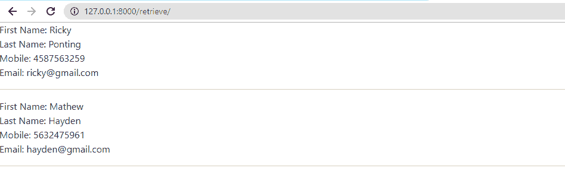
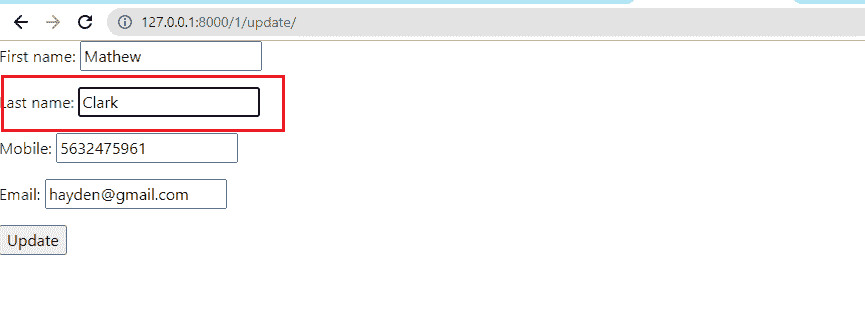
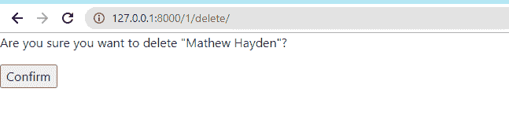

# 基于 Django 类的通用视图

> 原文：<https://www.javatpoint.com/django-class-based-generic-views>

Django 是 Python 最流行的 web 框架，用于快速的 web 应用开发。它提供了一个内置的界面，使其易于使用。它也被称为**电池**内置框架，因为它为每次操作提供内置设施。

我们大多数人可能已经熟悉了基于函数的视图，并且知道如何使用基于函数的视图来处理请求。如果您不熟悉它们，请访问我们的 [Django 教程。](https://www.javatpoint.com/django-tutorial)

在本教程中，我们将介绍**基于类的通用视图**。这些是内置视图的高级集合，用于实现选择性的 CRUD(创建、检索、更新和删除)操作。使用基于类的视图，我们可以轻松处理视图的获取、发布请求。

这些并不能代替基于函数的视图，但是提供了一些超越基于函数的视图的附加功能。

让我们简单概述一下基于函数的视图和基于类的视图。

### 基于功能的视图

基于函数的视图是初学者友好的；初学者很容易理解。与基于类的视图相比，这很容易理解。

*   很容易理解，也很容易使用。
*   它提供了显式的代码流。
*   装饰者的直接用法。

但是基于函数的视图不能扩展，还会导致代码冗余。

### 基于类的视图

基于类的视图可以用来代替基于函数的视图。所有操作都使用 Python 对象而不是函数来处理。它们为基于函数的视图提供了一些很好的例子。基于类的视图可以以简单的方式实现 CRUD 操作。

*   它遵循 Django 的干公约。
*   我们可以扩展基于类的视图，并可以使用 Mixin 根据需求添加更多功能。
*   它允许继承另一个类，可以针对各种用例进行修改。

但是这些很难理解，也很难读懂。它有隐式的代码流。

## 使用基于类的视图执行 CRUD(创建、检索、更新、删除)

我们将演示如何使用基于类的视图创建基本的 crud 应用。

我们将创建项目名称**你好**，其中包括一个名为**样本 app 的应用。**如果不知道如何在 django 创建 app，请访问 [Django App](https://www.javatpoint.com/django-app) 教程。

在应用中，我们将在 **model.py** 文件中创建一个 Employee 模型。

**示例-**

```py

from django.db import models

# Create your models here.

class Employee(models.Model):
    first_name = models.CharField(max_length=30)
    last_name = models.CharField(max_length=30)
    mobile = models.CharField(max_length=10)
    email = models.EmailField()

    def __str__(self):
        return "%s %s" % (self.first_name, self.last_name)

```

然后我们运行以下命令。

python manage.py [makemigrations](https://www.geeksforgeeks.org/django-app-model-python-manage-py-makemigrations-command/)
python manage.py [migrate](https://www.geeksforgeeks.org/django-manage-py-migrate-command-python/)

现在，我们将在 form.py 文件中为此模型创建 Django **模型表单**。它将用于向模板显示表单。

**T1T3】**

```py

from django.forms import fields
from .models import Employee
from django import forms

class EmployeeForm(forms.ModelForm):

    class Meta:
        # To specify the model to be used to create form
        model = Employee
        # It includes all the fields of model
        fields = '__all__'

```

### 实现基于类的视图

基于函数的视图用不同的类实例方法返回不同的 HTTP 请求方法。因此基于函数的如下所示。

```py

from django.http import HttpResponse
def function_view(request):
	if request.method == 'GET':
		# View logic will place here
		return HttpResponse('response')

```

如果我们实现基于类的视图，它将如下所示。

```py

from django.http import HttpResponse
from django.views import View
class NewView(View):
	def get(self, request):
		# View logic will place here
		return HttpResponse('response')

```

为了处理基于类的视图，我们需要在 urls.py 文件中使用**作为 _view()** 。

```py

# urls.py
from django.urls import path
from myapp.views import NewView

urlpatterns = [
	path('about/', NewView.as_view()),
]

```

## 创显

CreateView 实现了在数据库中创建表实例的视图。该视图自动完成创建实例的所有工作。我们只需要指定模型名称来创建视图及其字段。基于类的创建视图将搜索 employee_form.html。

#### 注意 employee _ form.html 文件应该包含在模板/app_name/employee_form.html 中，在我们的例子中，文件位置是模板/sampleapp/employee_form.html。

**T1T3】**

```py

from .models import Employee
from .forms import EmployeeForm
from django.views.generic.edit import CreateView

class EmployeeCreate(CreateView):
    model = Employee

    fields = '__all__'

```

***URL . py***

```py

from django.urls import path
from .views import EmployeeCreate

urlpatterns = [
    path('', EmployeeCreate.as_view(), name = 'EmployeeCreate')
]

```

现在我们在本地主机上运行服务器。

**输出:**



在这里，我们得到了可以创建员工的表单。让我们看看创建员工的演示。


正如我们在管理面板中看到的，该员工已在数据库中创建。


## 检索视图

有两种检索视图- **列表视图**和**详细视图。**我们将使用列表视图，该视图引用一个视图来显示数据库中一个表的多个实例。我们只需要指定应用列表视图的模型名称，基于类的列表视图将自动为我们完成这项工作。为了检索数据，我们需要创建**app _ name/model name _ list . html**文件。

**T1T3】**

```py

from django.views.generic.list import ListView

class EmployeeRetrieve(ListView):
    model = Employee

```

***url.py***

```py

from django.urls import path
from .views import EmployeeCreate, EmployeeRetrieve

urlpatterns = [
    path('', EmployeeCreate.as_view(), name = 'EmployeeCreate'),
    path('retrieve/', EmployeeRetrieve.as_view(), name = 'EmployeeRetrieve')
]

```

**sample app/模板/employee_list.html**

```py




    <ul class="nav flex-column">
        <!-- Iterate over object_list -->
        
        <!-- Display Objects -->
        <li class="nav-item">First Name: {{ object.first_name }}</li>
        <li class="nav-item">Last Name: {{ object.last_name }}</li>
        <li class="nav-item">Mobile: {{ object.mobile }}</li>
        <li class="nav-item"> Email: {{ object.email }}</li>

        <hr/>
        <!-- If object_list is empty -->
        
        <li class="nav-item">No objects Find</li>
        
    </ul>



```

现在，我们运行 **localhost** 服务器并发送获取数据的请求。



### 详细视图

**DetailView** 与 ListView 不同，它显示数据库中某个表的一个实例。Django 自动为每个条目分配一个主键，我们需要在请求中指定 **< pk >** 。DetailView 将自动执行所有操作。 **DetailView** 的实现与 ListView 相同，我们需要创建 **modelname_detail.html.**

让我们理解 DetailView 的以下实现。

**View.py**

```py

from django.views.generic.detail import DetailView

class EmployeeDetail(DetailView):
    model = Employee

```

**url.py**

```py

from django.urls import path
from .views import EmployeeCreate, EmployeeDetail, EmployeeRetrieve

urlpatterns = [
    path('', EmployeeCreate.as_view(), name = 'EmployeeCreate'),
    path('retrieve/', EmployeeRetrieve.as_view(), name = 'EmployeeRetrieve'),
    path('retrieve/', EmployeeDetail.as_view(), name = 'EmployeeDetail')
] 
```

**sample app/模板/employee_detail.html**

```py





    <h1>{{ object.first_name }} {{object.last_name}}</h1>

    <p>{{ object.email }}</p>
    <p>{{ object.mobile }}</p>



```

我们创建了一个新员工，并将 2 指定为主键。运行服务器并为请求提供主键。

**输出:**


## 更新视图

**更新视图**允许用更多的细节从数据库更新表的特定实例。该视图用于更改数据库中的条目。例如，我们想更改用户的名和姓。我们需要指定模型名称，它会自动执行所有操作。让我们看看 UpdateView 的以下实现。

我们已经创建了**员工表单**。模板中的 html 文件。在我们的例子中，是**D:\ python _ project \ my irstdjangoproject \ hello \ template \ employee _ form . html>**

**View.py**

```py

from django.views.generic.edit import UpdateView
class EmployeeUpdate(UpdateView):
    model = Employee

```

**url.py**

```py

from django.urls import path
from .views import EmployeeCreate, EmployeeDetail, EmployeeRetrieve, EmployeeUpdate, EmployeeDelete

urlpatterns = [
    path('', EmployeeCreate.as_view(), name = 'EmployeeCreate'),
    path('retrieve/', EmployeeRetrieve.as_view(), name = 'EmployeeRetrieve'),
    path('', EmployeeDetail.as_view(), name = 'EmployeeDetail'),
    path('<pk>/update/', EmployeeUpdate.as_view(), name = 'EmployeeUpdate'),
    path('<pk>/delete/', EmployeeDelete.as_view(), name = 'EmployeeDelete')

]</pk></pk> 
```

**输出:**



我们已经更新了对象的姓氏。更新后的值将自动添加到数据库中。


## 删除审阅

DeleteView 允许从数据库中删除表的实例。它用于删除数据库中的条目。

我们只需要指定模型名称，它就会自动完成所有工作。让我们看看 UpdateView 的以下实现。

**view.py**

```py

from django.views.generic.edit DeleteView

class EmployeeDelete(DeleteView):
    model = Employee

    # here we can specify the URL 
    # to redirect after successful deletion
    success_url = '/'

```

现在，我们创建 URL 路径来映射视图。

**url.py**

```py

from django.urls import path
from .views import EmployeeCreate, EmployeeDetail, EmployeeRetrieve, EmployeeUpdate, EmployeeDelete

urlpatterns = [
    path('', EmployeeCreate.as_view(), name = 'EmployeeCreate'),
    path('retrieve/', EmployeeRetrieve.as_view(), name = 'EmployeeRetrieve'),
    path('', EmployeeDetail.as_view(), name = 'EmployeeDetail'),
    path('<pk>/update/', EmployeeUpdate, name = 'EmployeeUpdate'),
    path('<pk>/delete/', EmployeeDelete, name = 'EmployeeDelete')

]</pk></pk> 
```

现在，我们创建**模板/sampleapp/employee _ confirm _ delete . html .**

```py





    <form method="post">


    <p>Are you sure you want to delete "{{ object }}"?</p>

    <input type="submit" value="Confirm">
</form>



```

**输出:**



当我们点击确认按钮时，该对象将被删除并重定向到主页。

我们已经使用类创建了 CRUD 操作

## 密码

下面是基于类的泛型视图的完整代码。

**View.py**

```py

from django.shortcuts import redirect, render
from django.urls import reverse, reverse_lazy
from django.contrib import messages
from .models import Employee
from .forms import EmployeeForm
from django.views.generic.edit import CreateView, DeleteView, UpdateView
from django.views.generic.list import ListView
from django.views.generic.detail import DetailView

class EmployeeCreate(CreateView):
    model = Employee

    fields = '__all__'
    success_url = reverse_lazy('sampleapp: EmployeeRetrieve')

class EmployeeRetrieve(ListView):
    model = Employee
    success_url = reverse_lazy('sampleapp: EmployeeRetrieve')

class EmployeeDetail(DetailView):
    model = Employee
    success_url = reverse_lazy('sampleapp: EmployeeRetrieve')

class EmployeeUpdate(UpdateView):
    model = Employee
    template_name_suffix = '_update_form'
    fields = '__all__'
    success_url = reverse_lazy('sampleapp: EmployeeRetrieve')

    # def get_success_url(self):

class EmployeeDelete(DeleteView):
    model = Employee
    # here we can specify the URL 
    # to redirect after successful deletion
    success_url = '/'

```

**你好/URL . py**

```py

"""Hello URL Configuration

The `urlpatterns` list routes URLs to views. For more information please see:
    https://docs.djangoproject.com/en/3.1/topics/http/urls/
Examples:
Function views
    1\. Add an import:  from my_app import views
    2\. Add a URL to urlpatterns:  path('', views.home, name='home')
Class-based views
    1\. Add an import:  from other_app.views import Home
    2\. Add a URL to urlpatterns:  path('', Home.as_view(), name='home')
Including another URLconf
    1\. Import the include() function: from django.urls import include, path
    2\. Add a URL to urlpatterns:  path('blog/', include('blog.urls'))
"""
from django.contrib import admin
from django.urls import path
from django.urls.conf import include

urlpatterns = [
    path('admin/', admin.site.urls),
    path('', include(('sampleapp.urls'), namespace='sampleapp'))

]

```

**sampleapp/url.py**

```py

from django.urls import path
from .views import EmployeeCreate, EmployeeDetail, EmployeeRetrieve, EmployeeUpdate, EmployeeDelete

app_name = 'sampleapp'
urlpatterns = [
    path('', EmployeeCreate.as_view(), name = 'EmployeeCreate'),
    path('retrieve/', EmployeeRetrieve.as_view(), name = 'EmployeeRetrieve'),
    path('', EmployeeDetail.as_view(), name = 'EmployeeDetail'),
    path('<pk>/update/', EmployeeUpdate.as_view(), name = 'EmployeeUpdate'),
    path('<pk>/delete/', EmployeeDelete.as_view(), name = 'EmployeeDelete')

]</pk></pk> 
```

**模板/基础. html**

```py

<!doctype html>
<html lang="en">
  <head>
    <!-- Required meta tags -->
    <meta charset="utf-8">
    <meta name="viewport" content="width=device-width, initial-scale=1">

    <!-- Bootstrap CSS -->
    <link href="https://cdn.jsdelivr.net/npm/bootstrap@5.0.2/dist/css/bootstrap.min.css" rel="stylesheet" integrity="sha384-EVSTQN3/azprG1Anm3QDgpJLIm9Nao0Yz1ztcQTwFspd3yD65VohhpuuCOmLASjC" crossorigin="anonymous">

    <title>Register Page</title>
  </head>
  <body>
  <div class = 'col-md-8'>
     
        <ul> 
            
              <div class = 'alert alert-{{message.tags}}'>
                {{ message }} 
              </div>
              
        </ul> 
     
  </div>
  
    <script src="https://cdn.jsdelivr.net/npm/bootstrap@5.0.2/dist/js/bootstrap.bundle.min.js" integrity="sha384-MrcW6ZMFYlzcLA8Nl+NtUVF0sA7MsXsP1UyJoMp4YLEuNSfAP+JcXn/tWtIaxVXM" crossorigin="anonymous"></script>

    
  </body>
</html>

```

**模板/样本 app/雇员 _ 列表**

```py





<table class="table table-borderless">
    <thead class="border-bottom font-weight-bold">
        <tr>
            <td>First Name</td>
            <td>Last Name</td>
            <td>Mobile</td>
            <td>Email</td>
                 <a href="" class="btn btn-outline-success">
                    <i class="fas fa-plus"></i> Add New 
                </a>
            </td>
        </tr>
    </thead>

    
        <!-- Display Objects -->
        <tr>
                <td>{{ object.first_name }}</td>
                <td> {{object.last_name }}</td>
                <td> {{object.mobile }}</td>
                <td>{{object.email }} </td>

            <td>
            <td><button><a href = '/{{object.pk}}/delete' class = 'class="btn text-secondary px-0'> Delete
            </a></button></td>

            <td><button><a href = '/{{object.pk}}/update' class = 'class="btn text-secondary px-0'> Update
            </a></button></td>
    

</table>

```

**模板/sampleapp/employee _ detail**

```py





    <h1>{{ object.first_name }} {{object.last_name}}</h1>

    <p>{{ object.email }}</p>
    <p>{{ object.mobile }}</p>

    <td><button><a href = '/{{object.pk}}/delete' class = 'class="btn text-secondary px-0'> Delete
    </a></button></td>

    <td><button><a href = '/{{object.pk}}/update' class = 'class="btn text-secondary px-0'> Update
  </a></button></td>


```

**模板/sample app/employee _ update _ form . html**

```py




    <form method="post">
    
        {{ form.as_p }}
        <input type="submit" value="Update">
    </form>


```

**模板/sample app/employee _ confirm _ delete . html**

```py





    <form method="post">

    <p>Are you sure you want to delete "{{ object }}"?</p>

    <input type="submit" value="Confirm">
</form>


```

## 结论

在本教程中，我们讨论了基于类的视图以及它们与基于函数的视图的区别。我们已经使用内置视图实现了 crud 操作。

CBV 是从现有视图继承并覆盖属性 **(template_name)** 或方法的强大方法。

这些视图有预先写好的代码，所以我们不需要进行硬编码。但是不建议初学者这样做，因为这无助于理解 Django 的核心深度。一旦你熟悉了基于函数的视图的概念。您可以转向基于类的视图。

* * *