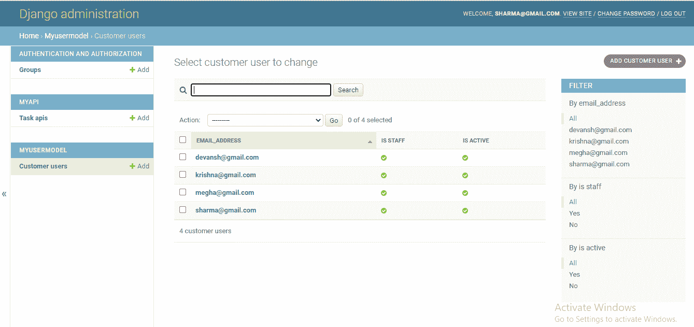

# Django 定制用户模型

> 原文：<https://www.javatpoint.com/django-custom-user-model>

Django 具有出色的内置用户模型和身份验证支持。这是大多数开发人员更喜欢 Django 而不是 Flask、FastAPI、AIOHttp 和许多其他框架的主要原因。

但是有时我们对用户模型不满意，或者我们想根据项目需求进行定制。假设我们不再需要用户名字段。或者我们想取**用户的邮箱**而不是默认的**用户名**。为此，我们需要定制我们的默认**Django 用户**模型。

在本教程中，我们将从头开始构建用户模型。您应该记住的一点是，定制 Django 默认值会给复杂的系统增加很多复杂性。所以尽量坚持默认的用户模型。但是对于项目需求，我们可以做默认的修改。

我们将使用 Django 内置的**基类**，它通过自定义类名继承。

如果您是 Django 的新手，那么请访问我们的 [Django 教程](https://www.javatpoint.com/django-tutorial)。

## 先决条件

*   安装最新的 Django (2.2 +)
*   创建 Django 项目
*   进行基本配置
*   创建虚拟环境

## 在 Django 创建自定义用户模型

我们的第一步是使用以下命令在项目中创建一个应用。

```py

python manage.py startapp MyUserModel

```

该应用将在项目目录中创建。现在将应用注册到 settings.py 文件。

**我的用户模型/设置. py**

```py

INSTALLED_APP = [
?????
?????.
MyUserModel
]

```

### 2.为自定义用户创建模型

现在我们将在 models.py 文件中创建自定义用户模型。让我们看看下面的代码。

```py

from django.db import models
from django.contrib.auth.models import AbstractBaseUser, PermissionsMixin
from django.utils import timezone
from django.utils.translation import gettext_lazy as _
from .managers import CustomUserManager
# Create your models here.

class CustomUser(AbstractBaseUser, PermissionsMixin):
    username = None
    email = models.EmailField(_('email_address'), unique=True, max_length = 200)
    date_joined = models.DateTimeField(default=timezone.now)
    is_staff = models.BooleanField(default=False)
    is_active = models.BooleanField(default=True)

    USERNAME_FIELD = 'email'
    REQUIRED_FIELDS = []

    objects = CustomUserManager()

    def has_perm(self, perm, obj=None):
        "Does the user have a specific permission?"
        # Simplest possible answer: Yes, always
        return True

   def is_staff(self):
        "Is the user a member of staff?"
        return self.staff

    @property
    def is_admin(self):
        "Is the user a admin member?"
        return self.admin

    def __str__(self):
        return self.email

```

让我们理解上面的模型；我们创建了一个名为 **CustomUser** 的类，它继承了 AbstractbaseClass。然后，我们为**邮箱添加了一个字段，是 _staff，** **是 _active，**和 **date_joined。**

*   **用户名**设置为无，因为我们希望通过用户唯一的电子邮件 id 而不是用户名来验证用户。
*   如果用户允许登录管理面板，则 **is_staff** 返回真。
*   如果用户当前处于活动状态，则**为活动状态**返回真。如果用户不活跃，他/她将不允许登录。
*   **USERNAME_FIELDS** 定义了用户模型的唯一标识——发送电子邮件。
*   当我们通过**创建超级用户**命令创建**超级用户**时， **REQUIRED_FIELDS** 会提示字段。它必须包括空白为假的任何字段。
*   管理器类对象指定该类的所有对象来自**客户用户管理器。**如果用户具有每个指定的权限，则**具有 _ 权限**返回真。

### 3.创建模型管理器

Django 为用户管理器提供了内置方法。但是如果我们创建自定义用户模型，我们需要覆盖默认方法。创建一个新的文件管理器。复制(可以是不同的)并创建用户模型管理器。以下方法由**基本用户管理器提供。**

```py

from django.contrib.auth.base_user import BaseUserManager
from django.utils.translation import ugettext_lazy as _

"""
    Custom user model manager where email is the unique identifiers
    for authentication instead of usernames.
    """

class CustomUserManager(BaseUserManager):
    """
    Custom user model manager where email is the unique identifiers
    for authentication instead of usernames.
    """
    def create_user(self, email, password, **extra_fields):
        """
        Create and save a User with the given email and password.
        """
        if not email:
            raise ValueError(_('The Email must be set'))
        email = self.normalize_email(email)

        user = self.model(email=email, **extra_fields)
        user.set_password(password)
        user.save()
        return user

    def create_superuser(self, email, password, **extra_fields):
        """
        Create and save a SuperUser with the given email and password.
        """
        extra_fields.setdefault('is_staff', True)
        extra_fields.setdefault('is_superuser', True)
        extra_fields.setdefault('is_active', True)

        if extra_fields.get('is_staff') is not True:
            raise ValueError(_('Superuser must have is_staff=True.'))
        if extra_fields.get('is_superuser') is not True:
            raise ValueError(_('Superuser must have is_superuser=True.'))
        return self.create_user(email, password, **extra_fields)

    def get_full_name(self):
        '''
        Returns the first_name plus the last_name, with a space in between.
        '''
        full_name = '%s %s' % (self.first_name, self.last_name)
        return full_name.strip()

    def get_short_name(self):
        '''
        Returns the short name for the user.
        '''
        return self.first_name 

```

我们创建了 **CustomManagerClass** ，它继承了 BaseUserManager。它提供了以下助手方法。

*   **create_user()** 方法创建、保存并返回用户。它会自动将电子邮件转换为小写，返回的用户对象会将 is_active 设置为 true。
*   **create _ super()**方法将 **is_staff** 和 **is_active** 设置为真。
*   **get_full_name()** 返回用户的全名。
*   **get_short_name** 返回用户的**名**。

### 4.将自定义用户注册到设置。复制

必须将创建的自定义用户模型注册到 setting.py 文件，否则 Django 会将其视为自定义用户模型。它会通过一个错误。打开 setting.py 文件并注册您的自定义用户模型。

```py

AUTH_USER_MODEL = appName.ClassName

```

在我们的情况下，会是-

```py

AUTH _USER_MODEL = MyUserModel.CustomUser

```

现在我们可以创建并应用 make 迁移，这将创建使用自定义用户模型的新数据库。让我们运行以下命令。

```py

python manage.py makemigrations
python manage.py migrate

```

我们将获得如下迁移文件。

```py

# Generated by Django 3.2.6 on 2021-08-09 19:55

from django.db import migrations, models
import django.utils.timezone

class Migration(migrations.Migration):

    initial = True

    dependencies = [
        ('auth', '0012_alter_user_first_name_max_length'),
    ]

    operations = [
        migrations.CreateModel(
            name='CustomerUser',
            fields=[
                ('id', models.BigAutoField(auto_created=True, primary_key=True, serialize=False, verbose_name='ID')),
                ('password', models.CharField(max_length=128, verbose_name='password')),
                ('last_login', models.DateTimeField(blank=True, null=True, verbose_name='last login')),
                ('is_superuser', models.BooleanField(default=False, help_text='Designates that this user has all permissions without explicitly assigning them.', verbose_name='superuser status')),
                ('email', models.EmailField(max_length=254, unique=True, verbose_name='email_address')),
                ('is_staff', models.BooleanField(default=False)),
                ('is_active', models.BooleanField(default=True)),
('groups', models.ManyToManyField(blank=True, help_text='The groups this user belongs to. A user will get all permissions granted to each of their groups.', related_name='user_set', related_query_name='user', to='auth.Group', verbose_name='groups')),
                ('user_permissions', models.ManyToManyField(blank=True, help_text='Specific permissions for this user.', related_name='user_set', related_query_name='user', to='auth.Permission', verbose_name='user permissions')),
            ],
            options={
                'abstract': False,
            },
        ),
    ]

```

我们可以看到，没有用户名字段，因为它在创建自定义用户模型时被删除了。

### 5.创建超级用户

运行以下命令创建超级用户。

```py

python manage.py createsuperuser

```

上述命令将提示电子邮件和密码字段创建超级用户。

```py
Email address: [email protected]
Password:
Password (again):
Superuser created successfully.

```

## 创建表单以存储用户信息

我们将使用默认子类**用户创建表单**表单创建一个表单，这样他们就可以使用自定义用户模型。

让我们在“我的用户模型”中创建一个 forms.py 文件。

**forms.py**

```py

from django.contrib.auth.forms import UserCreationForm, UserChangeForm
from django.db.models import fields
from django import forms
from .models import CustomerUser
from django.contrib.auth import get_user_model

User = get_user_model()

class CustomUserCreationForm(UserCreationForm):

    password1 = forms.CharField(widget=forms.PasswordInput)
    password2 = forms.CharField(label='Confirm Password', widget=forms.PasswordInput)

    class Meta:
        model = CustomerUser
        fields = ('email', )

    def clean_email(self):
        email = self.cleaned_data.get('email')
        qs = User.objects.filter(email=email)
        if qs.exists():
            raise forms.ValidationError("Email is taken")
        return email

    def clean(self):
        '''
        Verify both passwords match.
        '''
        cleaned_data = super().clean()
        password1 = cleaned_data.get("password1")
        password2 = cleaned_data.get("password2")

        if password1 is not None and password1 != password2:
            self.add_error("password2", "Your passwords must match")
        return cleaned_data

    def save(self, commit=True):
        # Save the provided password in hashed format
        user = super().save(commit=False)
        user.set_password(self.cleaned_data["password1"])
        if commit:
            user.save()
        return user        

class CustomUserChangeForm(UserChangeForm):
    class Meta:
        model = CustomerUser
        fields = ('email', )

    def clean_password(self):
        # Regardless of what the user provides, return the initial value.
        # This is done here, rather than on the field, because the
        # field does not have access to the initial value
        return self.initial["password1"]

```

**CustomUserCreationForm** 类继承了 **UsecreationForm** ，它由三个字段组成——用户名、密码 1 和密码 2。密码 1 与密码 2 匹配，如果两个密码都匹配，validate_password()将验证密码，并使用 **set_password()设置用户密码。**密码将以哈希格式保存。

现在我们将自定义管理面板。

## 自定义管理面板

默认的管理面板非常有用，可以有效地安排信息，但是我们可以通过提供所需的信息来实现。让我们看看下面的管理面板的代码。

**admin.py**

```py

from django.contrib import admin
from django.contrib.auth import authenticate
from django.contrib.auth.admin import UserAdmin
# Register your models here.
class CustomUserAdmin(UserAdmin):
    add_form = CustomUserCreationForm
    form = CustomUserChangeForm
    model = CustomerUser

    list_display = ('email', 'is_staff', 'is_active',)
    list_filter = ('email', 'is_staff', 'is_active',)
    fieldsets = (
        (None, {'fields': ('email', 'password')}),
        ('Permissions', {'fields': ('is_staff', 'is_active')}),
    )
    add_fieldsets = (
        (None, {
            'classes': ('wide',),
            'fields': ('email', 'password1', 'password2', 'is_staff', 'is_active')}
        ),
    )
    search_fields = ('email',)
    ordering = ('email',)
    filter_horizontal = ()

admin.site.register(CustomerUser, CustomUserAdmin)

```

现在我们准备创建新用户。运行以下命令，并使用超级用户凭据登录到管理面板。


一旦我们登录到管理面板。我们看到**添加自定义用户**按钮，在这里创建新用户。


创建一些用户后，管理面板将如下所示。



## 结论

Django 因其内置功能而广受欢迎，这节省了开发人员的大量时间。但是有时我们需要内置模型中没有的功能。然而，我们可以用自己的方式创造它们。在本教程中，我们通过扩展**抽象基类创建了自定义用户模型。**我们已经创建了管理器类来管理用户对象。您可以在本教程的帮助下创建新的自定义用户模型。您可以向用户提供更多的权限，并可以制作功能齐全的用户模型。

* * *