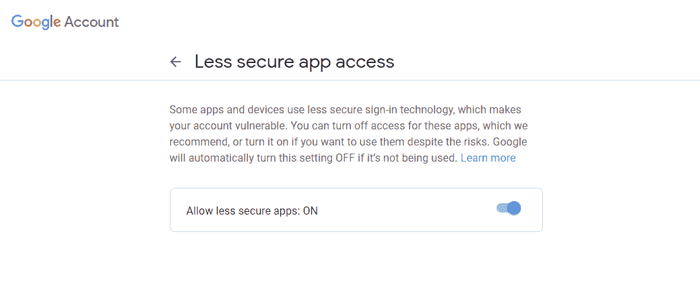

# Django 用户注册和电子邮件确认

> 原文：<https://www.javatpoint.com/django-user-registration-with-email-confirmation>

一般我们在任何网站注册，它都会发送确认链接激活账号。或者有时它要求发电子邮件来更改电子邮件或重置帐户密码。

在本教程中，我们将学习当有人在我们的网络应用上注册时，如何使用 Django 发送确认邮件。我们将讨论建立这个的简单方法。但是 Django 提供了很多其他选项，比如 django allauth 应用、django-registration、django-registration-redux。这些应用使得这项任务非常简单。

在开始之前，确保您必须了解 Django 和 Python 编程语言。创建 Django 的基本设置并配置设置。

## 配置设置

首先，我们需要在 settings.py 中为确认邮件配置电子邮件主机服务器。在**设置. py** 文件中添加以下配置。

```py

EMAIL_USE_TLS = True
EMAIL_HOST = 'smtp.gmail.com'
EMAIL_HOST_USER = 'youremail@gmail.com'
EMAIL_HOST_PASSWORD = 'yourpassword'
EMAIL_PORT = 587

```

我们使用了电子邮件 id 以及密码和 gmail SMTP 主机服务器。您也可以使用另一个 SMTP 服务器。

## 生成令牌

我们需要创建将在电子邮件确认网址中使用的令牌。在令牌中创建 token.py 文件，并添加下面的代码。

```py

from django.contrib.auth.tokens import PasswordResetTokenGenerator
from django.utils import six
class TokenGenerator(PasswordResetTokenGenerator):
    def _make_hash_value(self, user, timestamp):
        return (
            six.text_type(user.pk) + six.text_type(timestamp) +
            six.text_type(user.is_active)
        )
account_activation_token = TokenGenerator()

```

我们使用了**密码令牌生成器**类来重置密码。在上面的代码中，我们生成了用于确认的唯一令牌。

## 创建登记表

Django 提供了内置的 **UserCreationForm** ，这是一个创建表单的优秀类。我们在应用中创建一个 forms.py 文件，并导入 UserCreationForm 类。让我们理解下面的代码。

**forms.py**

```py

from django import forms
from django.contrib.auth.forms import UserCreationForm
from django.contrib.auth.models import User

class SignupForm(UserCreationForm):
    email = forms.EmailField(max_length=200, help_text='Required')
    class Meta:
        model = User
        fields = ('username', 'email', 'password1', 'password2')

```

在上面的代码中，我们导入了用户创建表单和内置的用户。然后我们创建了一个**签名表单**，在**签名表单**中包含额外的字段电子邮件。

**view.py**

```py

from django.http import HttpResponse
from django.shortcuts import render, redirect
from django.contrib.auth import login, authenticate
from .forms import SignupForm
from django.contrib.sites.shortcuts import get_current_site
from django.utils.encoding import force_bytes, force_text
from django.utils.http import urlsafe_base64_encode, urlsafe_base64_decode
from django.template.loader import render_to_string
from .tokens import account_activation_token
from django.contrib.auth.models import User
from django.core.mail import EmailMessage

def signup(request):
    if request.method == 'POST':
        form = SignupForm(request.POST)
        if form.is_valid():
            # save form in the memory not in database
            user = form.save(commit=False)
            user.is_active = False
            user.save()
            # to get the domain of the current site
            current_site = get_current_site(request)
            mail_subject = 'Activation link has been sent to your email id'
            message = render_to_string('acc_active_email.html', {
                'user': user,
                'domain': current_site.domain,
                'uid':urlsafe_base64_encode(force_bytes(user.pk)),
                'token':account_activation_token.make_token(user),
            })
            to_email = form.cleaned_data.get('email')
            email = EmailMessage(
                        mail_subject, message, to=[to_email]
            )
            email.send()
            return HttpResponse('Please confirm your email address to complete the registration')
    else:
        form = SignupForm()
    return render(request, 'signup.html', {'form': form})

```

这里我们创建了一个注册视图，它使用 POST 方法获取信息并使其有效。我们使用了 commit = False，因为它允许我们获取模型对象并添加一些额外的属性。这里我们已经完成了 **user.is_active = False** 这意味着在验证电子邮件之前，用户无法登录。

然后我们使用 **EmailMessage()** 功能发送邮件以及主题、消息。由模板创建的电子邮件。

**模板/acc_active_email.html**

```py


Hi {{ user.username }},
Please click on the link to confirm your registration,
http://{{ domain }}


```

此模板创建一个带有激活链接的电子邮件正文，将发送申请。

现在我们需要为激活链接创建一个视图。

## 创建激活视图

一旦用户点击激活链接，我们需要通过激活链接激活他们的账户。此过程由**激活**视图处理。

**view . py**

```py

def activate(request, uidb64, token):
    User = get_user_model()
    try:
        uid = force_text(urlsafe_base64_decode(uidb64))
        user = User.objects.get(pk=uid)
    except(TypeError, ValueError, OverflowError, User.DoesNotExist):
        user = None
    if user is not None and account_activation_token.check_token(user, token):
        user.is_active = True
        user.save()
        return HttpResponse('Thank you for your email confirmation. Now you can login your account.')
    else:
        return HttpResponse('Activation link is invalid!')

```

我们在注册功能之后增加了激活功能。该视图将检查令牌是否有效，然后用户将激活并登录。我们设置 **user.is_active = True** 表示用户可以登录。

现在我们将视图映射到 URL。

## 资源定位符

```py

from django.urls import path
from .views import home, index, activate
urlpatterns = [
    path('', home, name = 'home'),
    path('form/', index, name = 'index'),
    path('activate/(?P[0-9A-Za-z_\-]+)/(?P<token>[0-9A-Za-z]{1,13}-[0-9A-Za-z]{1,20})/',
        activate, name='activate'),
]</token> 
```

在模板/注册. html 中创建注册表单。

```py




<div class = "container">
  <h2>Sign up</h2>
  <form method="post">
    
      
      <p>
        {{ field.label_tag }}<br>
        {{ field }}
        
          <small style="display: none ">{{ field.help_text }}</small>
        
        
          <p style="color: red">{{ error }}</p>
        
      </p>
      
    <button type="submit">Sign up</button>
  </form>
</div>


```

该表单如下所示。当用户点击提交按钮时，激活链接会发送他们输入的电子邮件 id。


当你点击注册按钮，确认电子邮件发送给给定的电子邮件 id。


点击收到的链接，现在你可以登录了。

#### 注意-确保打开不太安全的应用访问设置。否则，您将面临 smtp 错误。



Tada，我们已经成功创建了一个基于电子邮件配置的用户注册。这个过程很简单，需要更少的代码来完成。你可以通过增加更多的功能，比如有吸引力的模板，重定向到登录等，使它更好。

* * *