# Jupyter 笔记本教程

> 原文： [https://www.javatpoint.com/jupyter-notebook](https://www.javatpoint.com/jupyter-notebook)


Jupyter 笔记本教程提供了 Jupyter 笔记本的基本和高级概念。我们的 Jupyter 笔记本教程是为初学者和专业人士设计的。

## 什么是 Jupyter 笔记本？

Jupyter Notebook 是一个**开源、基于网络的交互环境，**允许您创建和共享包含**实时代码、数学方程、图形、地图、情节、可视化、**和**叙事文本**的文档。它集成了 **Python、PHP、R、C#、**等多种编程语言。

#### 注: Jupyter Notebook 主要用于 Python，因为 Python 与人工智能(AI)、机器学习以及 Deep learning 一起使用。

在本教程中，我们将讨论以下主题:

*   [Jupyter 笔记本的优势](#Advantages)
*   [Jupyter 笔记本的缺点](#Disadvantages)
*   [Jupyter 笔记本的安装](#Installation)
*   [Jupyter 笔记本的仪表盘](#Dashboard)
*   [Jupyter 笔记本用户界面](#UserInterface)
*   [Jupyter 笔记本组件](#Components)
*   [在 Jupyter 笔记本中创建笔记本](#CreatingNotebook)
*   [Jupyter 笔记本中的细胞类型](#Typesofcells)
*   [Jupyter 笔记本中的 ipywidgets】](#IPyWidgets)

* * *

## Jupyter 笔记本的优势

Jupyter 笔记本有以下优点-

1.  **All in one place:** 众所周知，Jupyter Notebook 是一个开源的基于 web 的交互环境，它将代码、文本、图像、视频、数学公式、图、地图、图形用户界面和小部件组合到一个文档中。
2.  **易于转换:** Jupyter Notebook 允许用户将笔记本转换为 HTML、PDF 等其他格式。它还使用在线工具和 nbviewer，允许您在浏览器中直接呈现公开的笔记本。
3.  **易于共享:** Jupyter 笔记本以结构化文本文件(JSON 格式)保存，便于共享。
4.  **语言无关:** Jupyter Notebook 是平台无关的，因为它表示为 JSON (JavaScript Object Notation)格式，这是一种语言无关的、基于文本的文件格式。另一个原因是笔记本可以用任何编程语言处理，可以转换成任何文件格式，如 Markdown、HTML、PDF 等。
5.  **交互代码:** Jupyter 笔记本使用了**ipywidget**包，提供了很多常见的用户界面，用于探索代码和数据交互。

* * *

## Jupyter 笔记本的缺点

Jupyter 笔记本有以下缺点:

*   很难测试长时间的异步任务。
*   安全性降低
*   它使细胞失去了秩序
*   在 Jupyter 笔记本中，没有 IDE 集成，没有林挺，也没有代码风格的修正。

* * *

## 使用 pip 包安装木星笔记本

要安装 Jupyter 笔记本，首先需要安装 Python。您可以按照以下步骤下载 Python。

**第一步:**点击链接[https://www.python.org/downloads/windows/](https://www.python.org/downloads/windows/)下载最新版本的 Python。


**步骤 2:** 现在，双击下载的文件，打开如下窗口。选择**立即安装**安装 Python。


**步骤 3:** 可以看到安装正在进行中。


**步骤 4:** 安装完成后，下面的窗口打开，你只需点击关闭即可。


Python 安装完成后，请按照以下步骤安装带有 pip 包的 Jupyter 笔记本。

**步骤 1:** 打开命令提示符。

**步骤 2:** 复制/设置路径，Python 脚本在该路径中呈现。

**例如:**

```py

Path= C:\Users\Manya\AppData\Local\Programs\Python\Python37\Scripts

```

#### 注意:如果 AppData 不可见，则转到查看- >选项，选择更改文件夹，并搜索选项。点击选择更改文件夹后，点击查看，并选择显示隐藏文件、文件夹和驱动器然后点击应用- >确定。

**步骤 3:** 要升级 pip 的旧版本，请在指定路径后给出以下命令:

```py

pip install --upgrade pip

```

**步骤 4:** 要安装 Jupyter 笔记本，请键入以下命令:

```py

pip install jupyter 

```

安装 Jupyter 笔记本需要几秒钟。

**步骤 5:** 安装过程完成后，可以在命令提示符下使用以下命令在服务器上运行笔记本。

```py

jupyter notebook

```

几秒钟后，Jupyter 笔记本开始使用默认的网络浏览器，该浏览器显示所有 python 文件的列表。

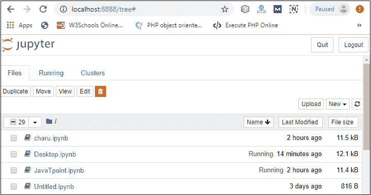

* * *

## Jupyter 笔记本的仪表盘

下面的截图显示了 Jupyter 笔记本的仪表盘，其中包含了**三个**标签。


### 文件选项卡

文件选项卡用于显示当前目录下的**文件**和**文件夹**。它还使用了**上传**按钮，通过该按钮可以将文件上传到笔记本电脑服务器。

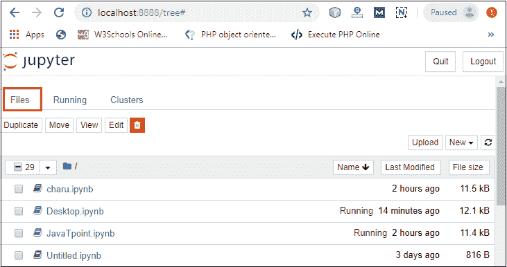

### 运行选项卡

运行选项卡用于显示当前运行的笔记本。


### 集群选项卡

IPython 提供了集群选项卡。IPython 是一个并行计算框架，是 IPython 内核的扩展版本。


* * *

## Jupyter 笔记本的用户界面

当你创建一个新的笔记本时，该笔记本会显示**笔记本名称、菜单栏、工具栏、**和一个**空代码单元格**。


**笔记本名称:**笔记本名称显示在页面顶部，Jupyter 标志旁边。

**菜单栏:**菜单栏呈现不同的选项，用于操作笔记本功能。

**工具栏:**工具栏提供了在笔记本中执行最常用操作的快捷方式。

**代码单元:**代码单元允许您编辑和编写新代码。

* * *

## Jupyter 笔记本的组件

Jupyter 笔记本有以下三个**组件-**

 ****1。笔记本网络应用:**它是一个用于编写和运行代码的交互式网络应用。

笔记本网络应用允许用户:

*   使用自动语法高亮和缩进在浏览器中编辑代码。
*   在浏览器上运行代码。
*   查看媒体表示的计算结果，如 HTML、LaTex、png、pdf 等。
*   创建和使用 JavaScript 小部件。
*   包括使用 Markdown 单元格的数学方程。

**2。内核:**内核是由笔记本网络应用启动的独立进程，用于以给定的语言运行用户代码，并将输出返回给笔记本网络应用。

在 Jupyter 笔记本中，内核有以下语言版本:

*   计算机编程语言
*   朱莉娅
*   红宝石
*   稀有
*   斯卡拉
*   node.js
*   去

**3。笔记本文档:**笔记本文档包含笔记本网络应用中可见的所有内容的表示，包括计算、文本、数学方程、图形和图像的输入和输出。

## 创建笔记本

要在 Jupyter 中创建笔记本，请转到**新建**并选择 **Python3** 。

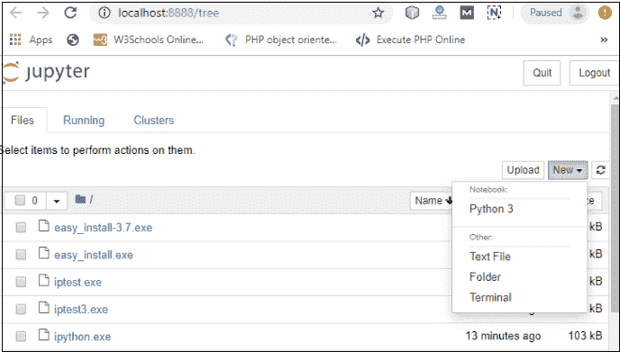

现在，您可以看到一个新的笔记本在新的选项卡中打开。


### 重命名笔记本

要重命名笔记本，请双击屏幕顶部的无标题。将打开一个弹出窗口来重命名文件。输入要添加的新笔记本名称。然后点击重命名。


## 如何在木星上编写和运行程序

重命名文件后，单击笔记本中的第一个单元格进入编辑模式。现在你可以在工作区写代码了。写完代码后，按下 **Shift+回车**键或者直接点击屏幕上方的**运行按钮**即可运行。


* * *

## Jupyter 笔记本中的单元格类型

Jupyter 笔记本中使用了以下四种类型的电池。


### 1.代码单元

代码单元中的内容被视为当前内核的编程语言中的语句。默认情况下，Jupyter 笔记本的内核在 **Python** 中，所以可以在一个代码单元中编写 Python 语句。当您运行该语句时，它的输出显示在代码下面。输出可以以文本、图像、matplotlib 图或 HTML 表格的形式呈现。


### 2.减价单元格

Markdown cell 为笔记本提供文档，使笔记本更具吸引力。此单元格包含所有类型的格式功能，如使文本加粗和斜体、标题、显示有序或无序列表、项目符号列表、超链接、表格内容、图像等。

要执行以下格式化功能，首先从下拉菜单中选择**标记单元格**。


### 粗体和斜体

*   要使文本加粗，请在**双下划线**或**双星号**之间书写文本。


下面的截图显示了上述代码的输出。


*   要使文本斜体，请在**单下划线**或**单星号**之间书写文本。

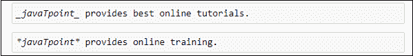

下面的截图显示了上述代码的输出。

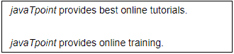

### 头球

在 Markdown 中创建标题与在 HTML 中创建标题非常相似。它以 6 种大小显示文本。要使文本成为标题，请使用 **#** 符号开始文本。#符号的数量取决于标题的大小。

**例如-**

标题 1 使用一个#符号，标题 2 使用两个#符号，以此类推。


下面的截图显示了上述标题单元格的输出。

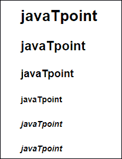

### 有序列表

有序列表以 1 开头。使用 tab 键使子目后跟顺序。


下面的截图显示了上述 Markdown 数据的输出。


### 项目符号列表

在 Jupyter 笔记本中，如果文本以**破折号(-)** 符号开始，则标记单元格将破折号为**实心圆**和**星号(*)** 到**实心正方形**。


下面的截图显示了上述 Markdown 数据的输出。


### 超链接

标记单元格允许您附加超链接。要附加超链接，请将链接的名称放在**方括号[]** 中，并将链接写在**括号()**内。

您可以使用以下代码插入超链接。


**输出:**


### 表格内容

标记单元格允许您使用**管道符号(|)** 和**破折号(-)** 创建表格。管道符号 **(|)** 用于制作列，破折号 **(-)** 用于制作行。

表的创建如下所示:


下面的截图显示了 markdown 单元格的表格内容。


### 形象

要在标记单元格中插入图像，首先需要在同一目录中插入图像。为此，转到 **Jupyter 仪表盘- >选择上传**，指定图像的路径，然后点击**打开**。

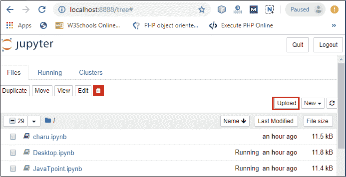

在仪表板中看到图像后，单击上传，您可以看到图像已上传到仪表板中。

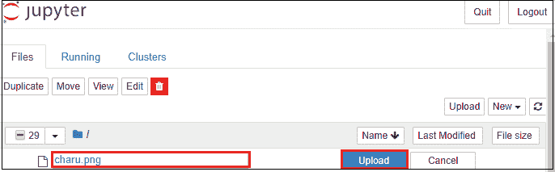

现在，转到您当前的笔记本，键入以下代码以插入图像。


下面的截图显示图像被插入到笔记本上。


### 3.原始 NBConvert 单元格

Raw NBConvert Cell 提供了一个可以直接写入输出的地方。笔记本内核不评估这些单元格。

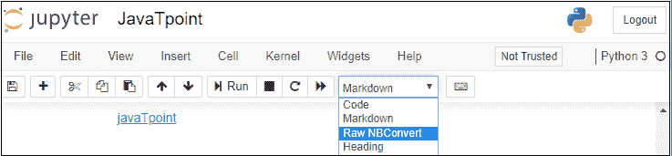

### 4.标题单元格

Jupyter 笔记本不支持标题单元格。当您从下拉菜单中选择标题时，屏幕上会弹出一个窗口，如下图所示。

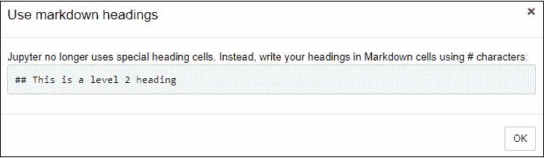

* * *

## 笔记本中的智能手机

ipywidgets 提供了许多通用的用户界面，用于交互式地探索代码和数据。

默认情况下，ipywidgets 安装在 Anaconda 中，或者您也可以使用 conda 手动安装它。

ipywidges 的一些示例如下:

### 1\. 小部件文本

文本小部件允许用户编写字符串:

```py

from ipywidgets import widgets
title_textbox = widgets.Text(
    value = 'Hello World',
    description = 'Title:',
)
title_textbox

```

**输出:**


### 2.按钮部件

按钮小部件类似于 HTML 按钮。要创建按钮，请键入以下代码。

```py

from ipywidgets import widgets
button = widgets.Button(
    description='Press Me',
)
button

```

**输出:**


### 3.颜色选择器

The Color picker allows you to select a color as per to your requirement.

```py

from ipywidgets import widgets
color_picker = widgets.ColorPicker(
    concise = True,
    description = 'Background color:',
    value = '#efefef',
)
color_picker

```

**输出:**


当你点击方块时，会弹出如下窗口。

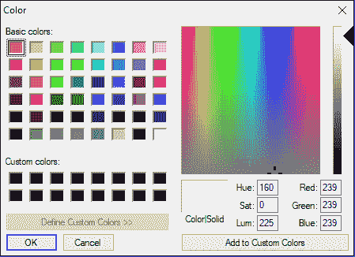

### 4.滑块

Sider 用于查找两个实体之间的范围和间隔。

```py

from ipywidgets import widgets
range_slider = widgets.FloatRangeSlider(
    value = [-2., +10.],
    min = -10., max = +20., step = 0.1,
    description = 'range:',
    readout_format = '.1f',
)
range_slider

```

**输出:**

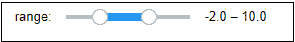

**例:写一个代码加两个数。**

```py

from ipywidgets import widgets
lb1 = widgets.Label('Enter the First number')
display(lb1)
text1 = widgets.Text()
display(text1)
lb2 = widgets.Label('Enter the Second number')
display(lb2)
text2 = widgets.Text()
display(text2)
btn = widgets.Button(description = "add")
display(btn)
lb3 = widgets.Label()
display(lb3)
def add(x):
    a = int(text1.value)
    b = int(text2.value)
    lb3.value = 'result='+str(a+b)
btn.on_click(add)

```

**输出:**


* * *

## 先决条件

在学习 Jupyter Notebook 之前，您必须具备 HTML、CSS 和 JavaScript 的基本知识。

## 观众

我们的 Jupyter 笔记本教程旨在帮助初学者。

## 问题

我们保证您在本 Jupyter 笔记本教程中不会发现任何问题。但是如果有任何错误或差错，请在联系表中公布错误。

* * ***